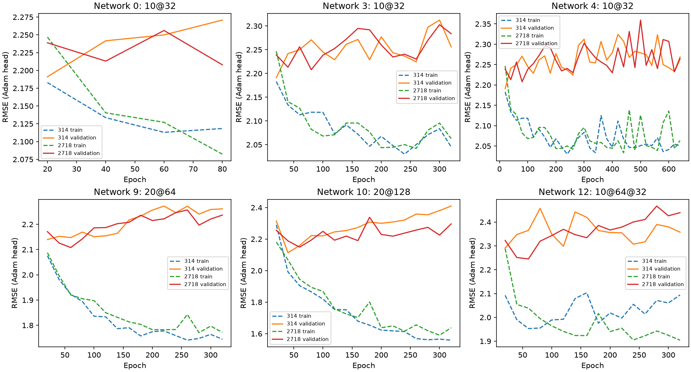
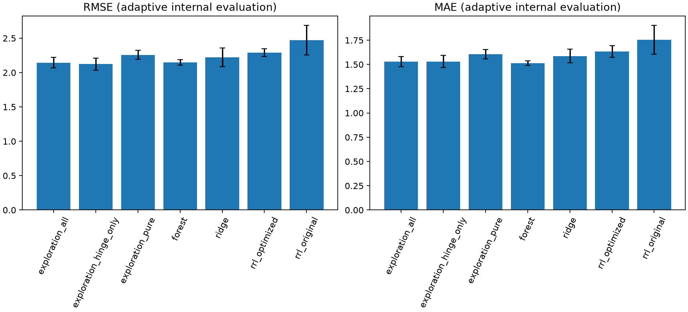

# Abalone 第二轮探索记录

本页保留第二轮当时的发现和失败结论。后续分组正则化、早停、强化RF与重复划分结果见 [第三轮报告](ABALONE-ROUND3.md)，请勿把本页的阶段性结论视为最新进展。

## 起点与边界（2026-09-28）

第一轮24组搜索把RRL的五折RMSE从2.473降至2.290，但Ridge为2.224、随机森林为2.147。此前把“实验完整”当作“探索充分”的停止条件不合适。本轮目标是解释剩余差距并尝试缩小，而不是预先承诺胜出。原始产物不覆盖，新结果放入 `results/abalone/exploration`。

再次核对课程PDF第3.1、4.3、4.4节：允许回归loss适配，结构优化方向不限于二值化/激活/逻辑层，要求解释忠实；未规定必须超过基线。本轮保留NLAF、硬规则和梯度嫁接，不替换成黑箱预测器。线性直连版明确称为“线性＋规则RRL”，不冒充原始纯规则模型。

**两个方向从哪里来。** 第一轮的核心观察是：RRL 扩大结构并搜索24组配置后，RMSE 从2.473降到2.290，却仍高于普通Ridge的2.224和随机森林的2.147；因此已知“当前RRL预测不足”，但尚不知道瓶颈位于规则表示、回归头还是信息表示。与此同时，EDA显示尺寸/重量与 Rings 总体相关且有非线性趋势，而纯RRL把连续输入转成阈值条件，模型输出由有限个规则激活构成，可能忽略同一阈值区间内的数值差异。前一观察提出了定位优化环节的需要，后一观察提供了连续信号可能被压缩的具体机制；两者都是待检验解释，不是先验断言规则或RRL必然有缺陷。

## 发现—假设—行动（结果产生前记录）

1. **输出头假设。** 原实现用Adam联合拟合离散规则和回归头；规则表示持续变化时，末端回归头可能没有达到给定规则下的最佳拟合。为隔离这一可能性，先冻结训练出的规则，再用手写Ridge重拟合输出权重。如果内部验证误差下降，只支持“重新拟合读出层有帮助”，不能据此断言Adam确实跟不上，也不能宣称规则本身更好。
2. **连续信息假设。** 阈值化会让同一阈值区间内的不同数值共享相同条件；对 Rings 这样的数值目标，区间内的连续变化可能仍有预测信息。先加入标准化原始输入形成“线性＋规则”对照；再根据开发结果，以RRL训练阈值构造 $\max(X-c,0)$ 分段线性基函数。为辨别规则是否有增量价值，另设移除规则、仅用连续分段项的对照。预测头在固定规则后由Ridge闭式拟合，不把这项实验描述为连续参数参与RRL反向传播。
3. 第一轮主要训练80/160轮且结构偏小，尚不能排除容量或训练不足。因此同时扩大训练轮数、阈值数和结构，比较MSE/Huber、学习率衰减、batch及NOT，并记录训练/验证曲线，以检查过拟合和优化波动；这是与前两项机制假设并行的容量/训练诊断，不预设增大模型一定有效。

所有阈值、编码、缩放、规则及回归头只使用当前训练子集。Ridge目标是平均MSE加L2，截距不受惩罚。暂不增加特征工程或集成，以免同时改变过多因素；如前三条仍不足，再依据诊断决定，不自动追加。

## 评价与停止约定

先在原外层第0折训练部分内部固定80:20划分，以两个初始化种子筛选扩展配置，避免先用五折外层分数挑方向。开发集最优分数不作为最终成绩。随后冻结小型候选集合，三折内层选参、五折外层重新评价，同步保留同折RF/Ridge参照；报告实际计算预算不等。

所有原始样本的外层结果此前都已查看，且开发筛选跨越后续某些外层测试样本。因此本轮属于自适应探索后的内部复核，不能称为严格独立或无偏的确认性嵌套CV。更换随机种子不会抹去这一限制；真正独立确认需要新数据。主指标预定为RMSE，同时记录MAE、R²、尾部误差与规则复杂度。无论是否胜出都保留失败配置和心路历程。

## 实施节点一：冻结设计并启动

固定28组网络×两个初始化种子，共56次开发训练；每次比较原Adam头、5档L2纯规则头、5档L2线性＋规则头，共616条记录。重拟合复用已学规则，不为每个头重复训练逻辑层。开发划分为原第0外折训练部分内的80:20固定划分（seed=2718），两个训练种子314/2718。每20轮保存训练与验证RMSE，不据该曲线追溯选择训练轮数。

筛选规则预先固定：每种输出头家族选开发均值最优的两个不同网络配置，加上第一轮最终配置作为锚点，最多7个候选；之后每个外层训练集合内部三折选参，另报告不含线性直连的纯规则结果。测试通过6项，旧实验完整审计仍通过。共享适配器新增参数均保持旧默认值，没有改动NLAF或逻辑层。设计文件同时保存原始数据SHA256与开发索引。

## 开发途中追加的假设：从直线到分段直线

初步开发结果显示，增加线性直连的收益比仅重拟合规则头更明显；20个阈值的宽网络有进一步改善，但当时仍未超过同一开发划分的RF。这提示平滑连续关系值得进一步检验，而不是继续只堆逻辑节点。此时决定追加分段线性基函数 h_jk=max(X_j-c_jk,0)，c沿用二值化层的训练阈值；预测为偏置＋离散规则加权和＋输入线性项＋这些hinge项。它是“分段线性＋规则RRL”，不是纯离散规则RRL。

追加范围在其结果产生前固定：第一轮开发全部结束后，取线性直连家族最优的两个不同网络与原锚点（去重至最多3个），使用相同开发划分与两个种子，比较五档L2（.0001/.001/.01/.1/1）。另加入去掉所有逻辑规则的hinge-only模型，防止把连续基函数的贡献冒充规则贡献。最多新增60条开发记录。最终各家族各取两个不同网络进入内部复核，总候选上限由7增至11；hinge-only是新增对照，不允许作为“RRL胜出”候选。此决定是已看开发结果后的自适应扩展，明确不同于最初冻结设计，不改写原design.json。

## 实施节点二：首批开发结果

56次训练及616条头部比较已完成。以下仅为同一个开发验证集上两个初始化的平均RMSE，不能当作五折成绩：原Adam头最优2.2393；纯规则Ridge重拟合最优2.1519；线性＋规则最优2.1104。同开发划分RF最优2.0746，Ridge最优2.2198。因此更广探索已经缩小差距，但首批仍未超过RF。

最优线性＋规则配置是20个阈值、64个AND＋64个OR、320轮，头部L2=.1；两个初始化RMSE约2.1124和2.1084。增加至128＋128节点并未进一步明显改善（均值2.1114）；原Adam头在较宽模型上训练RMSE可降至约1.759，但开发RMSE约2.249，提示输出与规则的联合拟合存在泛化问题，不能说训练损失越小越好。Ridge头在固定规则下大幅正则化、降低方差，是与结果一致的解释；还需逐折复核。

没有据此删除失败的长训练、深层、NOT、NLAF或有监督阈值配置。下一步分段线性扩展只复用网络0、9、10，设计在 `extension_design.json` 单独存档，不篡改初始616条实验。

## 实施节点三：分段线性验证与候选冻结

追加6次网络训练、60条开发比较结束。最佳分段线性＋规则配置为网络10、头部L2=.1，两个种子平均RMSE=2.0766（2.0800/2.0732）；网络9为2.0795。去掉逻辑规则的分段线性对照最优2.0882。开发最优RF为2.0746，差距已很小，但仍不能宣称超过。

这支持“保留连续趋势很重要”，也提示规则可能在连续项之外提供小幅信息；不过规则对照的差异只有约0.012，且已经筛选过配置，必须保留不确定性。hinge-only的两个种子结果相同，因为分位数阈值与闭式头都确定，其重复行不是额外独立证据。

现已冻结 `shortlist.json` 的10个候选：Adam、纯规则Ridge、线性＋规则、分段线性＋规则、hinge-only各两个不同网络；锚点已在其中，不额外添加。共享逻辑训练的组合只训练一次再拟合各头，五外折×三内折×四种网络，共60次内层网络训练，对应150条候选内层评分。每折另对“RRL候选全集”“纯规则候选”“无规则对照”各自按内层RMSE选参和重训。本轮不再根据外层结果扩展空间。

## 数学形式与解释边界

令X是仅在训练数据拟合的独热编码及标准化输入（log配置先log1p），R_j(X)为原RRL学到的严格0–1规则。分段线性＋规则版本预测为：

$$
\hat y=b+\sum_j a_jR_j(X)+\sum_k v_kX_k+\sum_{k\in\mathrm{continuous}}\sum_t u_{kt}\max(X_k-c_{kt},0).
$$

每个hinge在阈值以下为0，以上按斜率1增长；加权叠加得到连续的分段线性单变量趋势。规则项提供跨特征的逻辑组合。先按原梯度嫁接训练规则，再固定规则，以平均MSE＋λ||系数||²闭式拟合所有输出系数，截距不惩罚。全精度JSON同时保存阈值、规则、连续项系数与预处理，因此解释仍是实际预测公式，不是事后拟合的替代模型。规则支持度不等于连续项贡献，也不等于预测置信度。

复杂度分开记录原逻辑边数和连续项数，不能只报逻辑边数而隐藏额外的分段线性项。hinge-only输出的全部规则系数为0，其有效逻辑边数记为0；实现为复用训练流程而计算的未使用规则不计作预测结构。



图中虚线是训练RMSE、实线是开发验证RMSE，均指重拟合前Adam头；两个种子分别展示。宽网络（9/10）可继续降低训练误差，但验证误差反而上升，直接支持过拟合风险。长训练（3/4）未稳定改善验证误差，深层配置12也未解决问题。不能拿图中最优epoch回填本轮成绩：最终仍使用冻结配置的训练轮数。

## 实施节点四：五折结果与反证

全部复核完成。下表为同一五折的均值±样本标准差；第二轮属于自适应开发后的内部评价，不能把它与独立确认等同。

| 方法 | RMSE | MAE | R² | Rings>=20 MAE |
|---|---:|---:|---:|---:|
| 原始RRL | 2.47256±0.21637 | 1.75575±0.14848 | 0.40913±0.07216 | 8.95960±1.18463 |
| 第一轮优化RRL | 2.28993±0.05546 | 1.63360±0.06210 | 0.49326±0.01487 | 8.36265±0.61298 |
| 第二轮纯规则RRL | 2.25743±0.06517 | 1.60463±0.04848 | 0.50755±0.01799 | 8.69186±0.65371 |
| 第二轮分段线性＋规则RRL | 2.14504±0.07430 | 1.53002±0.05110 | 0.55515±0.02537 | 7.46678±0.63499 |
| 手写Ridge | 2.22385±0.13587 | 1.58712±0.06936 | 0.52221±0.03746 | 7.17027±0.71822 |
| 随机森林 | 2.14684±0.03945 | **1.51396±0.02399** | 0.55400±0.02771 | 7.38580±0.63227 |
| 新增无规则分段线性对照 | **2.12436±0.08854** | 1.53070±0.06103 | **0.56371±0.02826** | **7.13618±0.54958** |



新RRL相对原始版RMSE降低约13.25%，相对第一轮优化版降低约6.33%；对Ridge和第一轮优化RRL，五折RMSE全部更低。对RF的逐折差值依次为+0.01984、-0.02422、-0.04773、-0.00303、+0.04611，三折改善、两折变差，平均仅低0.00180（约0.084%），同时MAE和尾部MAE仍较差。不能把这个微小数值优势包装成“可靠击败RF”，更不能声称所有指标领先。

最重要的反证来自无规则对照：它的五折RMSE均低于混合RRL，平均低0.02068。开发集上加入规则略好，但外层复核没有复现这个优势。说明当前数据和正则化设置下，平滑的单变量连续趋势已经很有竞争力，复杂规则的边际收益未得到支持；不等于证明所有真实交互都不存在。没有把无规则对照改名成RRL，也没有删掉该结果来保持“RRL最佳”的叙事。

## 实施节点五：最终模型、解释核验与代价

最终配置只按150条内层评分的平均RMSE选取RRL候选7，没有用外层分数选配置：分位数阈值20个/连续输入、`20@64`（64 AND＋64 OR）、lr=.002、逻辑训练wd=0、NLAF(.999,8,3)、Huber(delta=1)、log1p后标准化、320轮、batch128、无显式NOT；固定规则后使用L2=.1的分段线性＋规则输出头。五折RRL流程中一折选128＋128节点、四折选64＋64节点，因此表格不是最终固定配置的独立五折成绩。

混合RRL平均有2718.8条逻辑边，另有149个连续项（2个Sex独热项＋7个连续线性项＋7×20个hinge项）；纯规则优化版平均3773.6条边。此前第一轮平均593.2条边，说明本轮增加了显著的阅读成本，不能只强调误差改善。全精度规则与模型计算的最大折外差约3.55e-15环，最终checkpoint重载差为0；这是当前数值计算下的一致性，不是所有平台逐位相同的保证。

审计核对了原始数据哈希、4177条样本每折外版本恰好覆盖一次、训练折预处理、内层最优候选、最终配置选择、指标重算、JSON预测和checkpoint重载。测试新增hinge排列与数值边界验证，共7项通过。所有第一轮证据保留不变。

## 心路历程闭环与下一步依据

| 观察或问题 | 当时的判断与行动 | 实际结果 | 修正后的认识 |
|---|---|---|---|
| 第一轮RRL明显弱于RF | 不能以24组搜索完成为停止依据，扩大容量、训练和输出结构 | 完成62次开发网络训练、676条比较及60次内层网络训练 | 更广搜索有必要，但并非组合越多必然越好 |
| 大网络训练误差下降、验证误差上升 | 不只延长训练，固定规则重拟合正则化头 | 纯规则CV RMSE改善至2.257，但仍弱于Ridge/RF | 过拟合存在，回归头调整只能部分解决 |
| 连续直连比纯规则重拟合更好 | 怀疑二值化损失平滑趋势，加入分段线性项 | 混合RRL达到2.145，与RF几乎持平 | 连续表达是有效方向，不宜把全部收益归给逻辑层 |
| 开发集上规则有小收益 | 加入无规则对照并做逐折复核 | 无规则对照在五折均有更低RMSE | 当前规则增量可能主要增加方差，开发结论未得到复现 |
| 数值上略胜原RF | 对比逐折差值、MAE、尾部和复杂度 | RMSE仅领先0.0018，其他方面有代价 | 尚未达到“RRL稳定优于强基线”的研究目标 |

这轮按冻结候选完成后停止追加，不根据外层分数临时继续筛选。更有针对性的后续假设是：分别控制规则项与连续项的正则化强度、在训练内部早停或学习针对连续基线残差的少量规则；这些本轮未做，不能预先声称会有效。若继续，应另立开发协议并保留同一无规则对照，最终需要新数据作独立确认，而不是通过删除强对照或反复利用这五折凑出胜出结论。

## 复现入口

从项目根目录使用现有环境；没有新增依赖。开发与复核支持按已完成记录续跑，设计不同则报错；从零复现请在新副本使用空的探索结果目录，保留本轮证据。

```bash
.venv/bin/python experiments/explore_abalone.py develop
.venv/bin/python experiments/explore_abalone.py extend
.venv/bin/python experiments/explore_abalone.py evaluate
.venv/bin/python experiments/explore_abalone.py final
.venv/bin/python analysis/abalone_exploration.py
.venv/bin/python -m pytest -q
```

`final_rules.json`是完整预测公式，使用 `models.rrl.abalone_refine.predict_graph(graph, frame)` 推理，输入不需要真实Rings。不能用第一轮的 `predict_rules` 单独执行第二轮混合模型，否则会遗漏连续项。`final_model.pth`含原网络参数、结构、预处理与新输出头；`predict_refit`返回真实整体输出。Markdown解释是阅读版，不代替全精度JSON。
