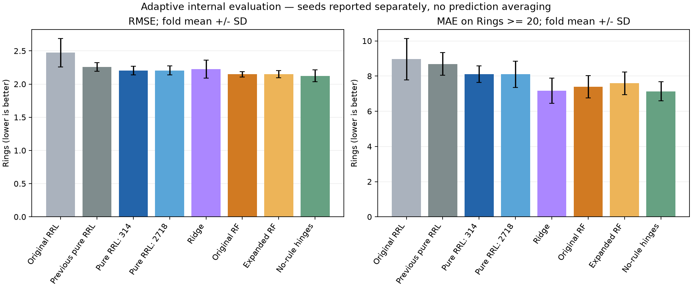

# Abalone：纯规则 RRL 新一轮优化

本轮模型的全部预测信息经过二值条件和 AND/OR 规则，输出为 $\hat y=b+\sum_j a_jR_j(x)$。训练保留 NLAF 与 Gradient Grafting，规则固定后只对规则激活拟合 Ridge 输出系数。两个训练种子分别报告，不平均两个模型的预测；交付种子事先固定为 314。第二至第四轮“规则＋连续/hinge”的混合模型另作历史旁支，本轮成绩不能与其混称。

## 1. 结果事实与适用边界

| 方法 | RMSE | MAE | R² | Rings≥20 MAE |
| --- | --- | --- | --- | --- |
| 原始回归 RRL | 2.47256 ± 0.21637 | 1.75575 ± 0.14848 | 0.40913 ± 0.07216 | 8.95960 ± 1.18463 |
| 旧纯规则流程 | 2.25743 ± 0.06517 | 1.60463 ± 0.04848 | 0.50755 ± 0.01799 | 8.69186 ± 0.65371 |
| 本轮纯 RRL（314） | 2.20336 ± 0.06690 | 1.56380 ± 0.04749 | 0.53074 ± 0.02170 | 8.10676 ± 0.47382 |
| 本轮纯 RRL（2718） | 2.20476 ± 0.06875 | 1.56121 ± 0.04232 | 0.53021 ± 0.02040 | 8.09988 ± 0.75112 |
| 普通 Ridge | 2.22385 ± 0.13587 | 1.58712 ± 0.06936 | 0.52221 ± 0.03746 | 7.17027 ± 0.71822 |
| 原 RF | 2.14684 ± 0.03945 | 1.51396 ± 0.02399 | 0.55400 ± 0.02771 | 7.38580 ± 0.63227 |
| 扩展搜索 RF | 2.14786 ± 0.05309 | 1.51660 ± 0.03474 | 0.55378 ± 0.02538 | 7.59144 ± 0.64936 |
| 无规则分段线性 | 2.12436 ± 0.08854 | 1.53070 ± 0.06103 | 0.56371 ± 0.02826 | 7.13618 ± 0.54958 |

表中为相同外层五折的指标算术均值 ± 折间样本标准差，不是置信区间；尾部每折样本少，不能只用全局 RMSE 评价。旧纯规则流程的 2.25743 已按原逐折配置重现。原 RF、扩展 RF、普通 Ridge 和无规则分段线性均读取原始结果，不因本轮表现调整其配置或分数。

| 当前训练种子 | 参照 | 平均 RMSE 差：本轮−参照 | 本轮更好折数/5 |
| --- | --- | --- | --- |
| 314 | 旧纯规则流程 | -0.05407 | 5 |
| 314 | 原 RF | 0.05652 | 0 |
| 314 | 扩展搜索 RF | 0.05550 | 0 |
| 314 | 无规则分段线性 | 0.07900 | 0 |
| 2718 | 旧纯规则流程 | -0.05268 | 5 |
| 2718 | 原 RF | 0.05792 | 0 |
| 2718 | 扩展搜索 RF | 0.05690 | 0 |
| 2718 | 无规则分段线性 | 0.08040 | 0 |

种子 314 相对旧纯规则流程的平均 RMSE 差为 -0.05407，相对扩展 RF 为 +0.05550（负值更好）。种子 2718 相对旧纯规则流程的平均 RMSE 差为 -0.05268，相对扩展 RF 为 +0.05690（负值更好）。两个种子中有 2 个改善旧纯规则流程，有 0 个低于扩展 RF；其余结果同样保留。这些是预测结果的比较，不能由差值断言某一模块贡献了多少。两种子共享数据、划分与选参流程，不是十个独立样本；仅一个种子改善时应报告初始化敏感性，不能只展示较好的种子。

本次实际结果中，两个种子均在五折全部优于旧纯规则流程，但也均在五折全部弱于原 RF 和扩展 RF。因此本轮确实缩小了纯 RRL 的差距，尚未超过随机森林。

| 方法 | 外层折 | RMSE | MAE | R² | 尾部 MAE |
| --- | --- | --- | --- | --- | --- |
| 本轮纯 RRL（2718） | 1 | 2.21645 | 1.55299 | 0.54765 | 8.17142 |
| 本轮纯 RRL（314） | 1 | 2.20362 | 1.53353 | 0.55287 | 8.08853 |
| 本轮纯 RRL（2718） | 2 | 2.18776 | 1.54630 | 0.50765 | 9.17624 |
| 本轮纯 RRL（314） | 2 | 2.18084 | 1.55905 | 0.51076 | 8.92835 |
| 本轮纯 RRL（2718） | 3 | 2.13222 | 1.51385 | 0.55084 | 8.12238 |
| 本轮纯 RRL（314） | 3 | 2.13570 | 1.51790 | 0.54937 | 7.84773 |
| 本轮纯 RRL（2718） | 4 | 2.17231 | 1.56370 | 0.51009 | 7.06323 |
| 本轮纯 RRL（314） | 4 | 2.18207 | 1.56752 | 0.50567 | 7.89563 |
| 本轮纯 RRL（2718） | 5 | 2.31506 | 1.62922 | 0.53481 | 7.96611 |
| 本轮纯 RRL（314） | 5 | 2.31457 | 1.64101 | 0.53500 | 7.77358 |

## 2. 从观察、假设到实现

此前扩大纯 RRL 容量仍落后强基线；混合路线又显示连续分段项提供了很强的预测力。因此本轮回到规则内部：一是原 Sex 删除 F，而首逻辑层没有显式 NOT，完整 F/I/M 词表可能让组合更直接；二是原逻辑连接都低于 0.5，初始 AND 恒真、OR 恒假，短规则初始化可能更快提供有区分力的表示。这些是待检验假设，不能把原初始化说成断梯度错误。阈值是训练前生成的 buffer，不由 Adam 学习；本轮实际冻结的候选沿用分位数阈值，没有把局部监督切点接口的存在写成已验证收益。沿用旧锚点的 log 预处理仅为控制变量，不再写成由 EDA 推导并验证有效的优化。

配对初始化按公共输入条件名称分别使用稳定随机流，输出层与批次顺序独立；添加 F 不移动已有 I/M、连续条件或输出初值。短规则从共享 drop-first 词表选择不同原始特征的 1/2/4 个条件，避免同一特征的矛盾字面量；完整词表新增 F 初始保留小正值、之后可学习。未选连接不是永久屏蔽。不同测量高度相关，所以逻辑上不矛盾的组合仍可能在训练样本中恒真或恒假，须由支持度诊断检验。

输出始终只有规则项。早停每次在训练子集拟合纯规则 Ridge 头，再用停止验证子集评价；确定轮数后，用完整当前训练集合重训规则并重拟合头。这样停止准则与交付预测流程一致。候选同时保留固定 320 轮及输出头正则强度对照，但不能只因为最终配置含某项就宣称该项起主要作用。

冻结设计见 [design.json](../results/abalone/pure_rrl/design.json)。共 9 组候选全部进入每个外层训练集合的三折内部验证，两种子共 270 条内部评分；按六次内部 RMSE 均值选配置，外层标签只评价。开发划分只作诊断，不用于过滤候选。初始方案曾计划开发筛选，在任何外层训练/得分前修正为全部候选进入内层，初稿另存 design_initial.json。早停的 20% 子集还在每次训练集合内部，不能把它与外层测试折混同。

## 3. 开发阶段的独立对照（包括失败尝试）

| ID | 候选 | RMSE 314 | RMSE 2718 | 训练 RMSE 均值 | 停止轮数314/2718 | 不同非常量规则均值 | 逻辑边均值 |
| --- | --- | --- | --- | --- | --- | --- | --- |
| 0 | reference | 2.12399 | 2.13216 | 2.04569 | 30/20 | 119.50000 | 1283.50000 |
| 1 | full_sex | 2.13693 | 2.14190 | 2.05357 | 20/20 | 117.50000 | 1104.00000 |
| 2 | short_1 | 2.12118 | 2.11839 | 2.04087 | 20/20 | 116.00000 | 1513.00000 |
| 3 | short_2 | 2.12293 | 2.11488 | 2.03122 | 20/40 | 108.00000 | 2009.50000 |
| 4 | short_4 | 2.15242 | 2.14114 | 2.07645 | 20/20 | 94.50000 | 2176.00000 |
| 5 | full_sex_short_2 | 2.13054 | 2.11291 | 2.03671 | 20/30 | 109.00000 | 1932.00000 |
| 6 | fixed_320 | 2.15243 | 2.13388 | 1.99389 | 320/320 | 122.00000 | 2279.00000 |
| 7 | head_alpha_1 | 2.26964 | 2.27176 | 2.34264 | 20/10 | 117.00000 | 950.50000 |
| 8 | short_2_head_alpha_1 | 2.33903 | 2.33997 | 2.43016 | 10/10 | 88.00000 | 1517.00000 |

| 单项对照 | ΔRMSE 314 | ΔRMSE 2718 | Δ逻辑边均值 | Δ不同非常量规则均值 |
| --- | --- | --- | --- | --- |
| reference → full_sex | 0.01294 | 0.00974 | -179.50000 | -2.00000 |
| reference → short_1 | -0.00281 | -0.01376 | 229.50000 | -3.50000 |
| reference → short_2 | -0.00106 | -0.01728 | 726.00000 | -11.50000 |
| reference → short_4 | 0.02843 | 0.00898 | 892.50000 | -25.00000 |
| reference → fixed_320 | 0.02844 | 0.00173 | 995.50000 | 2.50000 |
| reference → head_alpha_1 | 0.14565 | 0.13960 | -333.00000 | -2.50000 |
| short_2 → full_sex_short_2 | 0.00762 | -0.00197 | -77.50000 | 1.00000 |
| short_2 → short_2_head_alpha_1 | 0.21610 | 0.22510 | -492.50000 | -20.00000 |
| head_alpha_1 → short_2_head_alpha_1 | 0.06939 | 0.06821 | 566.50000 | -29.00000 |

此表的差值为“箭头右侧减左侧”，负的 RMSE 差表示改动有益。两个种子同时改善才比单个最优分数更支持方向；规则数量/长度变化提供机制线索，但不能代替验证误差。开发集已在历史探索中使用，因此这些对照是诊断证据，不能包装成独立确认；所有候选均保留，未按外层结果补充方案。

独立诊断中，short_1/short_2 在两个种子都小幅改善开发 RMSE，但最终平均条件数从参照的 10.03 增至 11.82/15.70，非常量规则数均值从 122.0 降至 117.0/109.0。因此“短初始化改善预测”得到局部支持，“最终更简洁、有效规则更多”的解释没有得到支持。完整 Sex 词表在两个种子都退步，与 short_2 组合也没有稳定增量；不能因为表达形式更直接就认定泛化更好。short_4 初始非常量规则只有 77/82 个，开发两个种子均退步，提示相关测量使结构上一致的多条件组合仍可能缺少样本支持。提高规则头 alpha 到 1 后训练和验证误差都更差，与更强收缩造成欠拟合的解释一致；但 alpha 同时改变早停轮数和最终规则，不能称为同一固定规则上的纯正则化效应。

## 4. 外层选参、去项消融与规则机制

| 外层折 | 候选ID | 名称 | 轮数314 | 轮数2718 |
| --- | --- | --- | --- | --- |
| 1 | 0 | reference | 10 | 40 |
| 2 | 0 | reference | 20 | 40 |
| 3 | 1 | full_sex | 10 | 20 |
| 4 | 0 | reference | 60 | 10 |
| 5 | 3 | short_2 | 30 | 20 |

| 对照版本 | 种子 | 适用折数 | ΔRMSE 对照−选中方案 | 选中方案更好折数 | ΔMAE | Δ逻辑边 |
| --- | --- | --- | --- | --- | --- | --- |
| no_earlystop | 2718 | 5 | 0.05208 | 5 | 0.03940 | 936.20000 |
| no_earlystop | 314 | 5 | 0.06877 | 5 | 0.05011 | 1018.40000 |
| reference | 2718 | 5 | -0.00051 | 1 | 0.00223 | -13.00000 |
| reference | 314 | 5 | 0.00511 | 1 | 0.00055 | -5.80000 |
| drop_first | 2718 | 1 | -0.00565 | 0 | -0.00334 | 362.00000 |
| drop_first | 314 | 1 | -0.00133 | 0 | -0.01010 | 441.00000 |
| empty_init | 2718 | 1 | 0.00311 | 1 | 0.01446 | -427.00000 |
| empty_init | 314 | 1 | 0.02691 | 1 | 0.01286 | -470.00000 |

reference 是整套配对参照，不是单项消融；no_earlystop 固定训练 320 轮；drop_first、empty_init、head_alpha_01 分别撤去完整词表、短规则初始化或更强规则头正则化。后几项仅在被选配置包含相应改变时生成，适用折数不足五折不能隐藏。消融是固定所选配置后去一项、按同一规则重新选停止轮数，不是为每个去项方案另做完整超参搜索。差值为“对照减选中方案”，正值才支持保留该项；方向和开发表的正负定义相反，CSV保留完整配对记录便于复核。

本轮最一致的正向消融证据来自早停：相对同配置固定训练 320 轮，种子 314 平均下降 0.06877，5/5 折改善；种子 2718 平均下降 0.05208，5/5 折改善，合计 10/10 个配对更好。这支持控制训练时长，而不能把相对历史流程的全部改善都归给早停。完整词表只在一折被选中，去掉它在两个种子都更好；短规则也只在一折被选中，该折去掉它会退步，支持范围有限。全数据最终选中的仍是 reference，未采用完整词表或短规则初始化，因此不能将最终交付描述为已经验证并采纳这些核心改进。

| 种子 | 折 | 初始非常量 | 最终非常量 | 不同非常量 | 常量数 | 边数 | 平均条件数 | 硬边净变化率 | 训练 RMSE | 外层 RMSE |
| --- | --- | --- | --- | --- | --- | --- | --- | --- | --- | --- |
| 314 | 1 | 0 | 119 | 114 | 9 | 818 | 6.39062 | 0.02266 | 2.13326 | 2.20362 |
| 314 | 2 | 0 | 120 | 119 | 8 | 1256 | 9.81250 | 0.03480 | 2.09423 | 2.18084 |
| 314 | 3 | 0 | 117 | 113 | 11 | 807 | 6.30469 | 0.02228 | 2.15473 | 2.13570 |
| 314 | 4 | 0 | 116 | 115 | 12 | 1848 | 14.43750 | 0.05120 | 2.02474 | 2.18207 |
| 314 | 5 | 119 | 110 | 109 | 18 | 2003 | 15.64844 | 0.05366 | 2.01755 | 2.31457 |
| 2718 | 1 | 0 | 119 | 113 | 9 | 1645 | 12.85156 | 0.04557 | 2.03461 | 2.21645 |
| 2718 | 2 | 0 | 123 | 120 | 5 | 1689 | 13.19531 | 0.04679 | 2.03867 | 2.18776 |
| 2718 | 3 | 0 | 121 | 119 | 7 | 1263 | 9.86719 | 0.03487 | 2.09092 | 2.13222 |
| 2718 | 4 | 0 | 124 | 121 | 4 | 818 | 6.39062 | 0.02266 | 2.13061 | 2.17231 |
| 2718 | 5 | 116 | 108 | 107 | 20 | 1934 | 15.10938 | 0.05081 | 2.03331 | 2.31506 |

Support 是规则在当前训练集合中的激活比例；0/1 支持度为训练样本上的常量规则。“不同非常量”按训练激活向量计数，不证明逻辑全局等价；硬边净变化率比较初始和最终选边状态，不等于训练全过程跨门槛次数。短规则只约束初始化，训练仍可开启新边，不能因此声称最终规则更短；最终长度与复杂度由表中实际结果判断。只有误差与机制同时符合预期，才支持具体解释，不能把规则越多直接当成优化成功。

## 5. 最终单模型、核查与成本

最终候选为 0（reference），按全部外层训练集合的内部评分均值选择，固定种子 314，全数据重训轮数 30。配置为 `{"alpha": 0.999, "beta": 8, "epochs": 320, "full_categories": false, "gamma": 3, "init_literals": 0, "loss": "huber", "lr": 0.002, "min_delta": 0.001, "monitor_every": 10, "paired_init": true, "rule_head_alpha": 0.1, "stop_patience": 3, "structure": "20@64", "threshold": "quantile", "transform": "log", "use_not": false, "wd": 0.0}`。最终含 128 个逻辑节点、118 个训练非常量规则、117 个不同非常量激活模式、1559 条逻辑边，平均每节点 12.180 个条件。全数据模型没有独立测试成绩；上面的五折表评价的是内层选参流程，不能冒充最终 checkpoint 的外部验证。

保存于 [final_model.pth](../results/abalone/pure_rrl/final_model.pth)、[全精度规则 JSON](../results/abalone/pure_rrl/final_rules.json) 和 [可读规则](../results/abalone/pure_rrl/final_rules.md)。独立 NumPy 规则执行与全部新外层预测的最大绝对差为 1.78e-15，最终 checkpoint/JSON 的最大差为 0；旧纯规则逐折复现最大预测差为 1.78e-15。本报告生成时还核查数据/源文件哈希、每个内部候选×折×种子的完整性、内层选优、训练与评价索引隔离、停止子集归属、外层指标重算、训练预处理和纯规则图结构。

本轮 14 项 pytest 检查已全部通过，覆盖旧路径兼容、新类别词表、初始化配对、短规则一致性、阈值边界、停止流程及导出/重载。独立审计 [audit.json](../results/abalone/pure_rrl/audit.json) 已通过。

| 阶段 | 评分记录数 | 规则网络训练次数 | 累计训练轮数 | 记录用时/小时 |
| --- | --- | --- | --- | --- |
| dev | 18 | 34 | 1780 | 0.01226 |
| inner | 270 | 510 | 27980 | 0.16174 |
| outer | 34 | 58 | 5240 | 0.04707 |

训练次数包含早停试训后的完整集合重训；累计轮数同样计入两段。记录用时为各 trial 的实际耗时之和，包含该 trial 的输出头拟合与导出，未包括历史复现、全数据最终训练、报告生成及中断等待；没有运行时价格数据，不把机器时间换算成货币费用。逐次配置、训练索引、停止曲线和耗时保留在 trials/。运行入口为 `python experiments/abalone_pure_rrl.py all`；训练结束后执行 `python analysis/abalone_pure_report.py` 重新核查并生成本报告。

本轮重新聚焦纯规则表示，但仍反复研究同一份 Abalone 数据。当前成绩属于自适应内部评价，换训练种子或重做同一五折不能构成独立确认；不能承诺纯 RRL 必须超过 RF，也不能只保留有利尝试。第二至第四轮混合模型的结果和失败对照完整保留，参见 [第二轮](ABALONE-EXPLORATION.md)、[第三轮](ABALONE-ROUND3.md)；本轮相应方案见 [纯 RRL 计划](ABALONE-RRL-PLAN.md)。
