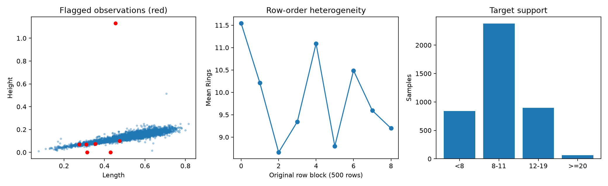
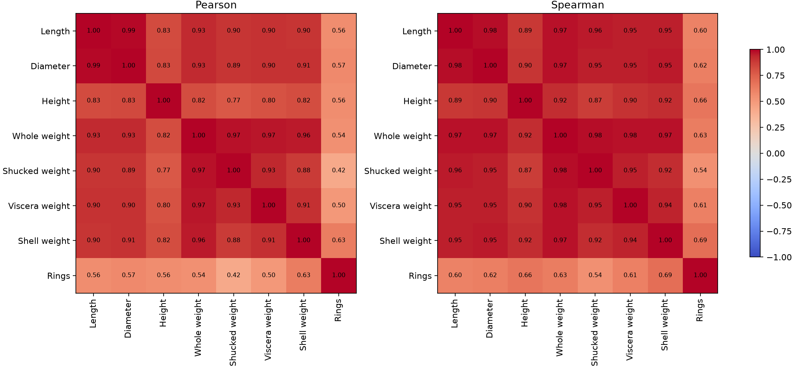
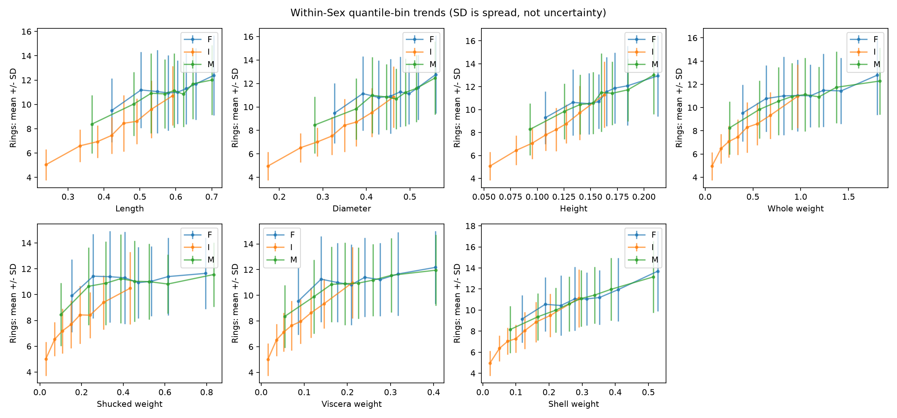
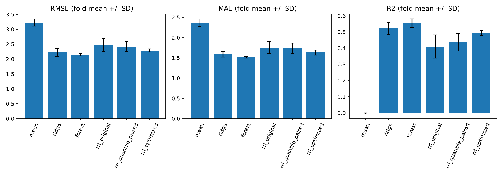
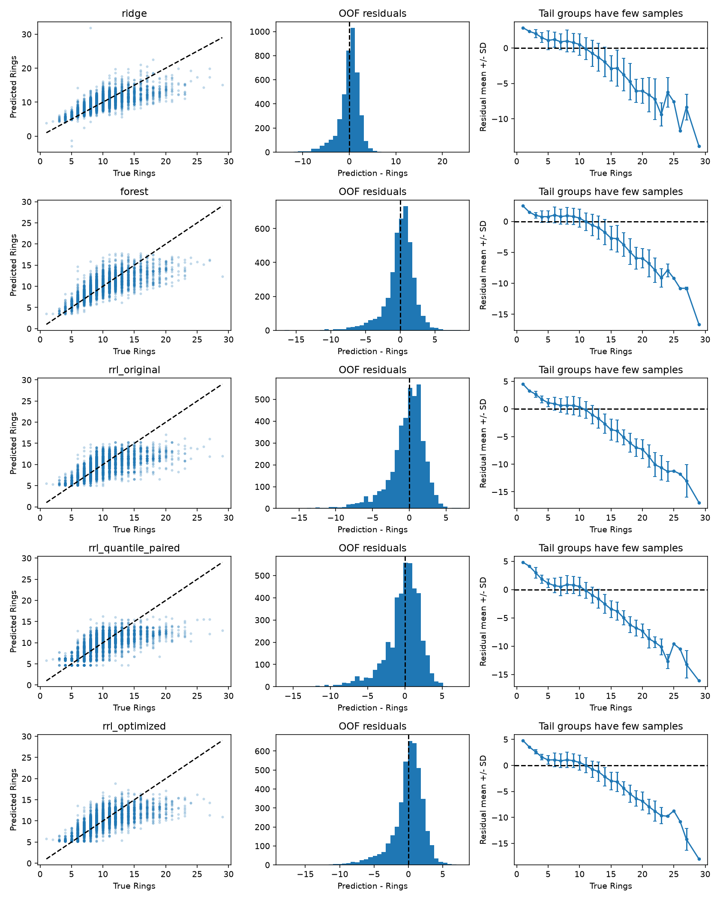
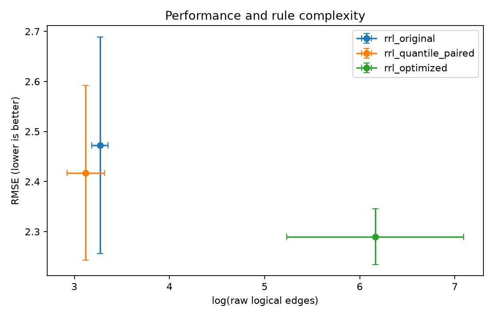

# Abalone：数据证据、回归规则与实验历程

本任务用 `Sex` 和七个测量特征预测 Rings。以下实验保留原始行号，目标保持连续预测；不对预测取整或按测试集范围裁剪。年龄约为 Rings+1.5，添加常数不会改变环数预测误差。本报告与 [DIA 报告](DIA-REPORT.md) 采用相同研究流程，具体处理由 Abalone 的证据决定。

**后续探索已完成：** 本文保留第一轮24组搜索的完整历史。[第二轮](ABALONE-EXPLORATION.md)曾降至RMSE 2.145，但规则增量未获支持；[第三轮完整报告与心路历程](ABALONE-ROUND3.md)进一步强化RF、分组正则化、早停和双初始化，改进RRL主五折RMSE为2.10283，扩展RF为2.14786，五折均改善；额外两组固定配置的五折平均也优于RF。匹配去规则消融支持规则增量。结论限于自适应内部实验，尚无独立外部确认；新结果不覆盖原始证据。

[第四轮扩展探索](ABALONE-ROUND4.md)已完成：588条开发评分、120条内层评分，尝试局部规则斜率、正则化细调及更多成员。没有扩大优势，主五折RMSE为2.10609，最终配置回到第三轮；因此仍推荐第三轮，第四轮作为失败假设及复现审计的补充证据保留。

## 1. 数据来源、定义与质量审查

本地 [官方说明](../data/raw/abalone/abalone.names) 指向 Tasmania 渔业研究数据；原始研究用于估计鲍鱼年龄，环数需切壳、染色并在显微镜下数取。`Sex` 中 I 指幼体，并非第三种生物学性别。长度为最长壳尺寸，Diameter 为垂直方向直径，Height 含壳内肉；Whole、Shucked、Viscera、Shell 分别为整体、肉、放血后内脏、干燥壳重量。说明同时声明连续数据已除以 200，因此不能把文件里的 0.5 直接称为实际 0.5 mm；实验使用发布值，规则也以发布值解释。Shell 是干重、Viscera 是放血后重量，不能机械要求三个组成重量之和精确等于整体重量。

4177 条记录包含 8 个输入和 Rings；没有缺失、非有限值、重复整行，也没有重复输入，暂不需要分组防重复泄漏。七条记录被测量一致性检查标记：两条 Height=0、一条 Height>Length、四条肉重量大于整体；一条壳重量大于整体的记录与 Height=0 重合。完整原始行号与标记见 [suspect_records.csv](../results/eda/abalone/suspect_records.csv)，计数见 [quality.json](../results/eda/abalone/quality.json)。这些是复核线索，不能据此猜测正确数值。0.515 的高度虽极端但未违反预定高度大于长度规则，保留；主实验全部保留，敏感性实验只从训练折移除七条中的训练记录，测试集始终完整。

移除标记行后的 Height 标准差从约 0.0418 降至 0.0388，比例 1.0785；其余特征标准差比例约 1，证据见 [scale_sensitivity.csv](../results/eda/abalone/scale_sensitivity.csv)。因此少数可疑高度会影响标准化，但“存在异常”不足以证明清洗能提升预测，需要比较相同测试折的误差。



原始行顺序也并非均匀混排：每连续 500 条的 Rings 均值约在 8.66–11.54 之间变化，I 比例约 0.188–0.408，见 [row_order_blocks.csv](../results/eda/abalone/row_order_blocks.csv)。无法据此断言它们是采样地点或时间批次，但能排除直接按头尾切分而不解释其分布差异的做法。采用固定打乱五折评价当前数据的同分布泛化；没有采样群组信息，不能宣称验证了跨地点泛化。

## 2. 六类 EDA 及进一步推理

已有六类图完整保留在 [EDA.md 的 Abalone 章节](EDA.md#abalone回归)。补充脚本为 [abalone_eda.py](../analysis/abalone_eda.py)，按整体和 F/I/M 分组统计中心位置、标准差、IQR、偏度、1%/99%分位数、零值与 IQR 离群数量，见 [group_statistics.csv](../results/eda/abalone/group_statistics.csv)。

**中心位置与离散程度。** Rings 均值 9.934、中位数及众数 9，标准差 3.224，四分位区间 8–11；I/F/M 平均 Rings 分别约 7.890/11.129/10.705。因此保留 Sex 并 One-Hot，不能用 1/2/3 赋予虚假顺序。连续测量的众数受测量精度和取整影响，不把它当作稳定的“典型形态”。Length 与 Diameter 的偏度分别约 -0.640/-0.609，重量偏度约 0.531–0.719，Height 为 3.129，目标为 1.114：并非所有输入都强右偏，也不应对全部字段强制对数变换。

**箱线图、直方图与分位数。** Height 有 29 个 IQR 离群记录，Rings 有 278 个，但只有七条记录满足预定测量疑点条件。IQR 是描述性边界，不能把超出边界的 278 个目标视为错误删除。Rings>=20 仅 62 条（约1.48%），正式表格同时报告尾部样本数、MAE 和有符号偏差；样本很少使尾部评价方差较大。高年龄并不等于大尺寸，尾部无法仅凭单个测量识别。

**相关性与散点。** Length/Diameter Pearson r≈0.987、Whole/Shucked r≈0.969，支持在线性基线中比较 L2；不足以自动支持删特征。目标 Spearman 相关性中 Shell≈0.692、Height≈0.658，分别高于 Pearson≈0.628/0.557，提示单调关系可能更强、线性或异常观测会影响 Pearson。两种相关系数见 [pearson.csv](../results/eda/abalone/pearson.csv) 和 [spearman.csv](../results/eda/abalone/spearman.csv)，相关性不能证明因果，也不能推出所有共线变量无额外预测信息。





进一步在每个 Sex 组内按输入八分位分箱，点表示箱内输入与 Rings 均值，误差棒是 Rings 标准差，**不是均值置信区间**。肉重、内脏重在成年组的曲线存在平台，壳重较持续上升；相近测量下 Rings 仍宽幅分布，箱内标准差约 1.2–3.8 环。这支持保留非线性模型与目标误差诊断，但不能仅据图宣称不可约误差大小。各组分箱边界不同，曲线差异也不能直接解释为控制所有混杂后的性别效应。[条件趋势原始统计](../results/eda/abalone/conditional_trends.csv) 提供每箱样本量。

## 3. 由 EDA 到可检验决策

| 证据                           | 风险或假设                         | 主处理或候选实验                               | 判断标准                         |
| ------------------------------ | ---------------------------------- | ---------------------------------------------- | -------------------------------- |
| 无缺失、无重复输入             | 无需为不存在的问题添加流程         | 显式校验输入，遇缺失或未知 Sex 报错            | 所有折均通过输入检查             |
| Sex 组有年龄阶段差异           | 丢弃或序数编码损失信息             | One-Hot，训练折确定类别                        | 三组误差分别报告                 |
| 七条测量疑点，主要改变高度尺度 | 错误记录可能干扰拟合               | 主实验保留；固定 RRL 训练折去疑点敏感性        | 完整测试折上的 RMSE/MAE 差值     |
| 共线性强                       | 线性系数不稳                       | 手写 Ridge 内层选择 L2；RRL/RF 保留全特征      | 内层 RMSE 和外层误差             |
| 偏态及不同经验密度             | 随机阈值覆盖不足                   | 同预算随机/分位数 RRL 消融                     | 相同外层折的成对差值             |
| 单调非线性、成年组平台         | 线性欠拟合；均匀阈值不一定区分目标 | RF 基线、方差下降阈值候选                      | 内层 RMSE 选配置                 |
| 目标右尾稀少                   | RMSE 被少量大误差影响，尾部低估    | RMSE 为主指标，MAE/R²为辅，MSE/Huber 候选     | 全局指标与 >=20 子集误差同时展示 |
| 连续特征的偏态方向并不一致     | 单凭偏度无法推断变换能改善预测     | EDA 不据此指定统一变换；变换效用由匹配实验判断 | 只按训练集内的验证结果选择       |

变换选择保持克制：不默认 PCA、删相关特征或重加权高 Rings；未进行无依据的数值修正。目标标准化是优化尺度处理，不是改善目标分布的统计假设；先在训练子集拟合均值、标准差，预测还原 Rings 后评价。其必要性未由单独消融证明，因此只称为固定训练约定。

## 4. 回归适配、评价与冻结设计

课程 PDF 第3.1节明确允许修改 loss 适配回归。我们复用原始 AND/OR、NLAF 与 Gradient Grafting，仅在独立回归适配器中使用单输出、数值标签、MSE/Huber 和回归预测。源码核查发现 `RRL.clip()` 本就仅裁剪逻辑层，不裁剪线性输出，不需要为此修改共享核心。分类 softmax 温度在回归中不参与前向，固定为1并冻结；没有类别加权。每个结构尾部的数字 n 表示 n 个 AND 和 n 个 OR 节点，`5@16` 因此有32个逻辑节点。

训练目标 y'=(y-μ)/σ，输出还原为 yhat=μ+σ(b+Σw_j R_j)。规则权重也乘以σ、偏置加μ，能够以“环”解释。使用 Adam，batch=128，每100 epoch 学习率乘0.75；逻辑权重每步裁剪至[0,1]。标准化参数和阈值始终只在当前训练子集拟合。

共同外层 `KFold(5, shuffle=True, random_state=0)`，内部三折 seed=100+外层编号。手写 Ridge 候选 λ=0/.001/.01/.1/1，目标为平均平方误差+λ||w||²、不惩罚截距，使用 NumPy 线性代数求解。RF 使用150棵树，比较深度8/不限制与叶节点1/5/10。所有调参以内层平均 RMSE 为准。均值预测提供朴素参照。

指标均在原始 Rings 单位计算：

$$
\mathrm{RMSE}=\sqrt{\frac{1}{n}\sum_i(\hat y_i-y_i)^2},\qquad
\mathrm{MAE}=\frac{1}{n}\sum_i|\hat y_i-y_i|,\qquad
R^2=1-\frac{\sum_i(\hat y_i-y_i)^2}{\sum_i(y_i-\bar y_{test})^2}.
$$

RMSE 关注大误差，MAE 易解释为平均相差几环，R²相对测试折目标均值表示解释能力，允许为负。测试均值只用于 R²定义，不进入模型。Bias=mean(yhat-y)，负值表示低估。正式比较报告逐折均值±样本标准差；按Sex、环数区间和疑点分组的表则汇总折外预测，不能把两种聚合结果混为同一个数字。

RRL 原始基线固定随机阈值、`5@16`、lr=.002、L2=.001、NLAF(.9,3,3)、100 epoch。分位数初版使用相同种子和参数，但审计发现随机阈值会额外消耗随机数，使后续逻辑权重初值不同。因此另补 `rrl_quantile_paired` 五折：固定阈值前消耗与随机基线相同数量的随机数，并用测试确认逻辑与输出权重初值逐位相同。该版本才是严格对齐初始化的阈值消融；初版结果保留，不掩盖审计修正。补充实验不进入联合搜索排名，不改变已选最终模型。

清洗敏感性只换训练记录，因此训练数据量和打乱后样本顺序变化也属于该干预，不能进一步把效果归因于某一单条样本。联合搜索24组：6组锚点+固定种子18组抽样，覆盖三种阈值、五种结构、学习率、L2、三组NLAF、轮数、MSE/Huber、log1p及NOT。方差阈值仅用训练标签，按子集加权方差下降选择，限制两侧至少5%训练样本。

搜索空间和数据 SHA256 在第一次模型结果前保存在 [design.json](../results/abalone/design.json)。这样初版残差用于检验预先提出的假设，不能在看过同一外层测试结果后扩大搜索，再把评价描述为全新的独立确认。全数据 EDA 仍参与了研究设计，故本实验是课程内部验证，未提供外部确认。24组 RRL 与5/6组基线的搜索预算不同，比较不等于等计算预算竞赛。

## 5. 结果与实验历程

### 5.1 五折主结果

下表为逐折均值±样本标准差，所有模型评价同一4177条记录；RMSE、MAE、尾部MAE越小越好，R²越大越好。尾部每折分别14、9、11、10、18条，因此尾部五折均值与把62条折外预测合并计算的数值不同。

| 模型                   |                   RMSE |                    MAE |                    R² | Rings>=20 MAE |
| ---------------------- | ---------------------: | ---------------------: | ---------------------: | ------------: |
| 训练均值预测           |           3.224±0.122 |           2.364±0.097 |          -0.003±0.004 | 11.692±0.684 |
| 手写 Ridge             |           2.224±0.136 |           1.587±0.069 |           0.522±0.038 |  7.170±0.718 |
| 随机森林               | **2.147±0.039** | **1.514±0.024** | **0.554±0.028** |  7.386±0.632 |
| 原始回归 RRL           |           2.473±0.216 |           1.756±0.148 |           0.409±0.072 |  8.960±1.185 |
| 分位数 RRL（对齐初值） |           2.417±0.175 |           1.740±0.127 |           0.436±0.054 |  8.851±0.955 |
| 优化 RRL               |           2.290±0.055 |           1.634±0.062 |           0.493±0.015 |  8.363±0.613 |



原始 RRL 明显优于均值参照，但弱于两种基线。优化后 RMSE 相对原始版降低约7.4%，R²由0.409升至0.493，折间波动也下降；仍比 Ridge 的 RMSE 高0.066，比 RF 高0.143。这个结果与 DIA 不同，不能把“使用相同实验流程”误解为必须得到相同模型排名。RF 的平均误差最低；Ridge 用少量线性系数取得接近结果，解释也更紧凑；当前 RRL 的优势是可执行离散规则，而非领先的回归精度。

Ridge 的内层选择在两折为 λ=0、三折为0.001；这说明共线性支持“提供正则化选择”，不支持“必须强正则化”。RF 五折全部选叶节点最少10个样本，四折不限制深度、一折深度8，表明适度叶节点平滑优于本候选集中的很小叶节点。

### 5.2 预处理与结构假设实际奏效了吗？

**分位数覆盖假设得到部分支持。** 对齐初值后，分位数版在五折中的四折降低 RMSE，平均差值为-0.055环；一折反而增加0.035。对应 [成对差值](../results/abalone/rrl_quantile_paired_paired_delta.csv)。进一步回查训练数据，原始随机阈值约5.14%的大于条件激活率小于1%或大于99%，分位数版为0；每个特征阈值的平均激活率跨度从0.623增至0.666，见 [threshold_diagnostics.csv](../results/abalone/threshold_diagnostics.csv)。这直接支持覆盖改善的机制，但性能提升有限，不证明它是唯一瓶颈。

**初始化审计改变了我们对消融的表述。** 未对齐随机数消耗的初版分位数结果为 RMSE 2.398±0.100；审计后的对齐版为2.417±0.175。两者都保留在汇总文件。相同随机种子不自动等于相同初始权重，不能只保留更好看的2.398并称为严格控制变量。追加五折只用于校正这一证据强度，没有加入搜索候选或重新选择最终模型。

**测量疑点不意味着统一删除能解决问题。** 只移除训练折疑点后，原始 RRL 平均 RMSE 从2.473降到2.417，但各折变化为+0.078、-0.050、-0.006、-0.003、-0.298，改善主要集中在一折；尾部MAE反而平均增加0.211。见 [清洗敏感性](../results/abalone/rrl_clean_sensitivity_paired_delta.csv)。主实验继续保留全部数据，不能把测试中的疑点记录删除以提高成绩。折外七条疑点的 Ridge MAE 约6.902、RF约1.726、优化RRL约1.440，支持线性外推受可疑测量影响的担忧；样本仅七条，不能据此证明某个模型普遍鲁棒。

**匹配对照没有发现单独的 log1p 收益。** 在冻结搜索锚点上，分位数、100 epoch、`5@16` 的内层 RMSE 为2.382；仅加log1p后为2.3819，差约-0.00009，实际近乎相同。统一对所有连续特征取对数并不是由各特征偏度推导出的处理结论。它虽出现在联合配置搜索中，最终配置14也包含该变换，但多个设置共同变化，不能据此把效果归因于log1p；此处只保留为实际测试过但未显现独立收益的记录。作为其他匹配对照，仅换为有监督方差阈值后 RMSE 为2.619，仅把MSE换成Huber后为2.429，均未改善。单调变换基本保持分位数条件分组，是可验证的机制；贪心方差阈值可能集中于相近切分而减少覆盖、Huber可能削弱稀少高值的影响，则只是与结果一致的假设，尚未单独证实。完整对照见 [inner_ablation.csv](../results/abalone/inner_ablation.csv)。不同外层训练集合互相重叠，这五个内层汇总并非五次独立数据实验。

### 5.3 联合优化与最终配置

24组配置×3内折×5外折，共360次内层 RRL 训练，之后每个外层折选择一个配置重训。四折选配置14，一折选配置13。平均内层排名前3分别为：

| 配置 | 阈值/结构         | NLAF       | 学习率/L2    | 损失/变换/轮数      | 平均内层RMSE |
| ---- | ----------------- | ---------- | ------------ | ------------------- | -----------: |
| 14   | 分位数 /`10@32` | (.999,8,3) | .002 / 0     | Huber / log1p / 80  |        2.301 |
| 13   | 随机 /`10@32`   | (.999,8,1) | .001 / .0001 | Huber / 标准化 / 80 |        2.312 |
| 23   | 随机 /`10@32`   | (.9,3,3)   | .005 / .0001 | MSE / log1p / 160   |        2.319 |

前三均不显式加入NOT。结构更宽、阈值更多是这三组的共性，但联合搜索不能证明其中任一项独立造成全部提升。尤其不能说“Huber一定更好”：在小结构匹配对照中它变差，在更大结构的联合配置中却排在前列，反映了参数交互。

最终只按平均内层 RMSE 选择配置14，在全部4177个样本上训练：10个阈值/连续特征，一层32个AND+32个OR，学习率.002，无L2，NLAF(.999,8,3)，Huber损失、log1p后标准化、80 epoch、无显式NOT。log1p是联合搜索中留下的参数组合之一；它的匹配对照几乎持平，所以不作为有效改进或偏态分析推导出的建议。最终模型约40 KB，包含全部缩放状态。这里“优化RRL五折成绩”属于内层选择过程，不等于对配置14单独做了独立五折验证。

### 5.4 残差回到 EDA：剩下的问题是什么？



左列越接近对角线越好，中列展示残差分布，右列按真实Rings展示平均残差±组内标准差。多数模型在小 Rings 区间高估、在高 Rings 区间低估，符合 EDA 发现的目标集中和相同测量对应较宽年龄范围。按真实目标分组本身也会表现出向中间收缩，不能仅凭该图断言模型整体有系统偏差。

优化 RRL 在1–7、8–11、12–19、20+四组的折外 MAE 分别为1.283、1.253、2.509、8.296，样本量分别839、2378、898、62；高环数组的偏差为-8.296，62条全部被低估。RF 与 Ridge 同样未解决尾部低估。按Sex汇总，优化RRL在F/I/M上的MAE为1.932/1.229/1.734，平均偏差约-0.016/+0.059/-0.025。整体偏差接近零不代表各年龄段都准确，幼体较易预测也不意味着应删除成年样本。原始说明提到环境和地点可能提供额外信息，本数据未包含这些变量，不能承诺仅靠现有输入消除尾部误差。

### 5.5 性能与规则复杂度

| RRL 版本         | 原始逻辑节点数 |     逻辑边数 | log(逻辑边数) |
| ---------------- | -------------: | -----------: | ------------: |
| 原始版           |             32 |    26.4±2.3 |  3.270±0.085 |
| 对齐初值分位数版 |             32 |    23.0±4.6 |  3.120±0.198 |
| 优化版           |             64 | 593.2±281.8 |  6.162±0.930 |



优化增加了规则数量与条件连接，换来较低误差；这些节点包含空规则和未激活规则，不是去重后的有效规则数。最终模型为64个逻辑节点、720条边，人工理解成本明显高于简单线性系数。Ridge直接给出加性关系，但共线性限制单个系数的因果解读；RF由150棵树共同平均，单棵树可读，整体难以用少量规则概括；RRL规则能精确执行，但长规则和重复条件仍降低易读性。

### 5.6 实验历程与结论闭环

| 阶段       | 发现或假设                               | 采取的行动                               | 结果及是否解决                                 |
| ---------- | ---------------------------------------- | ---------------------------------------- | ---------------------------------------------- |
| 来源与质量 | 发布值已缩放、存在测量疑点、行顺序不均匀 | 核对定义、保存原始行号、固定打乱五折     | 处理依据可追溯；未擅自修正数值                 |
| EDA        | 分组差异、共线性、尾部稀少、单调非线性   | One-Hot、Ridge候选、尾部诊断、非线性模型 | 对应风险进入实验；未把异常和相关性当作删值指令 |
| 原始适配   | 分类代码不能直接回归                     | 单输出、数值目标、回归损失、目标反缩放   | 跑通并导出可执行规则，性能仍弱于基线           |
| 阈值与清洗 | 阈值覆盖不足、疑点可能干扰拟合           | 分位数对照及仅训练折清洗                 | 平均改善有限，清洗效果不稳定                   |
| 联合优化   | 单项改进不足                             | 冻结24组，内层选参、外层评价             | RMSE改善7.4%，仍未超过Ridge/RF                 |
| 消融审计   | 相同种子却未必相同权重初值               | 增加对齐随机数消耗的五折对照             | 修正因果归因强度，未只保留更漂亮的初版数字     |
| 交付审计   | 文本可能因舍入而偏离模型                 | 独立NumPy执行全精度JSON并重载checkpoint  | 最大数值差约1.62e-6环，输出可复核              |

**一次初始化审计让阈值消融更可信。** 最初看见分位数阈值结果变好时，我们回查训练调用路径，发现随机阈值版会先抽取切分点，分位数版则不会；相同随机种子因此没有带来相同的逻辑层初始权重。我们没有挑选较好看的初版分数，而是让分位数版补足相同的随机数消耗，并逐项检查两版初始权重一致，再补做五折对照。未对齐结果 RMSE=2.398、对齐结果为2.417，两者都保留。这个工程细节改变了结论强度：阈值覆盖的改善仍有证据，但应以配对结果为准，不能把随机初始化带来的差异也算作阈值收益。

**回归损失如何改动。** 原始 RRL 分类训练以类别 logits 和类别标签计算 `CrossEntropyLoss`；它回答“属于哪个类别”，不适用于直接衡量 Rings 数值误差。回归适配器改为单个线性实数输出，并对数值目标使用 `MSELoss`：$L_{MSE}=\frac{1}{N}\sum_i(\hat y_i-y_i)^2$。初版总损失为 $L=L_{MSE}+0.001\,L_2$；训练时的 Rings 先用当前训练子集的均值和标准差标准化，推理时再反标准化回环数。后续搜索也把 Huber 作为候选损失，但这不改变最初对应课程要求的核心改动：交叉熵换为回归损失。原始逻辑层与梯度嫁接没有因此改写。

本轮完成了课程要求的回归适配、两个基线（含手写）、结构优化、消融和解释性比较。成功之处是证据驱动的处理选择、原始RRL性能改善及可执行规则；未解决的是高龄低估、RRL落后于两种基线和规则复杂度增加。后续若开展新的方法探索，应使用新一轮预先规定的评价方案或独立数据确认，不能无限复用当前外层分数来筛选改进。

## 6. 解释忠实性的检查口径

回归任务不比较“类别是否相同”，而比较 Rings 数值。每折同时计算普通梯度嫁接前向、严格离散前向，以及从保存 JSON 读取阈值、AND/OR 连接和线性权重后由独立 NumPy 布尔运算得到的输出。前两者最大误差阈值为1e-5，独立导出规则相对模型为1e-4环，以容纳 float32 与 NumPy 累加顺序差异。该检查比只验证模型两种前向更接近“导出的解释可以执行”的要求。

规则图保留全部节点，包括空合取(TRUE)、空析取(FALSE)和训练中未激活的节点，避免按训练支持度删规则改变未来样本预测。复杂度因此使用未经剪枝的逻辑节点数与逻辑边数，不包含线性输出边；与 DIA 的去重简化规则计数口径不同，不能跨任务直接比较。文本用层/节点编号引用较深规则，避免重复展开成巨大表达式。JSON 包含预处理、全精度阈值、连接矩阵与原 Rings 单位输出权重；Markdown 为舍入后阅读版，不能声称舍入后的文字可逐位重现模型。

模型的一条规则贡献是权重×规则是否成立；正权重增加 Rings 预测，负权重减少，偏置和所有激活规则共同构成最终预测。Support 只是在训练样本中成立的比例，不是置信度或规则单独的预测准确性。多个高度相关条件不能自动解释为生物学因果机制。

例如最终L1R2要求 Diameter<=0.315、Whole weight<=1.51418、Viscera weight<=0.0405及<=0.33468、Shell weight<=0.36及<=0.43；可读时较宽的重复上界是冗余的。该节点Support≈0.0922，权重≈-0.5516环；成立时在总预测中贡献-0.5516环。最终偏置约9.9454环，不能只凭这条规则得出完整预测。保存图保留原连接便于审计，示例阈值已经舍入。

审计覆盖8种实验版本各五折、每种4177条恰好一次的折外预测、全部360次内层训练记录、各折训练预处理参数、最终配置选择、独立规则求值及checkpoint重载。全部折外规则相对模型最大差1.614e-6环，全数据最终模型差1.265e-6环，详见 [audit.json](../results/abalone/audit.json)。回归适配、对齐初值及手写模型测试与原有DIA测试共同通过（6 passed）。

## 7. 复现与交付

从项目根目录运行：

```bash
.venv/bin/python analysis/eda.py --dataset abalone
.venv/bin/python analysis/abalone_eda.py
.venv/bin/python models/rrl/prepare_abalone.py
.venv/bin/python experiments/run_abalone.py --stage initial
.venv/bin/python experiments/run_abalone.py --stage paired
.venv/bin/python experiments/run_abalone.py --stage search
.venv/bin/python experiments/run_abalone.py --stage final
.venv/bin/python analysis/abalone_model_comparison.py
.venv/bin/python -m pytest -q
```

`initial` 完成均值参考、手写 Ridge、RF、原始 RRL、分位数消融和清洗敏感性；`search` 完成24组×3内折×5外折及外层重训；`final` 只使用各外层搜索中的平均内层排名选择最终配置，在4177条记录上训练。脚本按已完成折与候选记录续跑；完整从零复现应在新项目副本使用空的 `results/abalone`，保留当前证据避免覆盖。`abalone.data/info` 是课程要求的兼容格式，回归入口直接读取同源官方 CSV，禁止使用分类入口把 Rings One-Hot 成29类。

源代码：[手写 Ridge](../models/manual_glm/ridge.py)、[RRL 回归适配器](../models/rrl/abalone.py)、[实验入口](../experiments/run_abalone.py)、[分析与审计](../analysis/abalone_model_comparison.py)。证据目录：[results/abalone](../results/abalone)；核心文件为 `design.json`、`fold_metrics.csv`、`summary.csv`、五份搜索记录、各模型逐折预测和规则，以及最终 `final_model.pth`、`final_config.json`、`final_rules.json/md`。最终 checkpoint 含模型参数、结构配置、输入预处理和目标缩放，可独立重载；NumPy 的 `predict_rules` 也可直接用最终 JSON 对相同字段的新记录推理，不要求提供真实 Rings。

最终模型的泛化成绩不能用全数据训练误差替代。外层表格评价的是内层选参后重训的整个过程，而不是单一最终配置的独立五折成绩；折间标准差不等于均值置信区间，五折也不支持轻率宣称统计显著性。所有材料供课程报告整合，正式PDF、成员分工与最终ZIP仍属于项目级交付整理。
