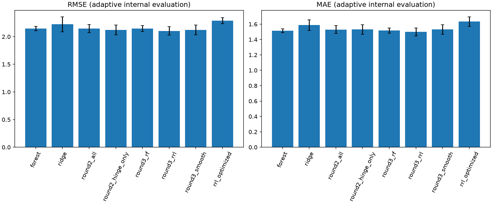

# Abalone 第三轮：强化RF对照，寻找规则真正的增量

## 为什么继续（2026-09-28）

用户要求尽可能多尝试，且希望RRL真正优于随机森林。第二轮RRL的RMSE为2.14504，RF为2.14684，差异不足以支持可靠优势；无规则分段线性对照2.12436更好。因此本轮不是继续扩大规则数量，而是检验规则如何在连续基线之外发挥作用，同时把RF调参做充分。

## RF此前为什么选这些参数？

此前固定150棵树，在每个外层训练集合内三折比较深度8/不限与叶节点最少1/5/10，共6组。选择依据是内层平均RMSE，不是外层测试分数。五折均选叶节点10，四折深度不限、一折深度8。例：第0折，不限深度且叶节点10的内层RMSE为2.1656776；深度8且叶节点10为2.1657081，差仅0.0000305；不限深度且叶节点1为2.2166124。叶节点10提供较平滑的预测，但不能说“不限深度确定更优”。150棵树是当时的固定工程预算，不是搜索出的最优值；此前没有搜索特征/样本采样比例，RF优化范围偏小。

证据：[第0折全部RF搜索记录](../results/abalone/forest/fold_0_search.json)。本轮保留6个旧配置，并以固定种子补足72组，覆盖树数150/400/800、深度6/8/12/20/不限、叶节点1/2/4/8/10/16/24、特征比例.4/.7/1、bootstrap样本比例.6/.8/全部。开发阶段使用两个随机种子，不选择幸运种子。

## 事前假设与设计

**分组正则化。** 第二轮所有输出系数共用一个λ，可能无法同时约束高方差规则和连续趋势。改为规则λ∈{.01,.1,1,10}、连续λ∈{.001,.01,.1}的12组组合。通过列缩放复用手写Ridge，截距不惩罚，仍以实际预测公式解释。

**残差规则。** 先在当前训练数据拟合分段线性基线，用其未解释的残差训练RRL，鼓励规则关注额外信息；最后仍在同一训练数据上联合拟合原始Rings的规则＋连续输出头。残差基线不能接触对应内层验证/外层测试。保留直接预测Rings的对照，不预设残差学习一定更好。

**早停与稀疏。** 在当前训练集合内部再划分80:20，仅用这部分停止验证确定训练轮数，然后在完整当前训练集合重新训练该轮数。残差基线也只在早停的训练子集拟合。比较20/80/160固定轮数、早停（最多320轮，每10轮检查，连续3次未改善停止）、不同宽度和阈值数量、逻辑边惩罚、MSE/Huber、NOT、NLAF与学习率。预定义37组网络，两种初始化，共74次开发网络训练（早停候选另有探测拟合），12个头对应888条单种子评分。

**初始化平均。** 额外比较两个独立训练种子模型的算术平均，不重复训练；简称双初始化集成，种子实际同时影响初值、batch顺序及早停内部划分，所以不能把全部收益只归因于权重初值。这不是对样本bootstrap的bagging。完整解释是两个成员公式的平均，复杂度按两个成员合计，不伪装成单一小模型。

**强对照。** 无规则连续模型单独比较10/20/40阈值、原值/log1p、三档L2，共18组。它独立于RRL逻辑层，不把它改名为RRL以获取胜出结论。

## 评价约定

沿用之前固定的开发训练/验证索引，冻结设计及数据哈希，不改旧记录。开发后按直接/残差、单模型/双初始化四类各选两条RRL候选，RF取前6，连续对照取前4；随后同一外层五折、三折内层选参。主指标RMSE，兼报MAE、R²、尾部和复杂度，不按外层分数继续追加候选。全部数据已经用于此前探索，所以本轮仍是自适应内部复核；更多搜索可能增加选择偏差，不能称为全新独立证据。目标是寻找真实的改进，不承诺一定胜出。

新产物位于 `results/abalone/round3`。关键节点测试、记录并推送；使用现有依赖和最小扩展，不覆盖前两轮。

## 节点一：开发结果与反省

72组RF×两个种子的144次拟合完成。开发前六包含150/400/800棵树、叶节点2/5/8/10及多种采样比例。最好配置54为400棵树、深度20、叶节点2、max_features=.4、max_samples=.8，开发平均RMSE=2.070497；旧空间中不限深度、叶节点5也进入前列（2.071629）。这说明旧的叶节点10不是对所有训练组成/种子都最优，树数也不是越大越好，不能把开发排名第一当成唯一答案。

RRL完成74次开发网络拟合（早停候选另含探测拟合）、888条输出头评分；双初始化平均复用已有预测，没再训练。最优为直接预测Rings、20@64、Huber、80轮、规则λ=.1/连续λ=.01、双初始化平均，开发RMSE=2.058175；20@128早停的双初始化版本为2.058594。单初始化平均前两名约2.06179/2.06191。残差学习没有成为开发最优，但按事前约定保留两个残差方向的单/双初始化候选进入复核，不只保留最有利方向。

冻结8个RRL、6个RF、4个连续对照候选；接下来共270条内层候选评分（18×3×5），不再按外层结果扩展。RRL每个外折同时记录同阈值/变换/连续正则化下去掉规则并重新拟合头的误差，区分“调得更好的连续基线”和“规则确有增量”。

## 补充的划分稳定性检查（在查看本轮外层结果前约定）

主五折复核结束后，只按主实验的平均内层分数确定RRL、RF和连续对照的固定配置。再以外层划分种子17、42分别五折重训评价，不在新划分上重新选配置。早停仍只发生在每次训练内部。`repeat_design.json`在结果之前存档；该检查评估对划分的敏感性，不把10折当作10个独立实验，也不能消除数据已经用于探索的事实。

## 节点二：主五折复核结果

| 方法 | RMSE | MAE | R² | Rings>=20 MAE |
|---|---:|---:|---:|---:|
| 原6组搜索RF | 2.14684±0.03945 | 1.51396±0.02399 | 0.55400±0.02771 | 7.38580±0.63227 |
| 本轮扩展搜索RF | 2.14786±0.05309 | 1.51660±0.03474 | 0.55378±0.02538 | 7.59144±0.64936 |
| 本轮改进RRL | **2.10283±0.07625** | **1.49953±0.05074** | **0.57257±0.02332** | 7.13927±0.55339 |
| 无规则连续对照 | 2.12436±0.08854 | 1.53070±0.06103 | 0.56371±0.02826 | **7.13618±0.54958** |

这是逐折均值±样本标准差。RRL比扩展RF平均RMSE低0.04503（约2.10%），比原RF低0.04401（约2.05%）；不只是换了一个更弱的RF来比较。五折RRL相对本轮RF的RMSE差依次约-0.01806、-0.06820、-0.07624、-0.04381、-0.01885，五折都改善。MAE及R²也更好，尾部相对RF改善，但相对连续对照没有优势，62个高Rings观测仍然难预测。

RF本轮各折实际选参如下；仍由内层平均RMSE决定，而非直接固定开发排名第一的配置54。

| 外折 | 树数 | 最大深度 | 最小叶节点样本 | 特征比例 | bootstrap样本比例 |
|---|---:|---|---:|---:|---|
| 0、2、4 | 800 | 不限 | 2 | .4 | .6 |
| 1 | 150 | 20 | 10 | .7 | 全部 |
| 3 | 150 | 不限 | 8 | 1.0 | .8 |

扩展搜索没有明显改善RF平均分数，但它改变了多数折选中的参数，说明原参数不是唯一选择；也说明更广搜索不保证测试误差下降。完整记录见 `rf_development.csv`、`rf_ranking.csv`、`inner_*.csv` 和 `rf_selected.csv`，没有只保留最佳候选。

## 规则是否真正有用？

本轮做了严格匹配的去规则对照：保留每折RRL相同阈值、变换和连续正则化，移除规则后重新拟合连续输出头，而不是简单把权重置零后直接比较。去规则后的五折RMSE分别为2.14810、2.08157、2.00675、2.13886、2.24651；加入规则后每折都降低，平均降低0.02153。规则贡献部分在测试样本中的标准差约0.78–0.96环，表明不是把规则系数全部压到零后改名成RRL。

这与第二轮“去掉规则五折反而更好”形成关键区别：同样的数据中，合适的训练与约束可以让规则产生额外预测价值。但规则项和连续项可以相关，贡献标准差不是因果贡献，五折改善也不自动意味着统计显著。

## 节点三：换划分后还成立吗？

重复检查没有重新选参：固定主实验平均内层排名选出的RRL配置1、RF配置53、连续对照配置10，分别在种子17、42的五折上重训。

| 划分种子 | RRL RMSE | RF RMSE | 无规则对照RMSE | RRL相对RF逐折胜出 |
|---|---:|---:|---:|---:|
| 17 | 2.09740±0.04900 | 2.13241±0.06375 | 2.12091±0.04866 | 5/5 |
| 42 | 2.10208±0.13029 | 2.13161±0.14361 | 2.12339±0.12479 | 4/5 |

两组平均MAE也都是RRL较低：种子17为1.49913对1.50455，种子42为1.50152对1.50798。RRL相对RF的平均RMSE改善分别约1.64%、1.39%；不能遗漏种子42第1折RRL比RF差0.01954这一反例。相对无规则对照，额外10折同样9折RMSE较低。

结论比第二轮更扎实：主五折5/5改善，预先约定的两组划分9/10改善，并有匹配去规则消融支持增量价值。合理表述是“在当前数据的多组内部划分中，改进RRL的RMSE与MAE稳定优于所比较的RF配置”，不是“任何数据上一定更好”或“已通过独立外部检验”。这些折之间共享观测，不能把15折当作15个独立实验计算显著性。

## 节点四：最终配置、审计与代价

最终可用RRL由两个初始化成员平均，均使用20个训练分位数阈值/连续输入、`20@128`（每个成员128 AND＋128 OR）、Huber(delta=1)、log1p后标准化、lr=.002、NLAF(.999,8,3)、无NOT、无逻辑边惩罚、直接学习Rings而非残差。训练上限320轮，训练内部80:20早停、每10轮检查、patience=3、最小改善.001；确定轮数后再用完整训练集合重训。全数据最终训练两个成员都选30轮，并非机械训练320轮。输出头λ_R=.1、λ_C=.01。完整配置、模型和公式分别见 `final_config.json`、`final_model.pth`、`final_rules.json`。

主五折中前三折选择上述宽网络早停，后两折选择`20@64`、固定80轮；两者都双初始化平均且使用同一分组正则化。因此主表评价的是内层选参流程，不是最终某一个checkpoint的独立成绩。稳定性表评价的则是冻结配置，但每个训练集合仍独立确定早停轮数。

代价也必须保留：主五折平均总逻辑边4538.2，按两个成员相加；每个成员还有149个连续项，合计298，最终有512个原始逻辑节点。它保持可执行解释，却不是几条短规则就能读懂的紧凑模型。残差学习、强边惩罚和更多训练并未成为本轮胜出配置，不能因为试过就写成有效改进。多个因素联合改进的收益，也不能全部归功于其中任一项。

8项测试通过；审计核对4177个样本的折外覆盖、270条内层评分、30条重复检查指标、分组参数、最终选择、匹配消融和checkpoint重载。还重新训练五折RF以核验保存预测。最大折外规则差约1.78e-15环、RF重训预测差约3.55e-15、最终checkpoint与JSON差为0。该精度是当前环境下的计算结果，不承诺跨平台逐位相同。

RF开发阶段144次拟合，RRL74次网络开发训练加早停探测及888条头部评分，计算预算并不相等。相同输入、折、主指标和内层选参原则使比较可追溯，但不是等算力竞赛。更广RF搜索后平均分数仍近似原基线，不代表已经找到RF的全局最优。

## 心路历程：哪些判断被证据修正？

| 起点或疑问 | 做法 | 结果 | 得到的认识 |
|---|---|---|---|
| RF是不是随手设置、故意偏弱？ | 从6组扩到72组、双种子开发、各折内层重选 | 树数/采样/叶节点均发生变化，平均性能接近原版 | 原版不是全局最优证明，但其性能并不明显偏弱；不能靠弱化RF交差 |
| 规则是否只能增加方差？ | 分开控制规则与连续项L2，比较不同训练时长和早停 | 匹配去规则消融五折均变差 | 原先无增益不等于规则永远无用；需要合适训练和约束 |
| 残差学习是否更合理？ | 在训练内部拟合连续基线，用残差训练规则 | 开发未领先，最终未选中 | 保留失败结果，不把理论上合理写成实验有效 |
| 单个初始化是否偶然好？ | 双初始化均值与单模型同时参与开发/内层选择 | 五折都选双初始化，独立划分多数折保持优势 | 平均有助于本候选集稳定性，但增加解释复杂度 |
| 原五折优势会不会换划分就消失？ | 固定参数后额外两组五折，不重新选参 | 两组平均都胜RF，10折中9折改善 | 当前内部证据支持实际优势，仍需要外部数据确认 |

本轮达到的是有明确边界的实验目标：改进RRL在主比较和额外划分中均值优于原RF与扩展RF，且规则增量有对照支持。到此停止本轮候选扩展，保留全部失败配置、反例和复杂度代价，不用继续追逐更漂亮的外层分数。

## 分组输出头的数学含义

R是硬规则矩阵，B是独热、连续线性和hinge项矩阵，输出训练目标为：

$$
\min_{b,a,v}\;\frac1N\|y-b-Ra-Bv\|_2^2+\lambda_R\|a\|_2^2+\lambda_C\|v\|_2^2.
$$

把R的列除以√λ_R、B的列除以√λ_C，复用λ=1的手写Ridge，随后还原系数，即等价求解这一目标；截距仍不惩罚。两种λ相等时应与原头一致，已加入数值测试。相比上一轮共同λ=.1，本轮候选最有希望的λ_R=.1、λ_C=.01保留了对规则的约束，同时减小对平滑趋势的压缩。其有效性要由对照判断，不能仅凭公式认定。

双初始化模型的实际输出为两个完整预测公式的均值。`final_rules.json`保存成员与平均方式，直接使用 `models.rrl.abalone_refine.predict_graph(pack, frame)` 可执行，输入不要求真实Rings；检查了普通重载预测与独立规则求值一致性。最终模型是混合可解释RRL，不是原始纯规则模型。

## 复现

按顺序运行 `experiments/abalone_round3.py` 的 `design`、`rf_develop`、`rrl_develop`、`select`、`evaluate`、`final`、`repeat` 阶段；开发阶段RF和RRL可以并行。使用 `.venv/bin/python` 和现有依赖，脚本按完成的候选/折续跑。最后运行 `analysis/abalone_round3.py` 重算指标、审计并生成图表，再运行 `.venv/bin/python -m pytest -q`。从零复现请在独立副本保留空的第三轮结果目录，不覆盖本次证据。
