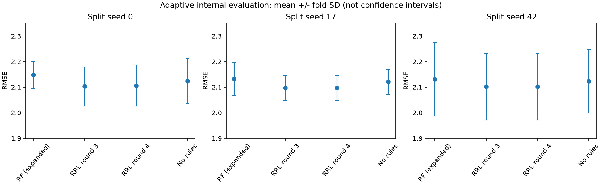

# Abalone 第四轮：扩大优势，也检查复杂度是否值得

## 起点与事前设计

第三轮已经优于所比较RF：主五折平均RMSE为2.10283对2.14786，另两组划分也保持均值优势。本轮由用户要求继续探索，目的不是修改第三轮成绩，而是检验仍有依据的改进空间。旧数据已经反复用于研究，所有新成绩仍是**自适应内部评价，不是独立确认**；不承诺优化必然继续有效。

EDA提示连续趋势、非线性与共线性同时存在。第三轮的硬规则贡献为成立/不成立时的常量增量，可能不能充分表达“在某一条件下，重量对年龄的影响斜率不同”。本轮增加少量规则门控线性项；保留原来的规则、连续hinge项和NLAF/梯度嫁接训练，不引入另一种黑箱模型。新增项为：

$$
\hat y=b+\sum_j a_jR_j(x)+\sum_l v_l B_l(x)+\sum_k q_k\frac{R_{j_k}(x)(X_{d_k}-\mu_k)}{s_k}.
$$

其中X为训练折拟合的log1p/标准化输入；μ是该规则成立的训练样本的特征均值，s是门控项在全部训练样本上的标准差。仅考察训练支持度5%–95%的规则与7个连续特征的乘积，按与无门控头训练残差的绝对相关排序选32或96项；排序、中心、尺度全部只用当前训练集合。规则不成立时该项严格为零。规则仍是原RRL学习出来的离散条件，新增的是局部线性输出结构，不能称为原始纯规则RRL。

输出头复用手写Ridge，分别惩罚规则、连续项与门控项系数。普通头λ_R∈{.03,.1,.3}、λ_C∈{.003,.01,.03}共9组；门控头固定λ_R=.1，λ_C同上，项数32/96、λ_G=.03/.3共12组。候选合计21，不基于外层结果临时加档。

网络6组：第三轮20@128早停锚点、20@64固定80轮锚点、10/40阈值、宽度256、Huber delta=.5。其他沿用第三轮设置。每组四个预先指定训练种子，128早停锚点另加四个；共28个网络开发拟合（早停另含内部探测）、588条单成员头部评分，平均成员数2/4，锚点另比较8。增加成员也增加规则总量，不把集成当作免费收益。

开发沿用固定2672/669划分。每种门控项数0/32/96分别保留两个不同(network,members)的最优候选，强制保留第三轮最终锚点以及最优8成员候选；最多8组。随后仍以同一主五折、三折内层选参，只按内层RMSE选模型，不按外层挑赢家。RF不弱化：复用第三轮72配置搜索及逐折内层选择的完整预测，同时保留原6配置RF。没有新增输入字段，RF输入不变。

主评价之后，按主实验平均内层分数冻结最终配置，再在种子17/42的两组五折重训，直接对照第三轮同索引/种子的RRL、RF和连续对照；不根据这些重复成绩改参数。门控消融是在相同规则/阈值/正则化下去掉门控并重拟合；无规则消融同时去掉规则及门控，重拟合连续头。失败候选、反例、误差和复杂度一起记录。

新结果仅写入`results/abalone/round4`。按照Ponytail复用现有预处理、训练、手写Ridge、导出和指标，不增加依赖或训练框架。关键阶段提交并推送，旧轮次不覆盖。

## 节点一：开发结论与冻结候选

28个网络开发拟合、588条单成员评分、273条2/4/8成员组合评分全部完成。开发最优为20@64固定80轮、两成员、λ_R=.1/λ_C=.03，RMSE=2.055321；第三轮开发最优2.058175，相差仅0.002854，不能据此宣布外层优势扩大。该候选四成员为2.057733；八成员最优2.062041，增加数量不是必然改善。

门控32项最好2.067199，96项最好2.075707，都不及无门控头；更宽网络、更多/更少阈值及更小Huber阈值也没领先。可能是新增斜率带来方差，或单次残差相关筛选没有找到真正有用的交互，但本阶段不能区分原因。仍按事前约定保留0/32/96门控各两组，加原最终锚点和8成员对照，合计8候选；没有因为结果不理想临时更换方案。

接下来完成120条内层评分（8×3×5）。候选共享网络训练以节省计算，但每折所有预处理、早停、门控排序与输出拟合仍从当前训练集合重新完成。8项测试通过，涵盖空门控集合、门控中心/尺度、分组线性方程的独立求解及原规则解释兼容性；完整折外审计和无标签推理检查在结果产生后运行。

## 节点二：主五折没有扩大优势

120条内层评分完成，五个外折均选择候选6，即第三轮最终配置：20@128早停、两成员、λ_R=.1/λ_C=.01、无门控。它是开发排名之外特意保留的历史锚点，说明保留锚点很重要，也说明开发集上的微小优势没能通过内层复核。

| 候选 | 配置摘要 | 平均内层RMSE |
|---|---|---:|
| 6 | 原20@128早停、两成员、连续λ=.01 | **2.111860** |
| 7 | 20@128早停、八成员、连续λ=.03 | 2.117353 |
| 1 | 20@64、80轮、四成员、连续λ=.03 | 2.117770 |
| 0 | 同上、两成员 | 2.120672 |
| 3 | 20@64、两成员、32门控、连续λ=.01 | 2.122779 |
| 2 | 20@64、四成员、32门控、连续λ=.03 | 2.124332 |
| 4 | 20@64、四成员、96门控、连续λ=.03 | 2.126478 |
| 5 | 同上、两成员 | 2.132759 |

全部候选规则λ=.1；门控候选λ_G=.3。上表对每条候选的15个内层分数取均值，只用于选参比较，不与外层分数混为一谈。

| 方法 | 外层RMSE | 外层MAE | 外层R² | Rings>=20 MAE |
|---|---:|---:|---:|---:|
| 扩展搜索RF | 2.147857±0.053085 | 1.516603±0.034739 | 0.553784±0.025380 | 7.591444±0.649358 |
| 第三轮RRL选参流程 | **2.102827±0.076251** | **1.499534±0.050743** | **0.572573±0.023322** | 7.139273±0.553388 |
| 第四轮RRL选参流程 | 2.106089±0.080382 | 1.502275±0.053850 | 0.571276±0.023768 | **7.134626±0.559710** |

第四轮仍比扩展RF平均RMSE低约1.94%，五折均优于RF；但第三轮约2.10%的优势**没有扩大**。第三轮前三折使用20@128早停、后两折选择20@64固定80轮；本轮五折都选早停，前3折分数完全相同，后两折略差。这是候选集改变后选参流程发生变化，不是同一模型忽然性能退化，也不能把两轮每折更好的结果拼成一个新分数。

匹配去规则对照的五折RMSE为2.14810/2.08157/2.00675/2.13886/2.24651；选中RRL为2.13476/2.07357/2.00090/2.10163/2.21958，仍每折改善，平均降低约0.01827。由于五折均未采用门控，“去门控”结果与完整模型完全相同，不能拿它证明门控有用。平均总逻辑边4328.8，两个成员共298个连续项；8成员候选的内层结果不支持为其付出更大解释复杂度。

## 心路历程：接受不能成立的假设

| 发现与假设 | 如何检验 | 实际结果与决定 |
|---|---|---|
| 二值规则只有常量贡献，局部连续斜率可能补足表达能力 | 训练折残差筛选32/96个规则×连续变量项，独立正则化 | 开发与内层均未领先；不纳入推荐模型，保留代码和完整失败记录 |
| 第三轮粗网格可能漏掉更合适的正则化 | 在成功参数附近细分规则/连续λ | 开发略有改善，但内层回到原λ；不根据单个开发切分宣布提升 |
| 两成员还不够稳定，增加到4/8可能进一步改善 | 固定种子序列，比较前2/4/8成员算术平均 | 内层平均均不及两成员历史锚点；不为复杂度增长而增长 |
| 多阈值、更宽网络、小Huber阈值可能有帮助 | 6组网络、28个开发训练、同一头部空间 | 未进入开发前列；更大容量不是自动有效的改进 |
| 更多搜索总会得到更好成绩吗？ | 保留旧方案，同折比较完整选参流程 | 本轮外层略差；推荐继续保留第三轮，不选择性报告漂亮分数 |

本轮结论是“若干合理方向被数据否定，旧方案更值得保留”，不是“已经找到所有可能的最优参数”。若未来还要扩大优势，应寻找新的、有依据的信息或机制，不能无限细分当前参数并反复查看同一批测试折来保证胜出。

## 节点三：重复检查、审计与交付选择

按平均内层分数选出的最终配置与第三轮完全一致；全数据两成员都选择30轮，重训后`final_rules.json`与第三轮规则图逐项一致。种子17/42两组五折也重新执行，得到RMSE=2.097399/2.102084，与第三轮相同配置、种子的逐折分数完全相同。这只是复现一致性，不是十次新的独立验证，也不是新配置的额外胜出证据。`repeat_design.json`和逐行预测保留执行记录。

图中点为逐折均值，误差线为折间样本标准差，不是置信区间；各折共享观测，不能直接按独立实验解释显著性。后两图重合来自最终配置相同，而非两个不同模型碰巧表现一致。

审计通过：4177行主五折覆盖完整，588条开发记录、120条内层评分、10条重复评分齐全；历史锚点的15条内层分数与第三轮一致。独立求解带分组正则化的正规方程，核对输出头、预处理及匹配消融；折外预测与JSON独立规则求值最大差3.55e-15环，最终checkpoint重载与规则求值差0，并验证不提供Rings也可预测。由于外层赢家不含门控，另重训开发阶段最好的门控配置的种子314成员，独立核查支持度、中心、尺度、训练残差排名、系数及预测，避免门控审计只是对空集合通过。测试仍为8项通过。

推荐交付继续使用[第三轮结果](ABALONE-ROUND3.md)及其模型；第四轮目录作为完整研究补充保留，不覆盖旧产物、不把本轮结果冒称为提升。未采用的门控实现保留为可复现实验分支，默认不开启；修改未触及RRL原NLAF、硬逻辑与梯度嫁接核心。按Ponytail复用已有训练和线性求解器，没有添加依赖；门控导出还覆盖了“重新换成无门控头时不能残留旧门控”的回归检查。

复现依次运行`experiments/abalone_round4.py`的`design`、`develop`、`select`、`evaluate`、`final`、`repeat`，再运行`analysis/abalone_round4.py`及`python -m pytest -q`；使用项目`.venv/bin/python`，设置`OPENBLAS_NUM_THREADS=1 OMP_NUM_THREADS=1`。`evaluate --fold 0`至`--fold 4`可分别执行；从头重跑应使用独立副本，不覆盖已归档结果。
