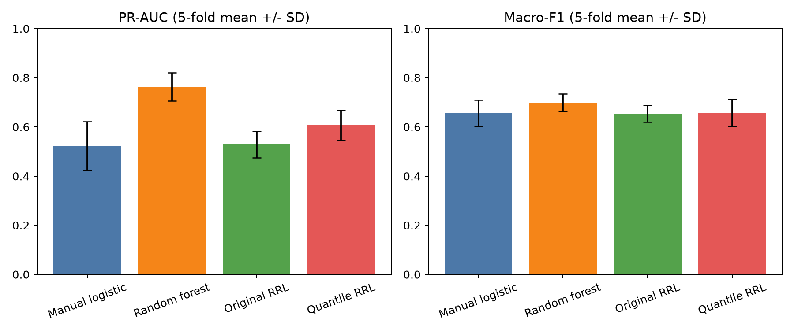
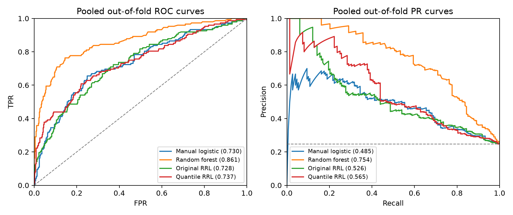
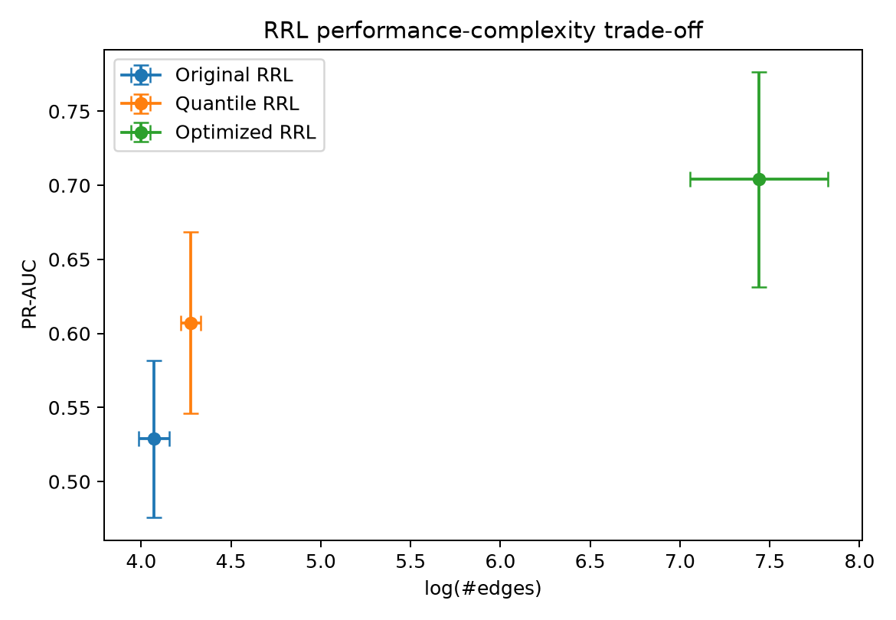

# DIA 任务实验报告材料

本文是 Drug Induced Autoimmunity Prediction（DIA）任务的可交付实验记录，可直接作为最终课程报告中 DIA 章节的基础。完整 EDA 见 [EDA.md](EDA.md)，RRL 原理与源码说明分别见 [RRL-CONCEPT-NOTE.md](RRL-CONCEPT-NOTE.md) 和 [RRL-CODE-NOTE.md](RRL-CODE-NOTE.md)。

## 1. 任务与数据

DIA 是二分类任务：根据药物的分子结构与理化描述符预测药物是否可能诱发自身免疫反应。按照课程要求，我们合并官方训练集和测试集做 5 折交叉验证，并排除只作为分子标识的 `SMILES`。合并后共有 597 个样本、196 个 RDKit 描述符；阴性 449 个、阳性 148 个，阳性比例为 24.79%。196 个描述符包含 17 个常量、20 个非恒定 0–1 特征、76 个一般整数特征和 83 个浮点特征，没有缺失值或无穷值。

EDA 显示：大量片段计数特征稀疏且集中于 0；部分连续特征具有强右偏和长尾；描述符尺度差异明显；179 个非常量描述符之间整体相关性较弱，但仍有 101 对满足 $|r|\ge0.95$；单特征与标签的最大绝对 Pearson 相关系数仅约 0.216。因此，模型需要处理尺度差异、类别不平衡和特征交互，不能依赖单个描述符完成分类。原始 RRL 基线保留全部描述符，使结构改进前后的输入一致；常量和相关特征可能增加冗余，但不在本轮比较中额外删除。

## 2. 数据划分与防泄漏

所有模型使用 `StratifiedKFold(n_splits=5, shuffle=True, random_state=0)` 产生完全相同的外层测试折。每个样本恰好作为一次测试样本，其余四折用于训练。标准化、缺失值填补、One-Hot 编码和 RRL 阈值估计均只在当前训练折拟合，然后应用到测试折；测试折不参与这些参数的估计。手写逻辑回归和随机森林在外层训练数据中再按 80:20 分层划分训练/验证部分，用验证 PR-AUC 选择少量候选超参数，随后在完整外层训练数据上重新拟合。优化 RRL 则在每个外层训练折中使用三折分层内层交叉验证选择配置，再在完整外层训练折重训一次。外层测试折始终只用于最终评价。

## 3. 模型

### 3.1 手写逻辑回归

手写模型仅使用 NumPy 实现二元逻辑回归。模型计算 $p(y=1|x)=\sigma(w^Tx+b)$，使用批量梯度下降优化二元交叉熵和 L2 正则项。每个外层折在内部验证集上从 $\lambda\in\{0,0.001,0.01,0.1\}$ 中选择正则化强度；连续输入只使用外层训练折拟合的均值和标准差进行标准化。该模型提供低复杂度线性基线，并满足课程“每个任务至少手动实现一种模型”的要求。

### 3.2 随机森林

随机森林使用 sklearn 实现，固定 300 棵树；在外层训练数据的内部验证集上比较最大深度 `4`、`8`、不限制深度，以及最小叶节点样本数 `1`、`5` 的小规模候选集合，以验证 PR-AUC 选择配置。它代表能够自动学习非线性交互、但整体解释性弱于规则模型的树集成基线。

### 3.3 原始 RRL

原始 RRL 使用 `5@16` 结构：每个连续特征准备 5 个候选阈值，逻辑层分别包含 16 个合取和析取节点；使用原论文 NLAF、gradient grafting 和线性输出层。每折训练 100 epoch，batch size 为 32，初始学习率为 0.002，L2 系数为 0.001。原始二值化方式从标准正态分布为每个标准化连续特征生成候选阈值。

### 3.4 改进：训练折分位数二值化

结构改进针对 EDA 中的偏态、长尾和零值集中问题。原始随机正态阈值没有考虑每个描述符的实际经验分布，可能使多个候选阈值落在几乎没有样本的区域。改进版在每个训练折内为每个连续特征计算 $1/6,2/6,\ldots,5/6$ 分位数，并用这些值替代随机阈值：

$$
c_{jk}=Q_{X_j}^{\mathrm{train}}\left(\frac{k}{6}\right),\qquad k=1,\ldots,5.
$$

测试折不参与分位数估计。该修改只改变 RRL 的二值化候选条件，NLAF、gradient grafting、逻辑层、损失函数、训练轮数和节点数均保持不变，因此原始版与改进版的差异可以归因于阈值初始化方式。

### 3.5 嵌套交叉验证优化 RRL

在上述单因素消融之后，我们把课程范围内可解释且不改变 RRL 核心思想的选择放入同一搜索空间：二值化策略为随机正态、训练折分位数或有监督阈值；结构为 `3@16`、`5@16`、`5@32`、`5@64`、`10@32` 或 `5@32@16`；学习率为 0.0005、0.001、0.002 或 0.005；L2 系数为 0、0.0001 或 0.001；同时比较是否使用类别加权、三组 NLAF 参数、80/160 epoch、温度 0.1/1.0 和是否显式加入 NOT 条件。由于完整笛卡尔积没有必要，搜索使用 6 个预设锚点和固定随机种子抽取的 34 个组合，共 40 个配置；候选集合在查看外层测试结果前固定。

有监督二值化只读取当前内层训练子集。对每个连续特征的候选阈值 $c$，以 Gini 不纯度下降评分：

$$
\Delta G(c)=G(y)-\frac{n_L}{n}G(y_L)-\frac{n_R}{n}G(y_R),\qquad G(y)=2p(1-p).
$$

每个特征保留得分最高的若干阈值，不足时用训练子集分位数补齐。每个外层折中的 40 个配置都经过三折内层验证，并以平均 PR-AUC 选出一个配置；总计完成 600 次内层训练和 5 次外层重训。外层第 0、4 折选择了有监督阈值、`5@64`、类别加权配置；第 1、2、3 折选择了随机阈值、`5@32`、不加权配置。两类胜出配置共同使用学习率 0.005、无 L2、NLAF $(\alpha,\beta,\gamma)=(0.999,8,3)$、160 epoch、温度 1.0 且不显式加入 NOT。

最终供后续使用的全数据模型不能再根据外层测试分数选择。我们把五次搜索中同一配置的内层 PR-AUC 求均值，选择排名第一的配置 27：随机阈值、`5@32`、学习率 0.005、无 L2、不加权、NLAF $(0.999,8,3)$、160 epoch、温度 1.0、无显式 NOT；其平均内层 PR-AUC 为 0.640±0.034。下文五折成绩评价的是“内层搜索后选择并重训”的完整优化流程，而不是这一固定配置单独运行五折的成绩。

## 4. 评价指标

由于阳性仅占约四分之一，Accuracy 可能掩盖阳性漏检。实验同时报告 Accuracy、Balanced Accuracy、Macro-F1、阳性 Precision/Recall/F1、ROC-AUC 和 PR-AUC，其中 PR-AUC 与阳性 F1 是重点指标。RRL 额外报告规则数量、边数以及 $\log(\#\mathrm{edges})$。所有表格均给出五折均值和样本标准差。

## 5. 五折结果

| 模型         |               Accuracy |          Balanced Acc. |               Macro-F1 |         阳性 Precision |            阳性 Recall |                阳性 F1 |                ROC-AUC |                 PR-AUC |
| ------------ | ---------------------: | ---------------------: | ---------------------: | ---------------------: | ---------------------: | ---------------------: | ---------------------: | ---------------------: |
| 手写逻辑回归 |           0.762±0.048 |           0.644±0.046 |           0.656±0.055 |           0.548±0.159 |           0.411±0.060 |           0.465±0.079 |           0.736±0.027 |           0.522±0.100 |
| 随机森林     |           0.826±0.017 |           0.669±0.030 |           0.699±0.036 | **0.861±0.080** |           0.359±0.065 |           0.503±0.063 | **0.863±0.041** | **0.763±0.058** |
| 原始 RRL     |           0.760±0.020 |           0.646±0.033 |           0.654±0.034 |           0.520±0.053 |           0.418±0.065 |           0.463±0.057 |           0.727±0.028 |           0.529±0.053 |
| 分位数 RRL   |           0.754±0.072 |           0.658±0.054 |           0.657±0.056 |           0.591±0.213 |           0.467±0.167 |           0.480±0.082 |           0.754±0.052 |           0.607±0.061 |
| 优化 RRL     | **0.828±0.029** | **0.732±0.039** | **0.749±0.041** |           0.696±0.066 | **0.541±0.063** | **0.609±0.063** |           0.843±0.018 |           0.704±0.073 |



优化 RRL 的 Accuracy 与随机森林近似，并取得最高的 Balanced Accuracy、Macro-F1、阳性 Recall 和阳性 F1，说明优化后的规则组合比原始 RRL 更能兼顾两个类别。随机森林仍取得最高的 ROC-AUC、PR-AUC 和阳性 Precision，说明它的概率排序能力更强，但在默认 0.5 阈值下预测较保守、漏掉更多阳性。实际药物安全筛查若更重视减少漏检，应在独立验证数据上调整决策阈值，而不能用测试折选择阈值。手写逻辑回归与原始 RRL 的总体结果相近，说明未经优化的最小 RRL 尚未全面超过线性基线。

分位数 RRL 相对原始 RRL 的平均 PR-AUC 提高 0.078、ROC-AUC 提高 0.027、阳性 Recall 提高 0.048、阳性 F1 提高 0.017；优化流程进一步把 PR-AUC 提高到 0.704、阳性 F1 提高到 0.609。相对原始 RRL，优化 RRL 的 PR-AUC、Macro-F1 和阳性 F1 分别提高 0.175、0.095 和 0.146；相对随机森林，其 PR-AUC 低 0.059，但 Macro-F1 和阳性 F1 分别高 0.050 和 0.106。由于只有 5 个外层折，这些差异应解释为当前数据上的实验趋势，不能宣称具有统计显著性。汇总折外预测曲线仅用于展示整体排序行为；正式数值以逐折计算后再取均值和标准差为准。



左侧 ROC 曲线的横轴是假阳性率 $\mathrm{FPR}=FP/(FP+TN)$，纵轴是真阳性率（也就是阳性召回率）$\mathrm{TPR}=TP/(TP+FN)$。每个点对应一个分类阈值；理想模型应在较低误报率下获得较高召回率，因此曲线越靠近左上角越好。灰色对角线代表随机排序，ROC-AUC 为 0.5；ROC-AUC 越接近 1，随机抽取一个阳性和一个阴性时，模型越可能给阳性更高分数。图中随机森林曲线在大部分区域最高，汇总折外 ROC-AUC 为 0.861；优化 RRL 为 0.839，明显高于分位数 RRL 的 0.737 和原始 RRL 的 0.728。若实际应用只能接受特定误报率，应在该 FPR 位置比较各曲线的 TPR，而不能只比较总面积。

右侧 PR 曲线的横轴是阳性 Recall，纵轴是阳性 Precision。理想曲线应在 Recall 增大时仍保持较高 Precision，即整体尽量靠近右上方；仅在 Recall 接近 0 时出现 Precision 接近 1 并不代表模型整体优秀，因为它可能只找出了极少数最有把握的阳性。灰色水平线是随机排序基线，等于 DIA 的阳性比例 $148/597\approx0.248$。曲线长期高于该线才说明模型能够把阳性样本集中排在前面。图中随机森林的汇总折外 PR-AUC 为 0.754，优化 RRL 为 0.673，分位数 RRL 为 0.565，原始 RRL 为 0.526，手写逻辑回归为 0.485；类别不平衡时，PR 曲线比 ROC 曲线更直接反映阳性检出质量。

图例中的 AUC 是把五个外层测试折的折外预测合并后计算的可视化数值，表格则先逐折计算 AUC，再报告五折均值和标准差。两种计算方式可能因各折样本组成和概率尺度不同而略有差异；正式模型比较以表格中的五折均值与标准差为主，曲线用于观察不同阈值下的行为及曲线是否交叉。

### 5.1 搜索与消融结果

分位数 RRL 与原始 RRL 的比较是严格的单因素消融：除阈值生成方式外，其余设置相同。40 组联合搜索则用于寻找配置，不能把某个参数的边际均值解释为独立因果效应，因为随机抽取的组合中各参数会共同变化。五个外层搜索记录合并后的前四名如下；排名只使用内层验证 PR-AUC，不读取外层测试标签。

| 排名 | 阈值   | 结构     | 学习率 | L2 | 加权 | NLAF          | Epoch | 温度 | NOT |  内层 PR-AUC |
| ---: | ------ | -------- | -----: | -: | ---- | ------------- | ----: | ---: | --- | -----------: |
|    1 | 随机   | `5@32` |  0.005 |  0 | 否   | (0.999, 8, 3) |   160 |  1.0 | 否  | 0.640±0.034 |
|    2 | 有监督 | `5@64` |  0.005 |  0 | 是   | (0.999, 8, 3) |   160 |  1.0 | 否  | 0.637±0.023 |
|    3 | 分位数 | `3@16` |  0.005 |  0 | 是   | (0.999, 8, 3) |    80 |  1.0 | 是  | 0.618±0.044 |
|    4 | 有监督 | `5@64` |  0.002 |  0 | 是   | (0.999, 8, 3) |   160 |  1.0 | 是  | 0.616±0.026 |

前四名共同偏好无 L2，且前三名均使用学习率 0.005 和 NLAF 的 $(0.999,8,3)$ 组合；但阈值策略、宽度、类别加权与 NOT 没有唯一胜者。这个结果支持把优化视为联合配置选择，而不是声称某一个超参数普遍最优。完整 40 组排名和描述性边际汇总分别保存在 `search_ranking.csv` 与 `search_effects.csv`。

## 6. 复杂度、规则与忠实性

| RRL 版本   |     规则数 |          边数 | $\log(\#\mathrm{edges})$ |   决策忠实度 |
| ---------- | ---------: | ------------: | -------------------------: | -----------: |
| 原始 RRL   |  13.8±0.8 |     58.8±4.9 |               4.071±0.085 | 1.000±0.000 |
| 分位数 RRL |  15.4±0.5 |     72.0±3.8 |               4.276±0.053 | 1.000±0.000 |
| 优化 RRL   | 69.8±24.6 | 1806.0±704.4 |               7.439±0.383 | 1.000±0.000 |

分位数改进提高排序性能的同时增加了约 13.2 条边。例如分位数版 fold 0 中，一条相对支持阳性的规则为：`MinAbsEStateIndex > 0.057 AND MinAbsPartialCharge <= 0.339 AND NumAliphaticRings <= 3 AND NumAromaticRings <= 2 AND VSA_EState8 <= 1.557 AND fr_imidazole <= 0 AND fr_unbrch_alkane <= 0`，训练折支持度约为 0.302。规则的阳性与阴性线性权重分别为 0.1833 和 -0.0210，因此规则成立时相对更支持阳性。

优化 RRL 的性能增益代价明显：平均规则数约为原始版的 5.1 倍，边数约为 30.7 倍，单条规则也可能包含较多条件。最终全数据模型导出 55 条规则、1345 条边；这些规则仍可逐条核查，但不再能称为“紧凑”。因此本实验把优化 RRL 视为性能与忠实规则解释之间的折中，而不是同时兼得最高排序性能和最简单解释。

最终模型中一条较短、相对支持阴性的规则是：`Chi1v > 8.454 AND ExactMolWt > 199.888 AND MaxEStateIndex > 9.304 AND MolMR > 51.404 AND SMR_VSA9 > 7.359 AND fr_Al_OH <= 1.737 AND fr_nitro_arom <= 0.088 AND fr_thiophene <= 0.196`。它在全数据中的支持度为 0.102，阴性与阳性输出权重分别为 0.336 和 -0.439；因此规则成立会提高阴性 logit、降低阳性 logit。完整 55 条规则均保存在 `final_rules.txt`，报告不挑选更长规则逐一展示。



忠实性通过同一测试样本的普通模型前向与严格二值逻辑前向进行核对；三个 RRL 版本在五折上的类别预测一致率均为 100%。这是因为 gradient grafting 在前向阶段使用硬逻辑值、只在反向阶段借用连续近似的梯度。因而导出的离散规则来自模型真实决策路径，不是事后拟合的替代解释。需要注意，线性输出仍会组合多条同时激活的规则，单条规则不能独立代表完整预测。

## 7. 实验设计与迭代历程

本节按真实实验顺序记录从原始复现到最终优化的推理链，而不是只展示效果最好的结果。每一轮都回答五个问题：上一轮暴露了什么问题、提出了什么假设、如何控制变量或选择配置、具体怎样实现，以及结果是否解决了原问题。

### 7.1 第一步：先建立可信的评价基准

最开始的问题并不是“怎样把分数调高”，而是怎样保证分数可信。课程允许把官方 training set 和 test set 合并后做 K 折交叉验证，但如果先在全数据上计算均值、标准差、One-Hot 类别或 RRL 阈值，再切分五折，外层测试折就会参与预处理参数估计。即使没有直接使用测试标签，这仍会使测试分布提前进入训练过程。

解决思路是先固定所有模型共享的外层五折，再把一切可学习步骤放回当前训练折。实现时使用相同的 `StratifiedKFold` 索引；每折的编码器、缺失值处理、标准化参数和 RRL 阈值都只在外层训练数据上拟合。逻辑回归和随机森林在外层训练折内部留出验证集选择超参数，外层测试折只评价一次。由此得到的折外预测覆盖全部 597 个样本且没有重复，为后续比较提供了统一地基。这一步解决了评价可信度问题，但还没有改善 RRL 性能。

### 7.2 第二步：复现最原始的 RRL，确认问题在哪里

我们先采用尽量接近源码默认思想的 `5@16` RRL：标准化连续特征后，从标准正态分布产生 5 个候选阈值，使用一层 16 个逻辑节点、原论文 NLAF 与 gradient grafting，训练 100 epoch。同时建立手写逻辑回归和随机森林两个参照物。这样可以区分三种可能：数据本身只能支持线性边界、数据包含非线性交互但 RRL 没有学好，或者 RRL 已经能够发挥优势。

结果显示，原始 RRL 的 PR-AUC 为 0.529、Macro-F1 为 0.654，与手写逻辑回归的 0.522 和 0.656 几乎相同；随机森林却达到 PR-AUC 0.763、Macro-F1 0.699。我们因此没有把问题归咎于“数据完全不可预测”：随机森林的优势表明描述符中很可能存在有用的非线性关系。更合理的判断是，原始 RRL 的阈值、容量或训练设置没有充分捕获这些关系。原始复现成功建立了基准，也暴露出真正需要优化的问题，但没有解决性能不足。

### 7.3 第三步：从 EDA 出发，先检验阈值假设

EDA 显示许多 DIA 描述符零值集中、强右偏或具有长尾。原始 RRL 在标准化空间中随机生成正态阈值，没有利用每个特征的实际经验分布；候选阈值可能落在样本很少的区域，造成多个二值条件几乎从不触发。我们的第一个可检验假设是：如果让候选阈值覆盖训练样本的经验分布，逻辑层会收到更有信息量的 0–1 条件。

为避免一次改变太多因素，我们只把随机阈值替换为训练折的五个等距分位点，其余结构、NLAF、学习率、L2 和训练轮数保持不变。这是整个流程中最清晰的单因素消融。实现后，PR-AUC 从 0.529 提高到 0.607，ROC-AUC 从 0.727 提高到 0.754，阳性 Recall 从 0.418 提高到 0.467；但 Accuracy 从 0.760 降到 0.754，折间波动也变大。结论是阈值错配确实是一个问题，分位数方法部分解决了它，却不足以追上随机森林；因此性能瓶颈不只来自二值化。

### 7.4 第四步：把单点修改扩展为有边界的联合优化

分位数实验之后，如果继续逐个手调参数，很容易根据外层测试结果反复试验并形成隐性泄漏。我们改用嵌套交叉验证：预先固定 40 个候选配置，每个外层训练折再做三折内层验证，以内层 PR-AUC 选择配置，然后在完整外层训练折重训，最后只在对应外层测试折评价一次。搜索覆盖三种二值化策略、六种结构、四个学习率、三档 L2、类别加权、三组 NLAF、训练轮数、温度与 NOT；总计完成 $5\times40\times3=600$ 次内层训练和 5 次外层重训。

除随机阈值和分位数阈值外，我们加入了有监督阈值：只在当前内层训练子集上计算候选切分的 Gini 不纯度下降，为每个连续特征选择区分类别能力较强的阈值。它会使用训练标签，但不读取内层验证标签或外层测试标签，因此仍符合无泄漏原则。类别加权通过交叉熵的类别权重实现；结构、NLAF、学习率、L2、epoch、温度和 NOT 则直接作为配置传入同一训练入口。候选集合由 6 个覆盖关键方案的锚点与固定种子抽取的 34 个组合构成，避免没有依据地训练完整笛卡尔积。

实现后，优化流程达到 Accuracy 0.828、Balanced Accuracy 0.732、Macro-F1 0.749、阳性 F1 0.609、ROC-AUC 0.843 和 PR-AUC 0.704。相对原始 RRL，PR-AUC、Macro-F1 和阳性 F1 分别提高 0.175、0.095 和 0.146；相对随机森林，优化 RRL 的 Macro-F1 和阳性 F1 分别高 0.050 和 0.106，但 PR-AUC 仍低 0.059。原先“RRL 与简单线性模型相近”的问题已经解决；“所有指标均超过随机森林”则没有实现，也不应为了实现这个目标继续查看外层结果后追加调参。

### 7.5 第五步：解释搜索结果，而不是只保留最高分

五个外层折出现两种胜出方案：第 0、4 折选择有监督阈值、`5@64` 和类别加权；第 1、2、3 折选择随机阈值、`5@32` 和不加权。两种方案共同使用学习率 0.005、无 L2、NLAF $(0.999,8,3)$、160 epoch、温度 1.0 且不显式加入 NOT。这说明更充分的训练和更合适的 NLAF/优化设置是稳定共性，而阈值策略、宽度与类别加权会随训练样本组成变化，并不存在五折一致的唯一选择。

用于交付的最终全数据模型也不能按外层测试成绩挑选。我们把同一配置在五次搜索中的内层 PR-AUC 求均值，选择配置 27，再使用全部 597 个样本训练。最终配置为随机阈值、`5@32`、学习率 0.005、无 L2、不加权、NLAF $(0.999,8,3)$、160 epoch、温度 1.0、无显式 NOT。这里必须区分两个结论：五折成绩评价的是“内层选择配置”的优化流程；最终 checkpoint 是该流程结束后、仅依据内层排名得到的可使用模型，不能把前者的均值直接解释成后者在未知数据上的保证。

### 7.6 第六步：检查性能提升是否破坏解释性

RRL 的价值不只在预测分数，还在于能导出真实参与决策的离散规则。因此每个外层折都同时执行普通前向与严格二值前向，两者的类别预测一致率均为 100%，证明规则仍对应模型自身的决策路径。最终全数据模型也成功导出 55 条带支持度和输出权重的规则，说明优化没有破坏 gradient grafting 的硬前向逻辑。

但是问题并非完全解决而没有代价：优化 RRL 平均包含 69.8 条规则和 1806 条边，原始 RRL 只有 13.8 条规则和 58.8 条边。换言之，预测能力提高了，人工阅读成本也显著上升。最终结论不是“优化模型在所有方面更好”，而是它从一个接近线性基线的紧凑规则模型，变成了一个在默认阈值下优于两个基线多项分类指标、仍然忠实但明显更复杂的规则模型。

### 7.7 完整实现流程与证据

| 阶段       | 具体实现                                                           | 产生的证据                                         | 阶段结论                                       |
| ---------- | ------------------------------------------------------------------ | -------------------------------------------------- | ---------------------------------------------- |
| 数据诊断   | 合并官方数据，排除`SMILES`，统计类别、类型、偏态、相关性和异常值 | `docs/EDA.md` 与 EDA 图表                        | 发现不平衡、长尾、尺度差异、冗余和弱单特征信号 |
| 公平划分   | 固定共同的外层五折，所有预处理仅拟合训练折                         | 各模型逐折预测文件                                 | 597 个样本各作为测试样本一次，无预处理泄漏     |
| 原始复现   | `5@16`、随机正态阈值、原 NLAF 与 gradient grafting               | `results/dia/rrl_original`                       | RRL 与线性模型相近，明显落后随机森林           |
| 单因素消融 | 只把随机阈值换成训练折分位数                                       | `results/dia/rrl_quantile`、`rrl_ablation.csv` | 阈值假设部分成立，但仍不足以解决总体性能问题   |
| 联合搜索   | 40 个固定配置，三折内层选择、五折外层评价                          | 五份`fold_*_search.csv`、`fold_metrics.csv`    | 优化 RRL 显著超过原始版，部分指标超过随机森林  |
| 结果分析   | 汇总均值/标准差、折外 ROC/PR、搜索排名和复杂度                     | `search_ranking.csv`、三张比较图                 | 确认性能提升、剩余差距与复杂度代价             |
| 最终训练   | 只按平均内层排名选配置，在全数据重训                               | `final_config.json`、`final_model.pth`         | 得到可重新加载的最终 RRL                       |
| 规则交付   | 严格离散前向核验并导出规则                                         | `final_rules.txt`、决策忠实度 1.000              | 优化后仍是忠实规则模型，但解释不再紧凑         |

整个流程可以概括为：数据与 EDA → 统一外层五折 → 原始 RRL 与基线 → 分位数单因素消融 → 固定搜索空间 → 内层三折选配置 → 外层重训与一次性评价 → 汇总性能和复杂度 → 仅按内层排名选择最终配置 → 全数据训练与规则导出。查看完外层结果后停止扩展搜索，避免把测试折逐渐变成调参验证集。

## 8. 结论与局限

随机森林在 DIA 上提供最佳的 ROC-AUC、PR-AUC 和阳性 Precision；优化 RRL 则在默认分类阈值下取得最高的 Balanced Accuracy、Macro-F1、阳性 Recall 和阳性 F1，并略高于随机森林的 Accuracy。它显著改善了原始 RRL，也保持 100% 的离散决策忠实度，但规则复杂度大幅上升。因此不能笼统宣称某个模型全面胜出：随机森林更适合追求概率排序，优化 RRL 更适合当前阈值下兼顾两类且需要忠实规则的场景，原始或分位数 RRL 则更易人工阅读。

本实验只有 597 个样本，没有额外外部验证集；五折结果仍可能受样本构成影响。优化 RRL 搜索了 40 组配置，而两个基线只使用较小候选集合，因此五折评价是无偏的，但三者获得的调参预算并不相同。模型也没有利用 `SMILES` 的结构表示，结论只适用于当前 RDKit 描述符输入。后续若强调安全筛查，应预先规定漏检成本并在独立验证集上选择阈值；若强调解释简洁，可增加边数惩罚或在验证集上选择性能与复杂度的折中点。

## 9. 复现与交付索引

```bash
# 测试
.venv/bin/python -m pytest -q

# 两个对比模型
.venv/bin/python experiments/run_dia_baselines.py

# 原始 RRL 和分位数 RRL
cd models/rrl
../../.venv/bin/python run_dia_cv.py --name rrl_original --epochs 100 --structure 5@16 --learning-rate 0.002
../../.venv/bin/python run_dia_cv.py --name rrl_quantile --epochs 100 --structure 5@16 --learning-rate 0.002 --quantile-thresholds

# 优化 RRL：嵌套五折搜索，以及仅使用内层验证排名训练最终模型
../../.venv/bin/python optimize_dia.py --max-candidates 40 --outer-folds 5
../../.venv/bin/python optimize_dia.py --max-candidates 40 --train-final-only

# 最终表格和图片（回到项目根目录）
cd ../..
.venv/bin/python analysis/dia_model_comparison.py
```

机器可读的逐折指标、折外预测、规则文本、消融差值和图片位于 [`results/dia`](../results/dia)。优化搜索的完整逐折记录、总排名、最终超参数、全数据模型和规则分别位于 [`results/dia/rrl_optimized`](../results/dia/rrl_optimized)。源代码分别位于 [`models/manual_glm`](../models/manual_glm)、[`models/tree_ensemble`](../models/tree_ensemble)、[`models/rrl`](../models/rrl)、[`experiments/run_dia_baselines.py`](../experiments/run_dia_baselines.py) 和 [`analysis/dia_model_comparison.py`](../analysis/dia_model_comparison.py)。最终模型仅约 461 KB，随其余小型结果一并保留；课程 ZIP 是否包含原始数据仍按 PDF 的提交要求处理。
