# 探索性数据分析（EDA）

本轮分析对应课程 Lecture02 中的 Central Tendency、Dispersion、Boxplot、Histogram、Quantile Plot 和 Scatter Plot。运行命令：

```bash
uv run python analysis/eda.py
```

脚本读取 `data/raw` 中的官方原始文件，在 `results/eda` 下重新生成统计表和图片。当前分析使用原始数值，不在全量数据上拟合标准化、分箱或特征选择参数；这些处理若进入模型，必须在每个交叉验证训练折内重新拟合。

## DIA（二分类）

### 数据概况

- 合并官方训练集与测试集后共 597 个样本、196 个数值描述符，另有 `SMILES` 标识和二分类目标 `Label`。
- 阴性 449 个（75.2%），阳性 148 个（24.8%）；无缺失值、重复行或重复 `SMILES`。
- 官方 ZIP 中的两个 CSV 均为 198 列，即 `Label`、`SMILES` 和 196 个输入特征；无空列、重复列名或额外索引列。`RDKit_ChemDes.xlsx` 也列出 196 个描述符，名称与 CSV 第 3–198 列完全一致。
- 完整统计见 [DIA feature summary](../results/eda/dia/feature_summary.csv)，其中 `observed_type` 给出每个特征的实际取值类型。

### 输入特征类型

类型按合并后的 597 个样本实际取值判定，并采用互斥分类。只有同时出现 0 和 1 才算二值特征；始终为 0 的列单独归为常量，避免把无信息列误称为二值特征。

从 CSV 的存储类型看，pandas 将 113 列识别为 `int64`、83 列识别为 `float64`。下面进一步把 113 个整数存储列拆成常量、0–1 二值和一般整数计数。

| 类型 | 数量 | 判定规则 |
|---|---:|---|
| 常量 | 17 | 全部样本取同一个值，当前均为 0 |
| 0–1 二值 | 20 | 非常量，且取值集合恰好为 `{0, 1}` |
| 整数 | 76 | 非常量、非二值，所有观测值均为整数 |
| 浮点 | 83 | 至少有一个观测值带小数部分 |
| 其他 | 0 | 没有非数值、缺失或无穷值输入特征 |

20 个实际二值特征是：`fr_C_S`、`fr_SH`、`fr_azo`、`fr_benzodiazepine`、`fr_dihydropyridine`、`fr_epoxide`、`fr_furan`、`fr_hdrzine`、`fr_hdrzone`、`fr_lactam`、`fr_lactone`、`fr_morpholine`、`fr_nitro_arom_nonortho`、`fr_nitroso`、`fr_oxazole`、`fr_oxime`、`fr_sulfone`、`fr_term_acetylene`、`fr_tetrazole`、`fr_urea`。

17 个常量特征是：`NumRadicalElectrons`、`SMR_VSA8`、`SlogP_VSA9`、`VSA_EState1`–`VSA_EState7`、`fr_azide`、`fr_barbitur`、`fr_diazo`、`fr_isocyan`、`fr_isothiocyan`、`fr_prisulfonamd`、`fr_thiocyan`。76 个整数特征和 83 个浮点特征的逐列归类保存在统计表中。

### 六项分析及发现

1. **Central Tendency**：大量片段计数描述符的中位数和众数为 0，说明特征具有明显稀疏性。阳性与阴性均值差异最大的特征包括 `fr_aniline`、`fr_priamide`、`SlogP_VSA10`、`fr_ArN`、`fr_amide` 和 `PEOE_VSA2`，但单特征与标签的最大绝对 Pearson 相关系数仅为 0.216，单个描述符不足以清楚分开两类。
2. **Dispersion**：196 个描述符中有 17 个标准差为 0，属于常量特征；58 个描述符至少 95% 的值为 0。不同描述符的尺度差异很大，例如 `Ipc` 的范围达到约 \(3.85\times10^{14}\)，而许多片段计数只在 0 到几之间变化。
3. **Boxplot**：类别间有位置差异，但箱体大面积重叠；多个计数特征因零值多而表现出大量箱线图离群点。这些点更多反映稀疏、偏态的化学计数，而不能直接视为错误样本。
4. **Histogram**：`Ipc`、`Kappa3` 等连续描述符呈强右偏；若直接输入依赖尺度或距离的模型，少数极大值可能主导优化。等宽分箱也可能把大部分样本压在少数区间。
5. **Quantile Plot**：多个描述符在高分位处突然上升，确认长尾并非均值能够充分描述。RRL 离散化宜优先比较分位数分箱或训练折内学习的监督阈值。
6. **Scatter Plot**：存在完全或近乎完全重复的信息，例如 `MaxAbsEStateIndex`/`MaxEStateIndex`、`NumAromaticCarbocycles`/`fr_benzene`；共有 101 对描述符满足 \(|r|\ge0.95\)，其中 18 对满足 \(|r|\ge0.99\)。

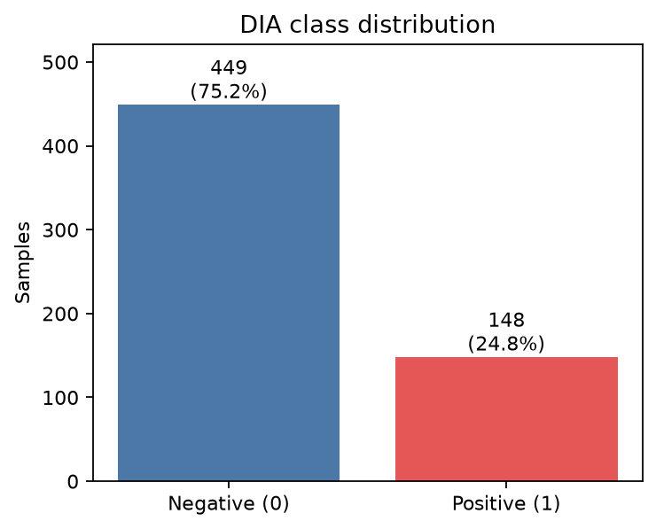

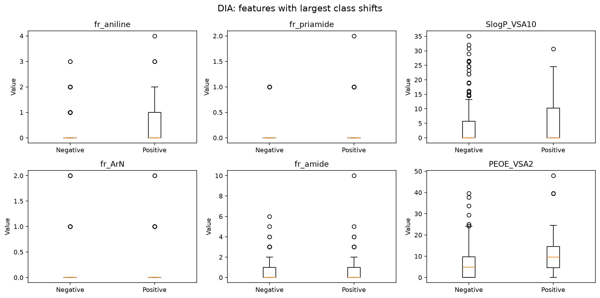

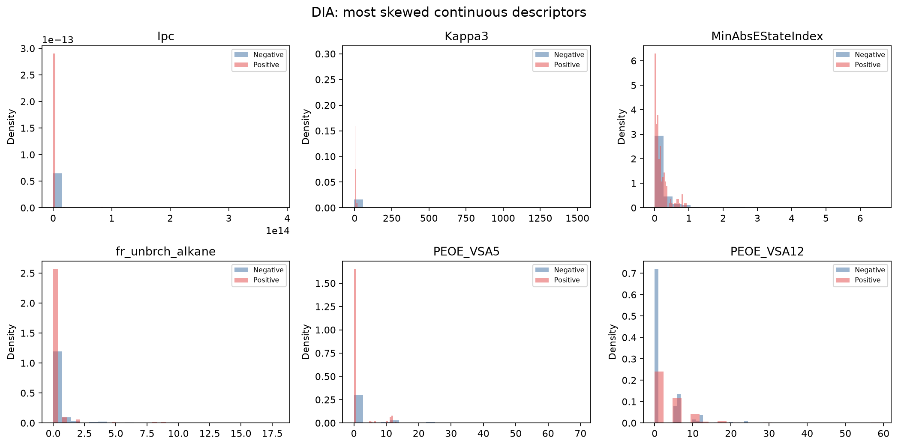

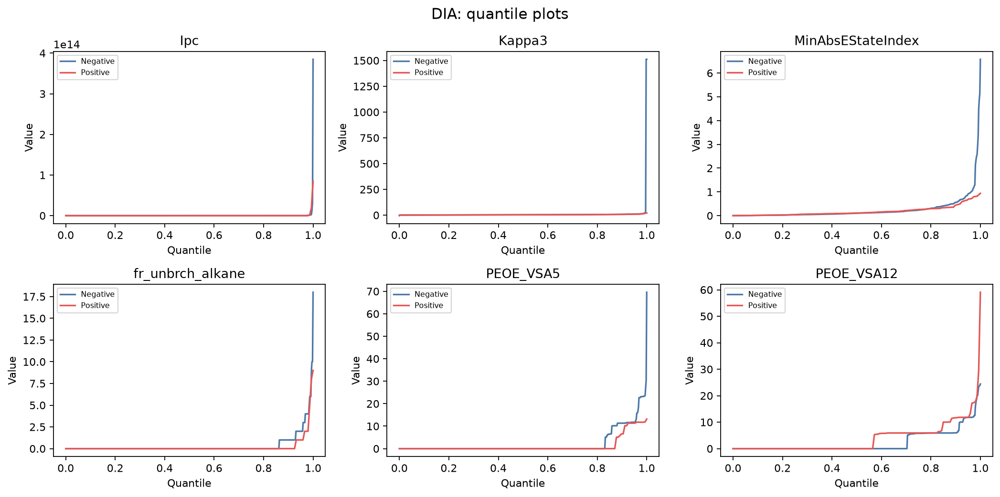

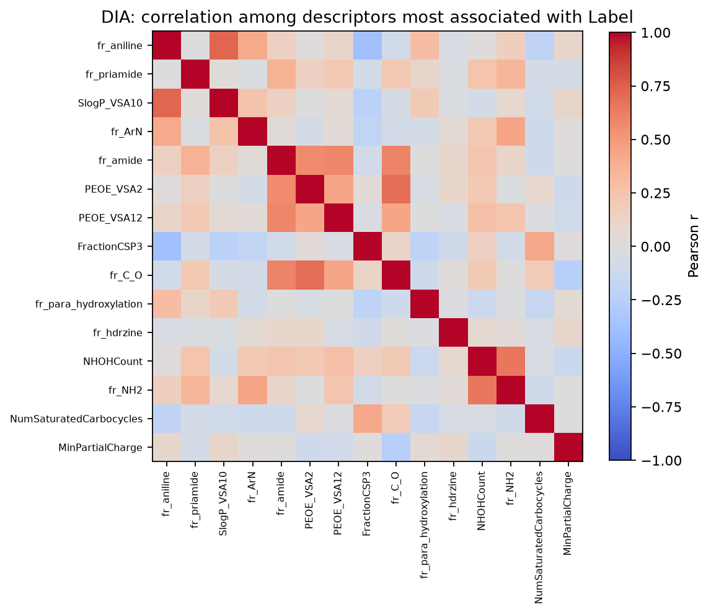

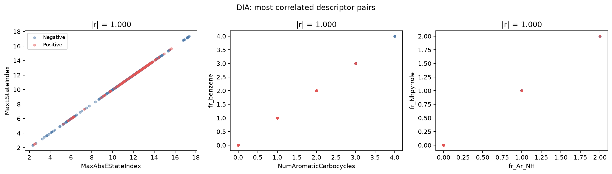

### 可能影响后续训练的问题与决定

| 问题 | 可能影响 | 后续处理 |
|---|---|---|
| 597 个样本对应 196 个描述符 | 高维小样本容易过拟合，验证结果波动大 | 使用固定的分层 K 折；报告各折均值和波动 |
| 阳性只占 24.8% | Accuracy 可能掩盖少数类效果 | 使用分层划分，并报告 F1、ROC-AUC、PR-AUC 等分类指标；类别权重作为待比较选项 |
| 17 个常量特征、58 个极稀疏特征 | 无信息特征增加参数和规则搜索空间 | 在每个训练折删除零方差特征；近零方差特征是否删除由验证结果决定 |
| 特征尺度和长尾差异大 | 线性/神经网络训练不稳定，等宽分箱失真 | 线性模型在训练折做标准化；RRL 比较分位数或监督离散化；树模型保留原尺度 |
| 101 对高度相关描述符 | 线性系数不稳定、规则重复、解释冗余 | 在训练折内做相关性约简，或保留给树模型并在解释时标明冗余 |
| 单特征与标签关系较弱 | 单变量阈值难以获得高性能 | 需要组合特征或非线性交互，同时严格控制复杂度 |

## Abalone（回归）

### 数据概况

- 共 4177 个样本；输入为 `Sex` 和 7 个连续物理测量，目标为整数 `Rings`。
- `Sex` 包含 M 1528 个、F 1307 个、I 1342 个，数量相对均衡；无缺失值或重复行。
- `Rings` 均值 9.934、中位数和众数均为 9、范围 1–29，分布右偏；完整统计见 [Abalone feature summary](../results/eda/abalone/feature_summary.csv)。

### 六项分析及发现

1. **Central Tendency**：幼体 I 的 `Rings` 均值为 7.890，明显低于 F 的 11.129 和 M 的 10.705，因此 `Sex` 与年龄阶段有关，不能丢弃，也不能简单编码成有顺序的 1/2/3。
2. **Dispersion**：`Height` 有两个 0、一个 0.515 和一个 1.130；其余大部分集中在约 0.1–0.2。另有 4 行 `Shucked weight > Whole weight`，其中一行同时 `Shell weight > Whole weight`，属于需要复核的物理矛盾。
3. **Boxplot**：重量和 `Rings` 均有较多高端离群点；幼体整体尺寸、重量和环数较低。IQR 离群不等于录入错误，不能统一删除。
4. **Histogram**：各重量字段和 `Rings` 右偏；`Rings` 的高年龄样本稀少，`Rings >= 20` 只有 62 个，模型可能倾向预测样本密集的 8–11 环区间。
5. **Quantile Plot**：`Height` 末端出现突跃，支持单独复核极端高度；重量和 `Rings` 的上尾也明显，但总体是连续过渡，宜保留真实的大个体和高龄样本。
6. **Scatter Plot**：长度、直径和重量与 `Rings` 呈中等正相关，但散点较宽，说明物理尺寸不能完全决定年龄。输入之间存在强共线性，例如 `Length`/`Diameter` 的 \(r=0.987\)，`Whole weight`/`Shucked weight` 的 \(r=0.969\)。

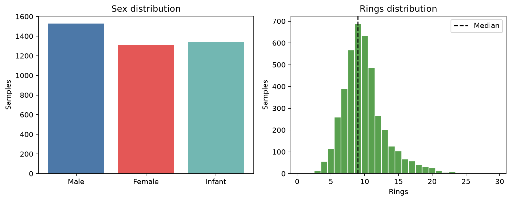

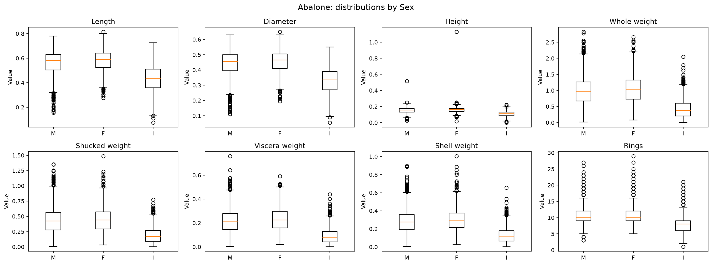

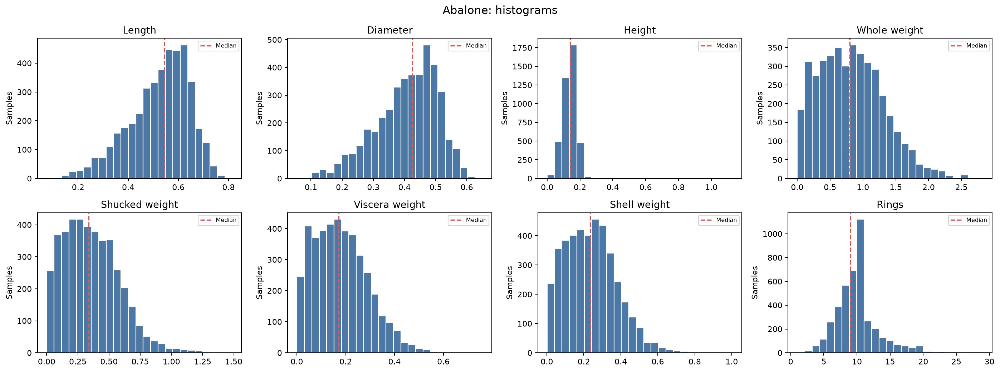

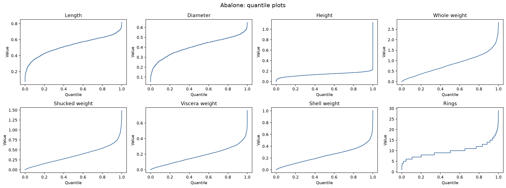

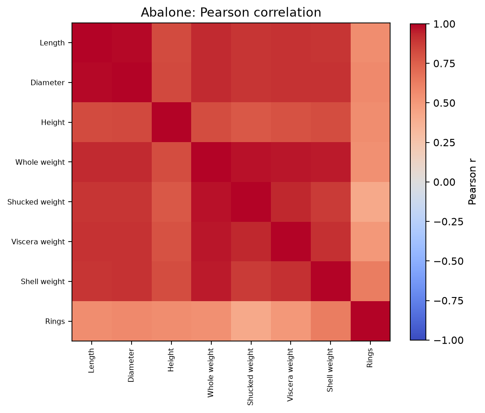

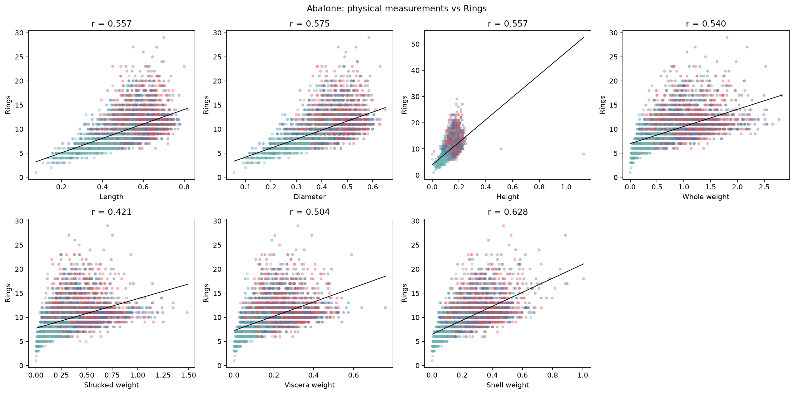

### 可能影响后续训练的问题与决定

| 问题 | 可能影响 | 后续处理 |
|---|---|---|
| `Sex` 是无序类别且各组分布不同 | 直接使用 M/F/I 字符或 1/2/3 会引入错误关系 | 在训练流程中使用 One-Hot Encoding |
| 极端/矛盾测量值 | 对均方误差、标准化和线性回归斜率影响较大 | 首轮保留并建立异常标记；再做“保留/修正或剔除”的敏感性比较，不直接批量删除 |
| 重量和目标右偏、高龄样本稀少 | 模型容易低估高龄鲍鱼，RMSE 对尾部误差敏感 | 除 RMSE 外报告 MAE 和 \(R^2\)，并单独检查高环数样本误差 |
| 输入特征高度相关 | 线性系数可能不稳定，重复信息增加模型复杂度 | 线性模型使用正则化；树模型保留原特征；不默认使用 PCA |
| 特征尺度不同 | 影响线性、距离和神经网络类模型 | 在训练折内标准化连续特征；树模型不强制标准化 |
| 尺寸与 `Rings` 关系不是纯线性 | 单一线性模型可能欠拟合 | 保留线性模型作为基线，并与树集成和 RRL 回归版本比较 |

## 当前结论

DIA 的首要风险是高维小样本、类别不平衡、稀疏/常量描述符、长尾和强冗余；Abalone 的首要风险是少量可疑测量、目标长尾、输入共线性以及非纯线性关系。下一阶段应先固定交叉验证，再把所有会学习参数的清洗、标准化、特征过滤和离散化放入训练折，避免数据泄漏。
