# 探索性数据分析（EDA）

本轮分析对应课程 Lecture02 中的 Central Tendency、Dispersion、Boxplot、Histogram、Quantile Plot 和 Scatter Plot。运行命令：

```bash
uv run python analysis/eda.py
```

脚本读取 `data/raw` 中的官方原始文件，在 `results/eda` 下重新生成统计表和图片。当前分析使用原始数值，不在全量数据上拟合标准化、分箱或特征选择参数；这些处理若进入模型，必须在每个交叉验证训练折内重新拟合。

## DIA（二分类）

### 数据概况

- 合并官方训练集与测试集后共 597 个样本、196 个数值描述符，另有 `SMILES` 标识和二分类目标 `Label`。
- 阴性 449 个（75.2%），阳性 148 个（24.8%）；无缺失值、重复行或重复 `SMILES`。
- 官方 ZIP 中的两个 CSV 均为 198 列，即 `Label`、`SMILES` 和 196 个输入特征；无空列、重复列名或额外索引列。`RDKit_ChemDes.xlsx` 也列出 196 个描述符，名称与 CSV 第 3–198 列完全一致。
- 完整统计见 [DIA feature summary](../results/eda/dia/feature_summary.csv)，其中 `observed_type` 给出每个特征的实际取值类型。

### 输入特征类型

类型按合并后的 597 个样本实际取值判定，并采用互斥分类。只有同时出现 0 和 1 才算二值特征；始终为 0 的列单独归为常量，避免把无信息列误称为二值特征。

从 CSV 的存储类型看，pandas 将 113 列识别为 `int64`、83 列识别为 `float64`。下面进一步把 113 个整数存储列拆成常量、0–1 二值和一般整数计数。

| 类型      | 数量 | 判定规则                           |
| --------- | ---: | ---------------------------------- |
| 常量      |   17 | 全部样本取同一个值，当前均为 0     |
| 0–1 二值 |   20 | 非常量，且取值集合恰好为 `{0, 1}` |
| 整数      |   76 | 非常量、非二值，所有观测值均为整数 |
| 浮点      |   83 | 至少有一个观测值带小数部分         |
| 其他      |    0 | 没有非数值、缺失或无穷值输入特征   |

20 个实际二值特征是：`fr_C_S`、`fr_SH`、`fr_azo`、`fr_benzodiazepine`、`fr_dihydropyridine`、`fr_epoxide`、`fr_furan`、`fr_hdrzine`、`fr_hdrzone`、`fr_lactam`、`fr_lactone`、`fr_morpholine`、`fr_nitro_arom_nonortho`、`fr_nitroso`、`fr_oxazole`、`fr_oxime`、`fr_sulfone`、`fr_term_acetylene`、`fr_tetrazole`、`fr_urea`。

17 个常量特征是：`NumRadicalElectrons`、`SMR_VSA8`、`SlogP_VSA9`、`VSA_EState1`–`VSA_EState7`、`fr_azide`、`fr_barbitur`、`fr_diazo`、`fr_isocyan`、`fr_isothiocyan`、`fr_prisulfonamd`、`fr_thiocyan`。76 个整数特征和 83 个浮点特征的逐列归类保存在统计表中。

### 六项分析及发现

1. **Central Tendency**：大量片段计数描述符的中位数和众数为 0，说明特征具有明显稀疏性。阳性与阴性均值差异最大的特征包括 `fr_aniline`、`fr_priamide`、`SlogP_VSA10`、`fr_ArN`、`fr_amide` 和 `PEOE_VSA2`，但单特征与标签的最大绝对 Pearson 相关系数仅为 0.216，单个描述符不足以清楚分开两类。
2. **Dispersion**：196 个描述符中有 17 个标准差为 0，属于常量特征；58 个描述符至少 95% 的值为 0。不同描述符的尺度差异很大，例如 `Ipc` 的范围达到约 $3.85\times10^{14}$，而许多片段计数只在 0 到几之间变化。
3. **Boxplot**：类别间有位置差异，但箱体大面积重叠；多个计数特征因零值多而表现出大量箱线图离群点。这些点更多反映稀疏、偏态的化学计数，而不能直接视为错误样本。
4. **Histogram**：`Ipc`、`Kappa3` 等连续描述符呈强右偏；若直接输入依赖尺度或距离的模型，少数极大值可能主导优化。等宽分箱也可能把大部分样本压在少数区间。
5. **Quantile Plot**：多个描述符在高分位处突然上升，确认长尾并非均值能够充分描述。RRL 离散化宜优先比较分位数分箱或训练折内学习的监督阈值。
6. **Scatter Plot 与整体相关性**：179 个非常量描述符形成 15,931 个有效特征对，$\lvert r\rvert$ 中位数仅为 0.068，但仍有 101 对满足 $\lvert r\rvert\ge0.95$，其中 18 对满足 $\lvert r\rvert\ge0.99$。说明整体以弱相关为主，同时存在少量需要去重的强冗余特征簇。

#### 类别分布

先统计阴性与阳性标签的数量。阴性样本明显更多，说明数据集存在类别不平衡。如果不加区分地直接训练，模型可能更倾向于预测为阴性。


#### 箱线图

箱线图由以下统计量构成：

- $Q_1$：第 25 百分位数
- $Q_2$：中位数，即第 50 百分位数
- $Q_3$：第 75 百分位数

四分位距为：

$$
IQR = Q_3-Q_1
$$

默认的潜在离群值边界为：

$$
\text{下界}=Q_1-1.5IQR, \qquad \text{上界}=Q_3+1.5IQR
$$

图中各部分的含义如下：

- 箱体下边：$Q_1$
- 箱体中线：中位数
- 箱体上边：$Q_3$
- 上下“须”：边界内最远的实际观测值
- 单独的圆点：落在 $Q_1-1.5IQR$ 或 $Q_3+1.5IQR$ 之外的观测

这里的圆点只是统计意义上的潜在离群点，不等于错误数据。

DIA 有 196 个特征，不适合全部画出来。脚本先计算每个特征的类别差异：

$$
D_j = \frac{|\bar{x}_{j,1}-\bar{x}_{j,0}|}{s_j}
$$

其中：

- $\bar{x}_{j,1}$：阳性样本中特征 $j$ 的均值
- $\bar{x}_{j,0}$：阴性样本中特征 $j$ 的均值
- $s_j$：全部样本中特征 $j$ 的标准差

然后选择 $D_j$ 最大的 6 个特征作图。每个特征分别绘制阴性和阳性两组箱线图，观察两组的中位数是否明显不同、箱体是否明显分离，以及组内波动和潜在离群点（Outlier）是否明显。这种做法主要是为了在正式建模之前，快速考察是否存在能够较好区分目标标签的单个特征。

实际结果表明并不存在这样的明显单特征。图中的 6 个特征已经是阳性与阴性样本的标准化均值差绝对值最大的特征，但两类箱体仍然有较多重叠。

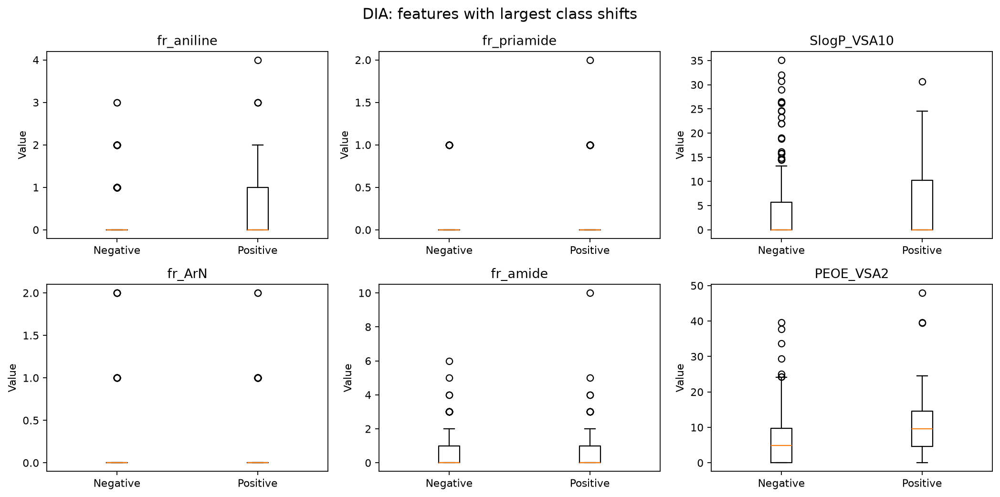

##### 对照：分布较对称的特征

上图中的 6 个特征是为了寻找类别位置差异，因此不能代表 DIA 中常见的分布形态。为提供对照，脚本另外从“不同取值数大于 10、标准差大于 0、零值比例不超过 5%”的特征中，选择偏度绝对值最小的 6 个：`FractionCSP3`、`MaxPartialCharge`、`MinAbsPartialCharge`、`MolMR`、`HallKierAlpha` 和 `Chi1v`。

这里称它们为“分布较对称的特征”，而不是严格的“正态特征”：偏度接近 0 只说明左右不对称程度较低，并不能证明服从正态分布。对照图中的中位数通常更接近箱体中央，上下须也相对均衡；部分特征仍然存在潜在离群点，这是正常数据中也可能出现的现象。两类箱体依然大量重叠，再次说明单个描述符的分类能力有限。

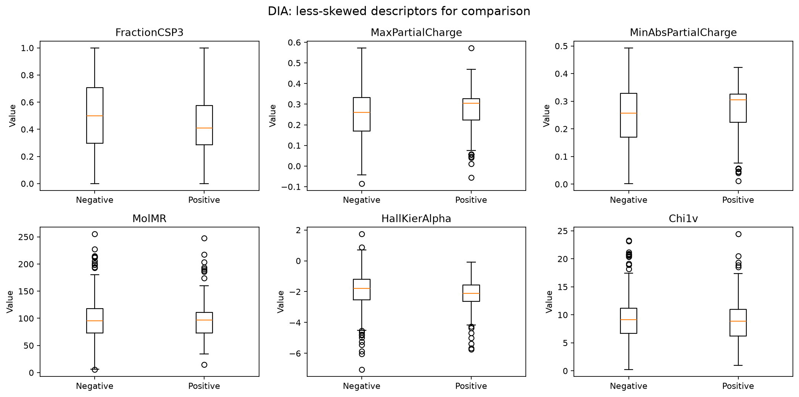

#### 直方图

直方图把特征的取值范围划分为若干区间（bin），再统计落入每个区间的样本。图中横轴是特征值，纵轴是概率密度，而不是样本数。对于类别 $g$ 的第 $k$ 个区间，其柱高可写为：

$$
h_{g,k}=\frac{n_{g,k}}{N_g\Delta_k}
$$

其中，$n_{g,k}$ 是该类别落入区间 $k$ 的样本数，$N_g$ 是该类别的总样本数，$\Delta_k$ 是区间宽度。因此，每种颜色柱形的总面积约为 1。这样可以比较阴性和阳性样本的分布形状，而不会让样本更多的阴性类别仅因数量较多就始终显得更高。图中蓝色表示阴性，红色表示阳性，透明区域表示两类分布重叠。

1. **如何挑选特征**：先排除标准差为 0 的常量特征，并只保留不同取值数大于 10 的特征，避免把简单的二值或低基数计数特征当作连续分布展示。然后计算每个候选特征的偏度。偏度可以直观写为标准化三阶矩：

   $$
   \operatorname{Skew}(X)\approx
   \frac{1}{n}\sum_{i=1}^{n}
   \left(\frac{x_i-\bar{x}}{s}\right)^3
   $$

   偏度大于 0 表示分布具有较长的右尾，偏度小于 0 表示具有较长的左尾。脚本按偏度绝对值从大到小选择特征，因此左右偏都会被考虑；本数据中选出的 6 个特征均为强右偏。

2. **为什么只画 6 个**：DIA 有 196 个输入特征，全部绘制会使图片难以阅读。6 个特征正好组成 $2\times3$ 的图格，用于展示偏态最严重的代表。数字 6 只是可读性选择，没有特殊的统计意义，这一步也不是模型的正式特征选择。

3. **这 6 个特征的目的**：它们用于集中检查最严重的偏态、长尾、零值集中和极端值问题，判断后续是否需要训练折内的变换、稳健缩放或分位数分箱。它们不是因为最能区分阴性和阳性而被选中，这一点与上面的箱线图不同。

| 特征 | 偏度 | 中位数 | 最大值 | 零值比例 |
| --- | ---: | ---: | ---: | ---: |
| `Ipc` | 22.67 | 411006 | $3.85\times10^{14}$ | 0% |
| `Kappa3` | 17.20 | 3.662 | 1512.24 | 0% |
| `MinAbsEStateIndex` | 7.10 | 0.106 | 6.578 | 0.3% |
| `fr_unbrch_alkane` | 7.03 | 0 | 18 | 87.8% |
| `PEOE_VSA5` | 4.58 | 0 | 69.606 | 84.1% |
| `PEOE_VSA12` | 3.63 | 0 | 59.072 | 67.0% |

4. **如何解读结果**：6 张图的主要质量都集中在横轴左端，右侧只有少量很大的取值，说明这些特征具有明显右偏和长尾。`Ipc` 最极端，其中位数约为 $4.11\times10^5$，最大值却达到 $3.85\times10^{14}$，导致绝大多数样本被压缩在图的最左侧。`fr_unbrch_alkane`、`PEOE_VSA5` 和 `PEOE_VSA12` 则表现出明显的零值集中。蓝色与红色分布整体仍大量重叠，说明这些严重偏态的特征也不能单独清楚地区分阴性和阳性；`PEOE_VSA12` 的两类形状存在一定差别，但仅凭该图不能认定它具有稳定的预测能力。

每个特征的阴性和阳性直方图共用由全体样本确定的 25 个等宽区间，因此同一子图中相同位置的蓝柱和红柱可以直接比较。

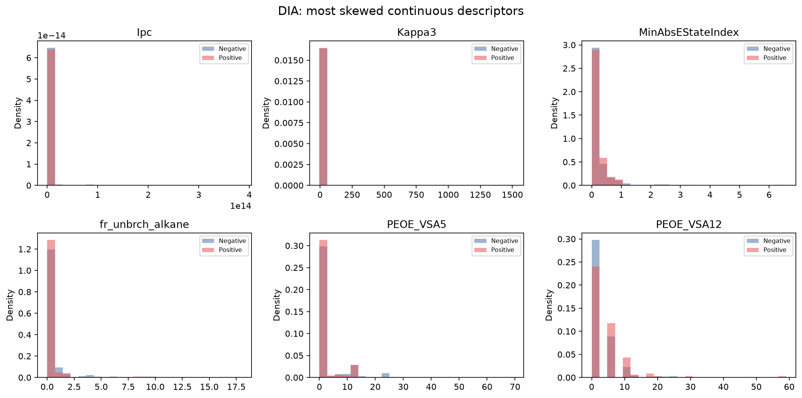

##### 对照：分布较对称的特征

对照直方图复用箱线图对照中的同一组 6 个特征。与强偏态图相比，它们的主要取值不会全部挤在最左侧，也没有由极少数样本拉出的超长右尾。`MolMR`、`HallKierAlpha` 和 `Chi1v` 呈现较清楚的单峰主体，`FractionCSP3` 因取值范围受限在 0 到 1 之间而较为平缓。它们仍不一定是理想的钟形正态分布，但更接近一般连续特征的常见形态。蓝红柱形大面积重叠，说明这些分布较常见的特征同样难以单独完成分类。

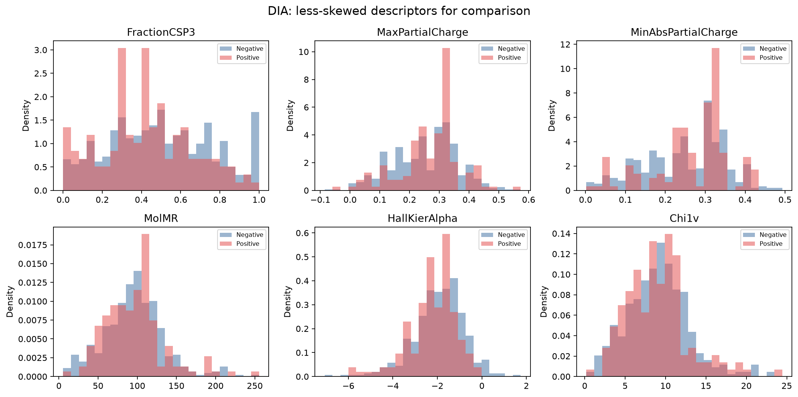

#### 分位数图

分位数图先把同一类别中的特征值从小到大排列：

$$
x_{(1)}\le x_{(2)}\le\cdots\le x_{(n_g)}
$$

再把第 $i$ 个有序值画在对应的分位位置：

$$
q_i=\frac{i-1}{n_g-1}, \qquad Q_g(q_i)=x_{(i)}
$$

其中，横轴 $q$ 表示样本在本类别中的相对位置，纵轴 $Q_g(q)$ 表示该分位处的特征值。蓝线代表阴性，红线代表阳性。曲线中的长水平段表示大量样本具有相同或接近的取值；末端突然变陡表示只有少量样本取得很大的值，即存在长尾或极端值；两条曲线在同一分位处明显分开，则表示两类样本在该段的分布不同。

1. **如何挑选特征**：分位数图直接复用直方图选出的 6 个特征。候选特征需要满足标准差大于 0、不同取值数大于 10，再按偏度绝对值从大到小选择。因此，这里展示的仍是 `Ipc`、`Kappa3`、`MinAbsEStateIndex`、`fr_unbrch_alkane`、`PEOE_VSA5` 和 `PEOE_VSA12`。

2. **为什么只画 6 个**：与直方图保持相同的 $2\times3$ 布局，可以逐一对照同一特征的两种图形。数字 6 仍然只是为了保证可读性，不代表统计阈值，也不是正式的特征筛选结果。

3. **这 6 个特征的目的**：直方图会受到区间数量和边界的影响，而分位数图直接展示排序后的全部观测值。它主要用于确认直方图中看到的偏态是否真实存在，并判断零值平台有多长、曲线从哪个分位开始上升、极端值集中在哪个类别。这些信息也能帮助后续决定是否采用分位数分箱、稳健变换或异常值敏感性分析。

4. **如何解读结果**：

   - `Ipc`：两条曲线在绝大多数分位上都贴近横轴，只在最末端急剧上升，说明分布具有极强的右尾。阴性组最大值约为 $3.85\times10^{14}$，阳性组约为 $8.50\times10^{13}$；少量极端值把纵轴范围拉得很大。
   - `Kappa3`：大部分样本取值较小，但阴性曲线的最后一个点升至约 1512，而阳性最大值仅约 20.8。图中的巨大差异主要来自极少数阴性极端值，不能理解成整个阴性组普遍更大。
   - `MinAbsEStateIndex`：两类在大部分分位上比较接近，但阴性曲线在高分位处上升更快，最大值为 6.578；阳性最大值为 0.940。这说明类别差异主要出现在阴性组的上尾，而不是主体区域。
   - `fr_unbrch_alkane`：阴性和阳性的零值比例分别约为 86.2% 和 92.6%，所以曲线长期保持在 0；接近最高分位时才呈阶梯状上升。阶梯来自整数计数值，阴性的尾部更长，最大值为 18，阳性最大值为 9。
   - `PEOE_VSA5`：阴性和阳性的零值比例分别约为 83.1% 和 87.2%。两条曲线都在高分位才离开 0，但阴性存在更长的上尾，最大值约为 69.6，阳性最大值约为 13.2。
   - `PEOE_VSA12`：阳性曲线比阴性曲线更早离开 0，因为阳性的零值比例较低，约为 56.8%，而阴性约为 70.4%。阳性上尾也更长，最大值约为 59.1，阴性最大值约为 24.4。这是 6 个特征中类别曲线差异相对较明显的一个，但两类仍有大量重叠，不能仅凭该图断定它能够稳定完成分类。

总体上，分位数图确认了直方图中的结论：这些特征的主体分布集中在较小取值或 0 附近，少量样本形成很长的右尾。后续若进行缩放、变换或分箱，参数必须只在每个训练折中拟合，避免把验证集的分位信息泄漏到训练过程。

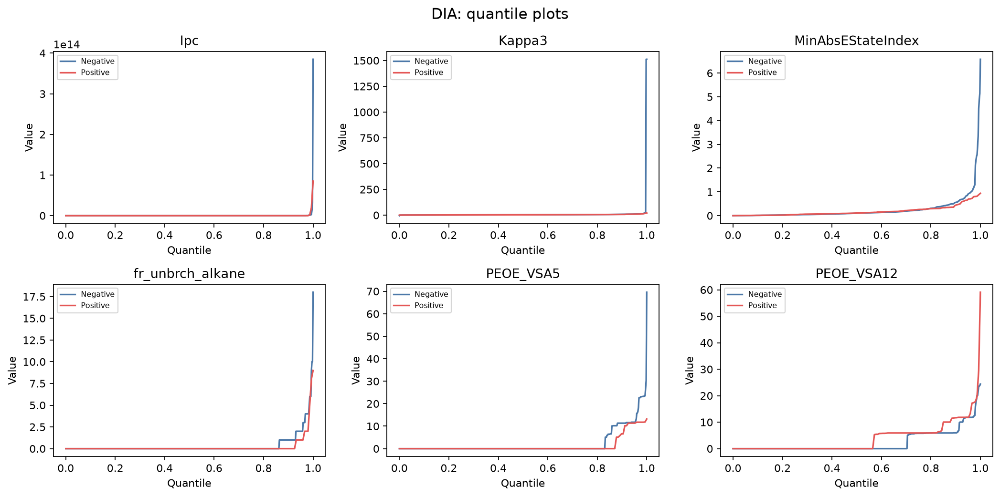

##### 对照：分布较对称的特征

对照分位数图仍使用相同的 6 个低偏度特征。与强偏态特征在最高分位处近乎竖直上升不同，这些曲线通常在整个 0–1 分位范围内逐渐变化，说明取值更均匀地分布在主体区间。`MolMR`、`HallKierAlpha` 和 `Chi1v` 的两端仍略有弯曲，表示尾部不是完全对称；这也说明“偏度较低”不等于“没有尾部或离群值”。多数蓝线和红线走势接近，仍未显示清晰的单特征分类边界。

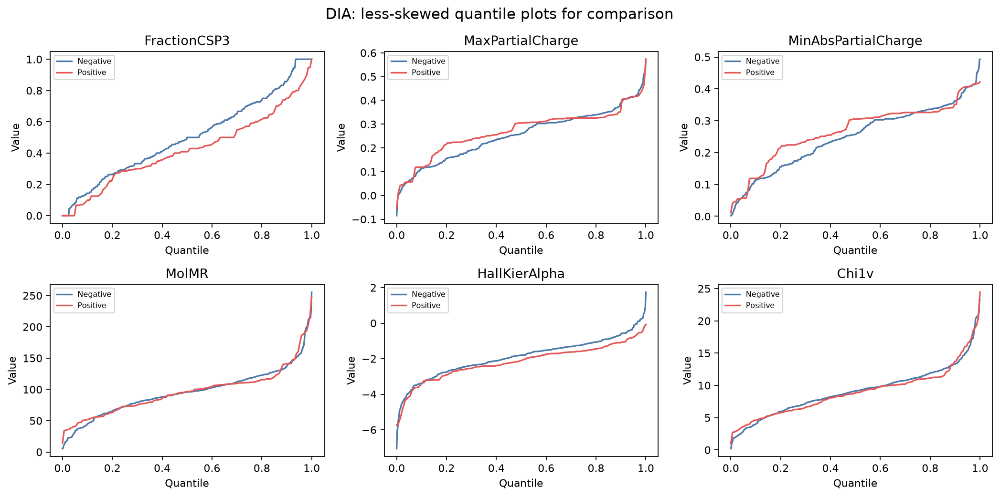

#### 相关性热力图

这张图使用 Pearson 相关系数衡量两个变量之间的线性关系：

$$
r_{XY}=\frac{\sum_{i=1}^{n}(x_i-\bar{x})(y_i-\bar{y})}
{\sqrt{\sum_{i=1}^{n}(x_i-\bar{x})^2}\sqrt{\sum_{i=1}^{n}(y_i-\bar{y})^2}}
$$

$r$ 的范围是 $[-1,1]$。$r$ 越接近 1，两个变量越倾向于同向线性变化；越接近 -1，越倾向于反向线性变化；接近 0 表示没有明显的线性关系，但不代表一定没有非线性关系。由于 `Label` 取 0 或 1，特征与 `Label` 的 Pearson 相关系数也可以理解为点二列相关系数：正值表示较大的特征值更常出现在阳性样本中，负值则相反。

1. **如何挑选特征**：先计算每个非常量描述符与 `Label` 的 Pearson 相关系数，再按相关系数绝对值从大到小选择前 15 个。选择绝对值是因为正相关和负相关都可能包含分类信息。选中的特征从 `fr_aniline` 到 `MinPartialCharge`，其中与标签关系最强的是 `fr_aniline`，但其相关系数也只有 $r=0.216$。

2. **为什么先画 15 个**：179 个非常量特征会形成很大的矩阵，难以直接阅读单个格子。先取 15 个特征并加入 `Label`，形成 $16\times16$ 的局部热力图，可以清楚查看与标签关系相对较强的一组特征。数字 15 是可读性选择，不是统计显著性阈值。

3. **这些特征的目的**：局部热力图同时展示这 15 个候选特征彼此之间的相关性，以及每个特征与 `Label` 的相关性。其目的是判断：哪些特征与标签存在相对较强的线性关系，以及这些特征是否其实描述了相近的化学性质，从而向模型重复提供同一类信息。

4. **如何解读结果**：横轴和纵轴是同一组特征以及 `Label`，每个方格表示一对变量的 Pearson $r$。主对角线都是变量与自身的相关性，因此恒为 1，不提供额外信息。红色表示正相关，蓝色表示负相关，颜色越深表示线性关系越强。最右列和最下行直接给出各特征与 `Label` 的相关性。

   - 图中多数非对角方格颜色较浅，说明这 15 个特征并没有全部表达同一种信息。
   - 较强的正相关包括 `fr_aniline` 与 `SlogP_VSA10`（$r=0.724$）、`PEOE_VSA2` 与 `fr_C_O`（$r=0.692$），以及 `NHOHCount` 与 `fr_NH2`（$r=0.650$）。这些特征可能包含部分重叠信息。
   - 最明显的负相关是 `fr_aniline` 与 `FractionCSP3`（$r=-0.378$），强度仍然不算很高。
   - 所选特征与标签的最大绝对相关系数仅为 0.216，因此不能把“入选热力图”理解成具有很强的单特征预测能力。它们只是 196 个描述符中相对靠前的 15 个。

这一步是在完整数据上进行的探索性展示。如果以后把“按标签相关性选择特征”真正用于模型训练，必须在每个训练折内部重新选择，不能利用验证折的标签。

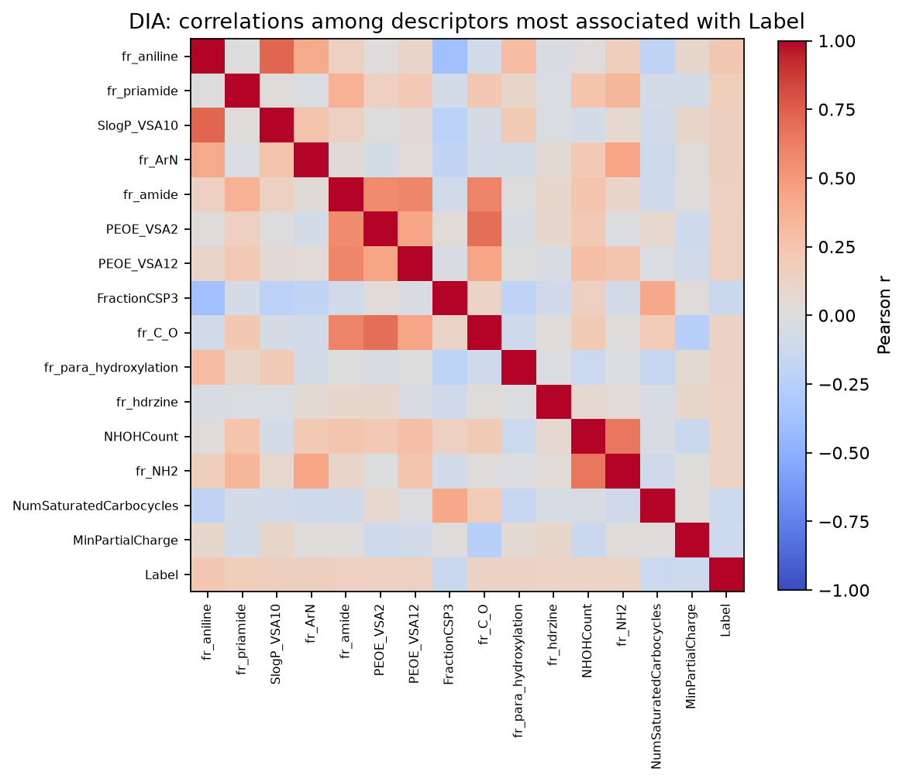

##### 全部非常量特征与 Label 的相关性

局部热力图只能显示前 15 个特征。为直接查看全部 179 个非常量描述符与 `Label` 的关系，脚本另外生成排序后的水平条形图：红色表示正相关，蓝色表示负相关，条形长度表示相关强度。图中所有系数都位于约 -0.13 到 0.22 之间，再次说明没有任何单个描述符与标签具有很强的线性关系。精确数值保存在 [DIA Label correlations](../results/eda/dia/label_correlations.csv)。

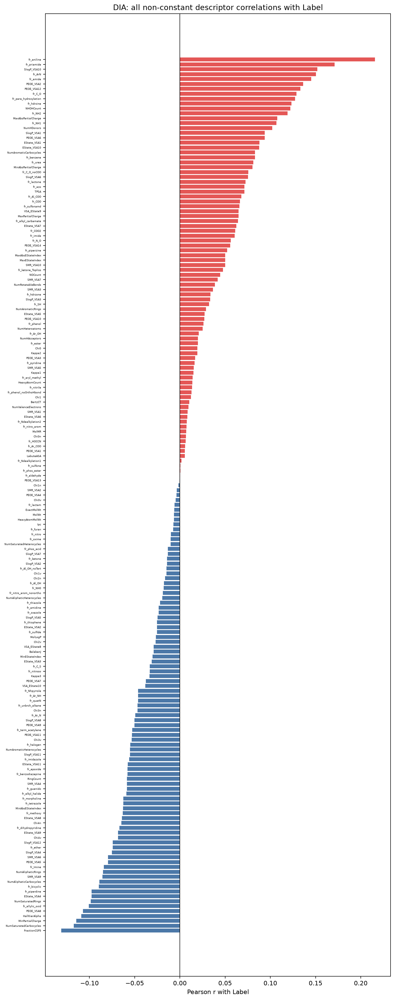

##### 全部非常量特征相关性矩阵

完整热力图包含 179 个非常量描述符和 `Label`，因此矩阵大小为 $180\times180$。所有描述符都实际参与了计算；17 个常量特征因为标准差为 0、Pearson 相关系数没有定义而被排除。图中左上区域出现多个深红色块，说明一批分子规模、连接性和表面积类描述符彼此高度正相关；其余区域大多颜色较浅，表示线性关系较弱。最右列和最下行是全部描述符与 `Label` 的相关性，因为数值整体较小，在完整矩阵中接近中性色。

这张大图适合观察整体结构和相关特征簇；由于单元格很多，不适合逐格读取。需要查看具体名称和数值时，应放大原图，并结合上面的局部热力图、Label 相关系数表和散点图。

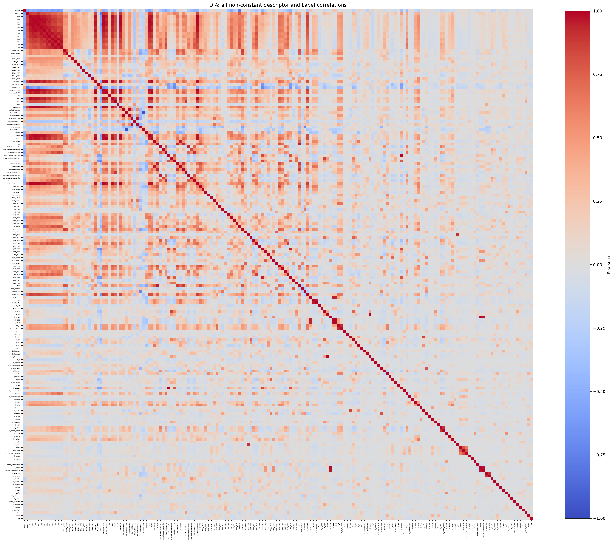

#### 全体描述符两两相关性概览

只展示相关性最高的 3 对散点，能够确认某些特征是否完全重复，但不能说明 190 多个特征整体上的相关情况。为回答整体问题，这里汇总 179 个非常量描述符产生的全部有效特征对：

$$
\binom{179}{2}=15\,931
$$

图中横轴是每一对特征的绝对 Pearson 相关系数 $\lvert r\rvert$，纵轴是落入相应区间的特征对数量。由于高相关特征对远少于低相关特征对，纵轴使用对数尺度。红色虚线分别标记 0.5、0.7、0.9 和 0.95。

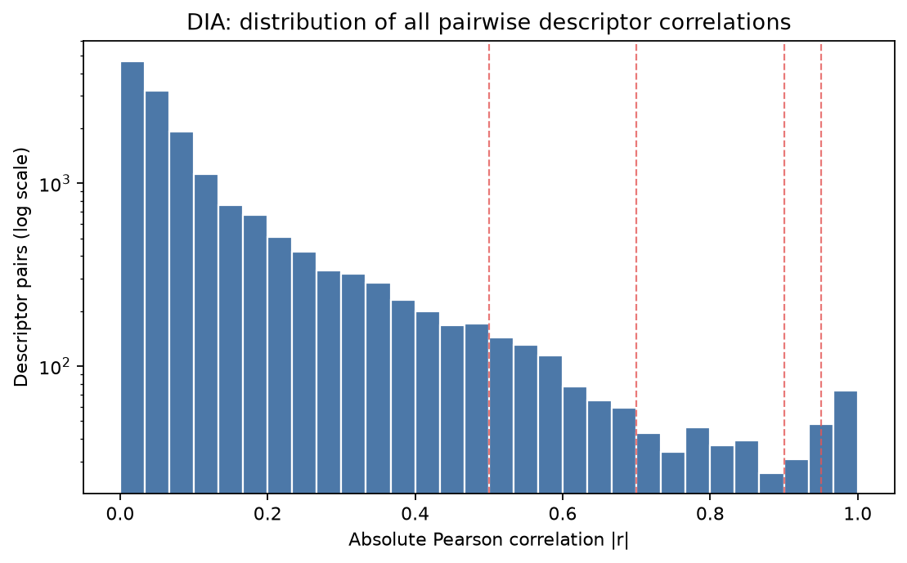

| 统计量或阈值 | 特征对数量或结果 | 占全部特征对比例 |
| --- | ---: | ---: |
| $\lvert r\rvert$ 中位数 | 0.068 | — |
| $\lvert r\rvert$ 第 75 百分位数 | 0.179 | — |
| $\lvert r\rvert\ge0.30$ | 2339 | 7.30% |
| $\lvert r\rvert\ge0.50$ | 966 | 3.01% |
| $\lvert r\rvert\ge0.70$ | 377 | 1.18% |
| $\lvert r\rvert\ge0.90$ | 152 | 0.47% |
| $\lvert r\rvert\ge0.95$ | 101 | 0.32% |
| $\lvert r\rvert\ge0.99$ | 18 | 0.06% |

整体结论是：大多数描述符之间的线性相关性较弱，不能简单地对全部 179 个特征进行大规模删除；但数据中确实存在一个规模不大的强相关子集，适合在后续训练折内做相关性去重。阈值越低，删除的特征越多，也越可能误删仍有补充信息的描述符。因此可以先把 $\lvert r\rvert\ge0.95$ 作为保守起点，再通过交叉验证比较去重前后的模型表现。

原来的 3 对散点图仍由脚本生成，作为验证极端相关关系的辅助结果，但不再承担总体结论。经逐行核对，`MaxAbsEStateIndex`/`MaxEStateIndex`、`NumAromaticCarbocycles`/`fr_benzene` 和 `fr_Ar_NH`/`fr_Nhpyrrole` 在当前数据中完全相等。

### 可能影响后续训练的问题与决定

| 问题                           | 数据支撑与图表表现                                                                                                                                                                                                                   | 可能影响                              | 后续处理                                                                                                                                        |
| ------------------------------ | ------------------------------------------------------------------------------------------------------------------------------------------------------------------------------------------------------------------------------------ | ------------------------------------- | ----------------------------------------------------------------------------------------------------------------------------------------------- |
| 597 个样本对应 196 个描述符    | 来自原始数据结构和[特征统计表](../results/eda/dia/feature_summary.csv)，样本数约为特征数的 3 倍；这是维度统计，没有单独作图                                                                                                           | 高维小样本容易过拟合，验证结果波动大  | 使用固定的分层 K 折；报告各折均值和波动                                                                                                         |
| 阳性只占 24.8%                 | [类别分布图](../results/eda/dia/class_distribution.png) 中阴性柱为 449（75.2%），阳性柱为 148（24.8%），高度约为 3:1                                                                                                                  | Accuracy 可能掩盖少数类效果           | 使用分层划分，并报告 F1、ROC-AUC、PR-AUC 等分类指标；类别权重作为待比较选项                                                                     |
| 17 个常量特征、58 个极稀疏特征 | [特征统计表](../results/eda/dia/feature_summary.csv) 中 17 列 `std=0`，58 列 `zero_fraction>=0.95`；[箱线图](../results/eda/dia/boxplots.png) 和 [直方图](../results/eda/dia/histograms.png) 中多个片段特征集中在 0，仅有少量非零点 | 无信息特征增加参数和规则搜索空间      | 在每个训练折删除零方差特征；近零方差特征是否删除由验证结果决定                                                                                  |
| 特征尺度和长尾差异大           | [直方图](../results/eda/dia/histograms.png) 中 `Ipc`、`Kappa3` 等主体挤在低值端；[分位数图](../results/eda/dia/quantile_plots.png) 在最高分位处突然上升，`Ipc` 最大值约为 $3.85\times10^{14}$                                  | 线性/神经网络训练不稳定，等宽分箱失真 | 线性模型在训练折做标准化；RRL 比较分位数或监督离散化；树模型保留原尺度                                                                          |
| 101 对高度相关描述符           | [完整相关性热力图](../results/eda/dia/correlation_all.png) 中存在局部深色块；[全部特征对相关系数分布](../results/eda/dia/correlation_distribution.png) 显示 101 对满足 $\lvert r\rvert\ge0.95$，占 15,931 对的 0.32% | 线性系数不稳定、规则重复、解释冗余    | 以 $\lvert r\rvert\ge0.95$ 作为保守起点，在训练折内做相关性约简，并通过交叉验证比较去重前后的表现                                               |
| 单特征与标签关系较弱           | 单特征与 `Label` 的最大 $\lvert r\rvert$ 仅 0.216；[箱线图](../results/eda/dia/boxplots.png) 中两类箱体和散点明显重叠，[直方图](../results/eda/dia/histograms.png) 中两类分布也大量重合 | 单变量阈值难以获得高性能              | 需要组合特征或非线性交互，同时严格控制复杂度                                                                                                    |

## Abalone（回归）

### 数据概况

- 共 4177 个样本；输入为 `Sex` 和 7 个连续物理测量，目标为整数 `Rings`。
- `Sex` 包含 M 1528 个、F 1307 个、I 1342 个，数量相对均衡；无缺失值或重复行。
- `Rings` 均值 9.934、中位数和众数均为 9、范围 1–29，分布右偏；完整统计见 [Abalone feature summary](../results/eda/abalone/feature_summary.csv)。

### 六项分析及发现

1. **Central Tendency**：幼体 I 的 `Rings` 均值为 7.890，明显低于 F 的 11.129 和 M 的 10.705，因此 `Sex` 与年龄阶段有关，不能丢弃，也不能简单编码成有顺序的 1/2/3。
2. **Dispersion**：`Height` 有两个 0、一个 0.515 和一个 1.130；其余大部分集中在约 0.1–0.2。另有 4 行 `Shucked weight > Whole weight`，其中一行同时 `Shell weight > Whole weight`，属于需要复核的物理矛盾。
3. **Boxplot**：重量和 `Rings` 均有较多高端离群点；幼体整体尺寸、重量和环数较低。IQR 离群不等于录入错误，不能统一删除。
4. **Histogram**：各重量字段和 `Rings` 右偏；`Rings` 的高年龄样本稀少，`Rings >= 20` 只有 62 个，模型可能倾向预测样本密集的 8–11 环区间。
5. **Quantile Plot**：`Height` 末端出现突跃，支持单独复核极端高度；重量和 `Rings` 的上尾也明显，但总体是连续过渡，宜保留真实的大个体和高龄样本。
6. **Scatter Plot**：长度、直径和重量与 `Rings` 呈中等正相关，但散点较宽，说明物理尺寸不能完全决定年龄。输入之间存在强共线性，例如 `Length`/`Diameter` 的 $r=0.987$，`Whole weight`/`Shucked weight` 的 $r=0.969$。


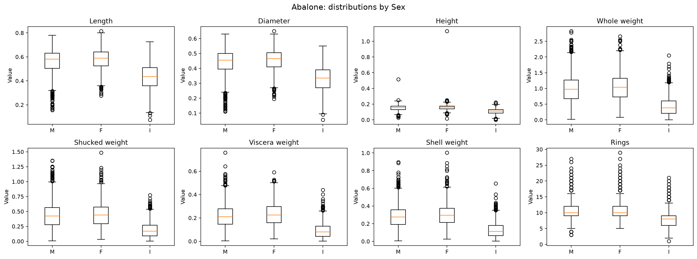

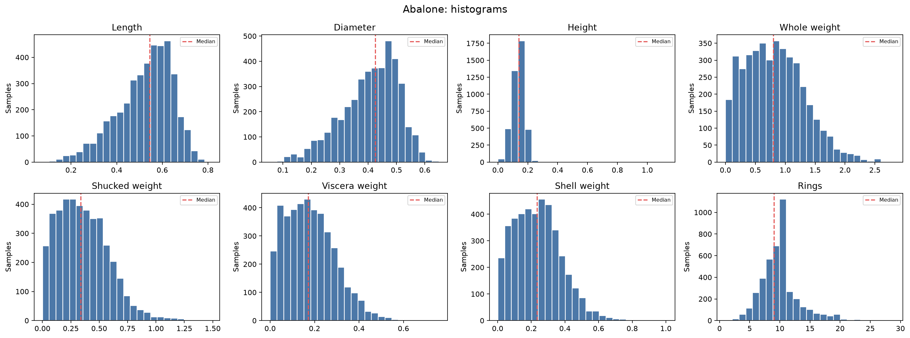

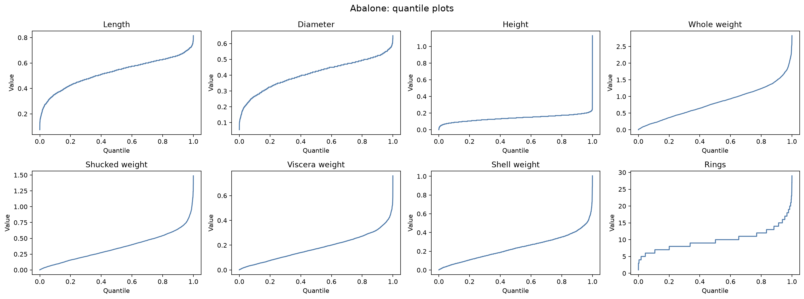

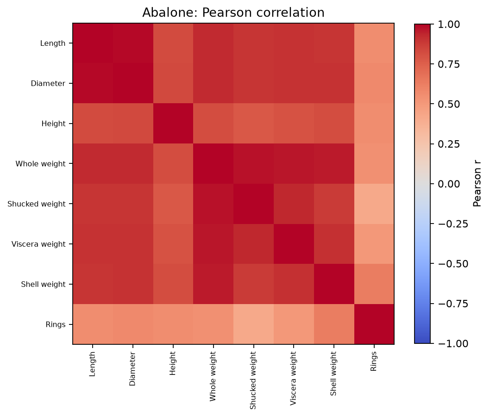

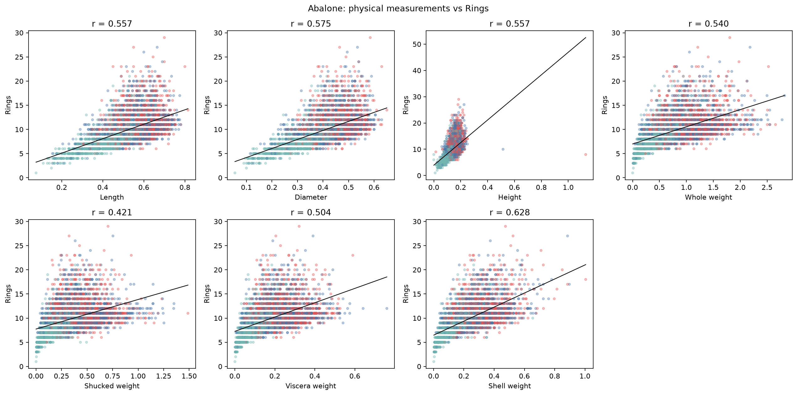

### 可能影响后续训练的问题与决定

| 问题                             | 数据支撑与图表表现                                                                                                                                                                                                                                                                   | 可能影响                                   | 后续处理                                                                    |
| -------------------------------- | ------------------------------------------------------------------------------------------------------------------------------------------------------------------------------------------------------------------------------------------------------------------------------------ | ------------------------------------------ | --------------------------------------------------------------------------- |
| `Sex` 是无序类别且各组分布不同 | [目标与类别分布图](../results/eda/abalone/target_distribution.png) 显示三组数量接近；[分组箱线图](../results/eda/abalone/boxplots.png) 中幼体 I 的尺寸、重量和 `Rings` 整体低于 M/F，I、F、M 的 `Rings` 均值分别为 7.890、11.129、10.705                                           | 直接使用 M/F/I 字符或 1/2/3 会引入错误关系 | 在训练流程中使用 One-Hot Encoding                                           |
| 极端/矛盾测量值                  | [箱线图](../results/eda/abalone/boxplots.png) 中 `Height=1.130` 远离箱体；[分位数图](../results/eda/abalone/quantile_plots.png) 的 `Height` 曲线末端突跃，[散点图](../results/eda/abalone/scatterplots.png) 中也出现孤立高度点；原始数据另有 4 行 `Shucked weight > Whole weight` | 对均方误差、标准化和线性回归斜率影响较大   | 首轮保留并建立异常标记；再做“保留/修正或剔除”的敏感性比较，不直接批量删除 |
| 重量和目标右偏、高龄样本稀少     | [直方图](../results/eda/abalone/histograms.png) 中重量和 `Rings` 有明显右尾；[目标分布图](../results/eda/abalone/target_distribution.png) 在 9–10 环附近最高，20 环后样本很少；`Rings>=20` 仅 62 个                                                                               | 模型容易低估高龄鲍鱼，RMSE 对尾部误差敏感  | 除 RMSE 外报告 MAE 和 $R^2$，并单独检查高环数样本误差                      |
| 输入特征高度相关                 | [相关性图](../results/eda/abalone/correlation.png) 中长度、直径和重量区域大面积深红；`Length`/`Diameter` 的 $r=0.987$，`Whole weight`/`Shucked weight` 的 $r=0.969$                                                                                                          | 线性系数可能不稳定，重复信息增加模型复杂度 | 线性模型使用正则化；树模型保留原特征；不默认使用 PCA                        |
| 特征尺度不同                     | [特征统计表](../results/eda/abalone/feature_summary.csv) 显示长度约 0.075–0.815、整体重量约 0.002–2.826、`Rings` 为 1–29；各 [直方图](../results/eda/abalone/histograms.png) 的横轴范围明显不同                                                                                   | 影响线性、距离和神经网络类模型             | 在训练折内标准化连续特征；树模型不强制标准化                                |
| 尺寸与`Rings` 关系不是纯线性   | [散点图](../results/eda/abalone/scatterplots.png) 虽有上升趋势，但同一尺寸对应的 `Rings` 范围很宽，并呈现性别/年龄组聚集；单特征相关系数仅约 0.421–0.628                                                                                                                           | 单一线性模型可能欠拟合                     | 保留线性模型作为基线，并与树集成和 RRL 回归版本比较                         |

## 当前结论

DIA 的首要风险是高维小样本、类别不平衡、稀疏/常量描述符、长尾和强冗余；Abalone 的首要风险是少量可疑测量、目标长尾、输入共线性以及非纯线性关系。下一阶段应先固定交叉验证，再把所有会学习参数的清洗、标准化、特征过滤和离散化放入训练折，避免数据泄漏。
