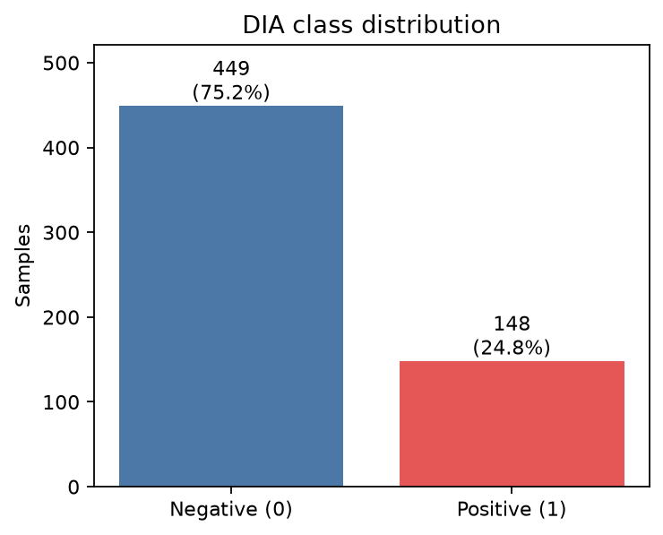
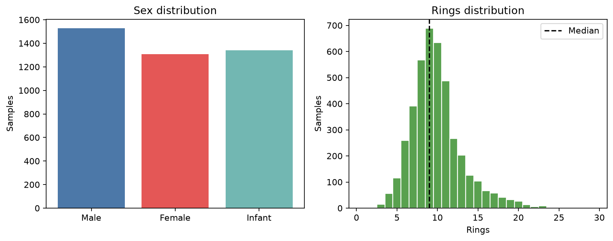
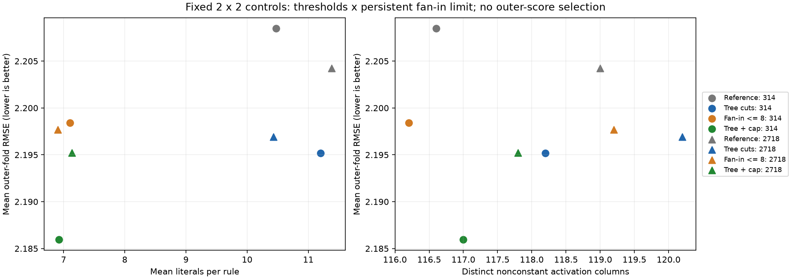
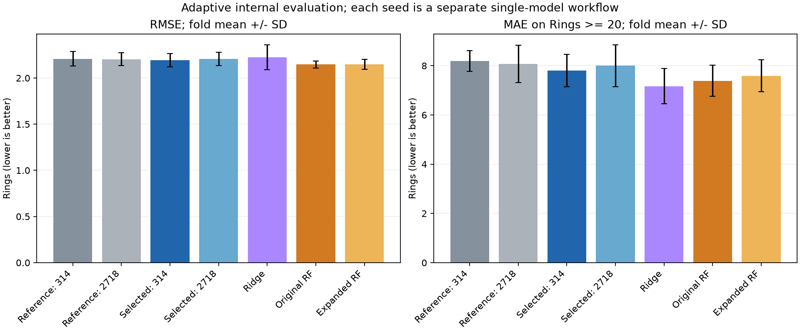

# 数据挖掘大作业协作总览

更新于 2026-10-08。本页供小组成员理解任务、接续实验和讨论想法。这里既记录做成了什么，也记录我们为什么尝试、哪些想法被结果改变。具体数字与实验细节可沿文中的链接查看；课程要求以[大作业 PDF](数据挖掘课程大作业.pdf)为准，逐项完成情况见[要求清单](REQUIREMENTS-CHECKLIST.md)。

目前两项任务的主要实验都已有结果。DIA 上，优化后的 RRL 在默认分类阈值下取得较好的阳性 F1，随机森林则更擅长给样本排序；Abalone 上，纯规则 RRL 比最初版本明显进步，但目前仍不及随机森林。实验资料已经相当丰富，下一步重点是把它们整理成一份前后一致的报告，并准备课程要求的 PDF 和代码 ZIP。

## 一、我们要完成什么

课程给了两个表格任务。**DIA 是二分类**：根据药物的 RDKit 描述符，预测它是否可能诱发自身免疫反应。**Abalone 是回归**：根据鲍鱼容易测量的属性，预测生长环数 `Rings`；年龄通常近似为 `Rings + 1.5`，但训练目标仍是 `Rings`。

对于DIA任务：给的是两个表格的数据

| 数据              | DIA-positive | DIA-negative | 总数 |
| ----------------- | -----------: | -----------: | ---: |
| Training set      |          118 |          359 |  477 |
| External test set |           30 |           90 |  120 |
| 总计              |          148 |          449 |  597 |

可以理解每一行是一个药物分子；数据集的简介里说有 195 个描述符，实际 CSV 中有 196 个数值描述符和一个 0/1 标签，任务是通过这些描述符进行分类，判断每个药物的 0/1 标签。数据集里需要知道的术语：**SMILES**是化学式的一个完整表述，理论上包含了所有需要的信息。**RDKit**是一个确定性程序，通过 SMILES 表达式确定性地计算出一些方便数据分析的特征，比如分子量、结构特征等等；我们获得的数据就是 500+ 个药物分子乘以每个分子的 196 个 RDKit 数值描述符。

对于abalone任务：一句话，就是通过鲍鱼一些简单、易测量的数据来预测它的年龄（难测量）。给了一个4177行，9列的表格数据，每一行代表一只鲍鱼。9列中，有8列是鲍鱼的8个属性，最后一列称为 Rings，是我们要预测的目标（年龄 ≈ Rings + 1.5，所以预测Rings就是预测年龄）。

| 字段               | 类型       | 含义                                               |
| ------------------ | ---------- | -------------------------------------------------- |
| `Sex`            | 类别型     | 性别：`M`雄性、`F`雌性、`I`幼体              |
| `Length`         | 连续数值   | 贝壳最长尺寸                                       |
| `Diameter`       | 连续数值   | 垂直于长度方向的贝壳直径（应该小于Length）         |
| `Height`         | 连续数值   | 包含肉体时的贝壳高度（应该小于Length）             |
| `Whole weight`   | 连续数值   | 整只鲍鱼重量                                       |
| `Shucked weight` | 连续数值   | 去壳后肉的重量（应该小于总重量）                   |
| `Viscera weight` | 连续数值   | 放血后内脏重量（应该小于总重量）                   |
| `Shell weight`   | 连续数值   | 干燥后贝壳重量（应该小于总重量）                   |
| `Rings`          | 整数型目标 | 贝壳生长环数量，用于预测年龄，是本次任务的预测目标 |

每个任务都需要一个可解释模型，以及至少两个对比模型；每个任务的对比模型中至少有一个需要自己实现。我们选择 RRL 作为可解释模型，在 DIA 上使用手写逻辑回归和随机森林，在 Abalone 上使用手写 Ridge 回归和随机森林。课程还要求对 RRL 至少做一种有意义的结构优化，说明数据分析、预处理、训练划分、指标、调参和模型比较的过程，并讨论解释是否真正对应模型的预测方式。[要求清单](REQUIREMENTS-CHECKLIST.md)列出了原文条款和各项证据。

## 二、两份数据各是什么样

| 项目         | DIA                                              | Abalone                                 |
| ------------ | ------------------------------------------------ | --------------------------------------- |
| 每行代表     | 一种药物分子                                     | 一只鲍鱼                                |
| 样本数       | 官方训练集 477、测试集 120，合并后 597           | 4177                                    |
| 输入         | 196 个 RDKit 数值描述符；`SMILES` 仅作分子标识 | `Sex` 加 7 个长度、高度、重量等测量值 |
| 目标         | `Label`，0 为阴性，1 为阳性                    | `Rings`，生长环数                     |
| 当前评价划分 | 合并官方两表后做分层五折                         | 对全部记录打乱后做五折                  |

数据来源和原始文件见[数据说明](DATASETS.md)及 `data/raw/`。

### DIA 的分析给了我们什么线索

597 个样本里有 148 个阳性、449 个阴性。若模型几乎都预测阴性，准确率看起来也可能不低，却会漏掉真正需要关注的阳性药物。因此评价时要看阳性召回率、F1 和排序指标，不能只看 Accuracy。

输入里有 17 个常量描述符、20 个实际只取 0/1 的描述符、76 个一般整数特征和 83 个浮点特征。许多片段计数大部分时间为 0；部分连续描述符有很长的右尾，而且不同列的数值尺度差很多。179 个非常量描述符之间，整体相关性不算高，但仍有 101 对满足 $|r|\ge 0.95$。这提示我们留意冗余，也启发了“固定随机阈值可能没有覆盖数据密集区”的二值化实验。删掉常量或高度相关的列曾是候选想法；现有正式对照保留全部 196 个输入。[EDA 统计表](../results/eda/dia/feature_summary.csv)和[完整分析](EDA.md)可逐列核对。强烈建议看看探索性数据分析的文档：EDA.md，这个文档里有两个任务的数据分析。对于数据的分析结果是指导我们后续工作的重要来源。



### Abalone 的分析给了我们什么线索

`Rings` 的均值约 9.93，中位数为 9；I 组平均约 7.89，F、M 组约 11.13 和 10.71。我们因此保留 `Sex`，并做 One-Hot 编码：F/M/I 是三个类别，用 1/2/3 会凭空给它们排出大小关系。当前主线保留 I、M 两个指示列：F 对应 $(0,0)$，I 对应 $(1,0)$，M 对应 $(0,1)$；F 是基准类别，两个指示列已足以区分三组。长度和直径的 Pearson 相关系数约 0.987，整体重量与去壳肉重约 0.969，这为 Ridge 的正则化候选提供了理由。

另有 7 条记录触发了事先定义的测量一致性检查，例如高度为 0、肉重超过整体重量。它们值得回看原始行，却没有可靠依据可替它们“修正”数值。主实验保留原记录，只在训练折做过移除疑点的敏感性比较。高龄尾部也很稀少：`Rings ≥ 20` 只有 62 条。若模型主要学到常见的 8–11 环，很容易把高龄个体估低，因此我们额外统计这一组的误差。数据证据和图见[Abalone EDA 与质量检查](ABALONE-REPORT.md)及[疑点原始行索引](../results/eda/abalone/suspect_records.csv)。同样的，更细致的数据分析核解释在EDA.md中，建议看看。



一条贯穿两个任务的习惯是：**图先告诉我们可能有问题，实验再判断处理是否真有帮助。**

## 三、模型到底怎样比较：五折、验证集和测试折

一个”折“是**一组样本**。DIA 原始训练表有 477 条、测试表有 120 条；按作业允许的交叉验证方案，我们把两表合成 597 条，再用固定随机种子打乱，并按阳性、阴性比例**分层**分成互不重叠的五折 F1–F5。每折约 119–120 条，阳性比例都尽量接近全体的 $148/597$。五折合起来恰好是全部样本，每条样本只属于其中一折。

所谓“外层五折”，是让 F1、F2、……、F5 **轮流当一次测试折**。例如本轮指定 F2 测试：F2 约 120 条先放在一边，剩下 F1、F3、F4、F5 约 477 条才是本轮可用的训练数据。换成 F3 测试时，又是一次从头开始的独立实验：F3 放在一边，其他四折参与训练。完成五轮后，每条样本都恰好被一个**没有用它训练的模型**预测过一次；这个过程总共会产生5个训练后的模型。五个测试折的成绩用来评价整个训练方法。

但“用四折训练”还留下一个问题：RRL 的规则宽度、正则强度等超参数该选哪组？如果试了很多组，直接挑 **F2 测试分数**最高的那组，F2 就参与了决策，最后再把这个分数当作客观测试成绩会偏乐观。这就是为什么需要“内层”：**外层负责检验最终效果，内层只在本轮的训练数据里选参数**。以优化版 DIA RRL 为例，本轮 F2 测试时，把其余约 477 条再分层分成 V1–V3；对每组候选参数，依次拿约 318 条训练、约 159 条验证，共做三次，比较三次验证分数的平均值。选定参数后，丢开这三次临时训练的模型，用约 477 条完整外层训练数据重新训练一个新模型，最后才在 F2 上评一次。

所以这里的“内外层都分折”不是把 597 条先分五折、再把包括 F2 在内的全部数据重新分三折；**内层三折只来自当前外层的四个训练折**。流程可以记成：

```text
DIA 全部 597 条
  外层：F2 约 120 条 → 本轮最后测试一次
        其余约 477 条 → 本轮训练和选参
          内层：V1/V2/V3 轮流验证 → 选超参数
        选好后在约 477 条上重训 → 到 F2 测试
```

预处理也跟着这个边界走：内层训练时，只用约 318 条估计均值、标准差和编码／切点，再应用到对应的验证折；外层重训时，只用约 477 条估计这些参数，再应用到 F2。否则即使没有看 F2 的标签，F2 的特征分布也提前影响了模型。轮到 F3 测试时，F2 可以进入**那个新模型**的训练数据；它不会倒流进先前那个以 F2 为测试折的模型，因此这不构成泄漏。

三折内层搜索是优化版 DIA RRL 的做法；DIA 的逻辑回归和随机森林也使用相同的外层五折，但在每轮外层训练数据中只做一次分层训练／验证划分来选参。固定参数的原始 RRL 则不做内层搜索。它们的共同原则都是：**本轮测试折不参与本轮的选参、预处理拟合或训练**。Abalone 同样使用外层五折，但回归任务不按类别分层，而是打乱后划分；其训练内早停也是在当前可用的训练数据中决定何时停止。[DIA 报告 §2](DIA-REPORT.md)和[Abalone 最新方案](ABALONE-LITERATURE-PLAN.md)记录了具体实验设置。

最后用 DIA 全部数据训练出的交付模型，与五折中被评价的五个模型都不同。因此“五折平均成绩”评价的是这套训练和选参方法，而不是给这个全数据模型又做了一次独立测试。

## 四、三类模型分别在做什么

两个任务都各使用了三种模型：手写线性模型和随机森林作为对比baseline，其中手写线性模型满足了作业文档要求的”自己手动实现至少 1 个模型“。RRL是我们待测的主模型。

**手写线性模型**回答“如果我只用简单关系建模预测模型，性能能做到什么程度”。DIA 的逻辑回归把输入加权求和后转成阳性概率；Abalone 的 Ridge 用输入的线性组合预测 Rings，并用 L2 正则化缓和高度相关特征造成的系数不稳定。两者都由项目代码实现，分别在[logistic.py](../models/manual_glm/logistic.py)和[ridge.py](../models/manual_glm/ridge.py)。它们容易作为参照，是一个baseline，也能提示更复杂的模型是否真正学到了额外关系。

**随机森林**训练很多决策树并合并预测，能表达阈值切分和特征交互。它使用成熟的 sklearn 实现，不算手写模型。在本项目中，它为 RRL 提供一个较强的非线性参照。DIA 和 Abalone 都对树的深度、叶节点样本数等参数做过训练内选择；Abalone 后来还扩大了 RF 搜索范围。入口分别见[DIA 基线](../experiments/run_dia_baselines.py)和[Abalone 基线](../experiments/run_abalone.py)。

**RRL**先把数值变成“是否大于某个阈值”这样的 0/1 条件，再用 AND、OR 组成规则，最后把规则交给输出层。比如：

> `Length > 0.5 AND Shell weight > 0.3`

这条规则对一只鲍鱼要么成立（1），要么不成立（0）。在 DIA 中，模型为阴性和阳性各算一个分数（logit）；两类分数经 softmax 转成总和为 1 的概率：

$$
z_c=b_c+\sum_j a_{cj}R_j(x),\qquad
p(y=1\mid x)=\frac{e^{z_1}}{e^{z_0}+e^{z_1}}.
$$

比如 $z_1=2,z_0=1$，阳性概率就是 $e^2/(e^2+e^1)\approx0.731$。某条规则给阳性分数加正权重，就表示它在与其他规则共同作用时更支持阳性。在 Abalone 中，分类输出改为单个实数：

$$
\widehat{\mathrm{Rings}}=b+\sum_j a_jR_j(x),\qquad R_j(x)\in\{0,1\}.
$$

这里 $R_j(x)$ 表示第 $j$ 条规则是否成立，$a_j$ 是它对预测环数的贡献。例如某规则成立时 $a_j=-0.55$，它就把模型在其他项基础上的预测降低 0.55 环；完整预测还要加上偏置和其他成立规则的贡献。原 RRL 面向分类，训练时使用交叉熵；而要把RRL用于回归，则需要魔改。初版改为一个实数输出和均方误差，后续也测试 Huber 损失。Huber 对小误差近似平方惩罚，对大误差改为较缓的线性惩罚。回归训练在当前训练集合内先把 Rings 标准化，预测时再还原为“环”。最新纯规则路线还会先学规则，再固定这些规则，用 Ridge 重拟合规则的输出权重：此处 Ridge 的输入是学出来的 0/1 规则，而手写 Ridge 基线直接使用原始数据的编码特征。模型学习规则时保留原来的逻辑层、NLAF（新型逻辑激活函数）和 gradient grafting（梯度嫁接）；它们让预测时使用硬逻辑值，又让训练时能通过连续近似传回梯度。想深入看公式和代码，可读[概念笔记](RRL-CONCEPT-NOTE.md)和[源码笔记](RRL-CODE-NOTE.md)。这个也建议读一下，对于理解我们的作业主体——RRL很有帮助。RRL-CONCEPT-NOTE.mdz这个文档也是我在做这个项目前，一段一段让codex教我时形成的笔记。

我们检查解释是否忠实于模型：DIA 的普通前向与严格离散前向在五折测试样本上分类结果一致；Abalone 最新实验还用独立的 NumPy 布尔运算执行导出的全精度规则图，所得预测与保存的外层预测最大相差约 $1.78\times10^{-15}$ 环。[最新规则](../results/abalone/literature_rrl/final_rules.md)可阅读，[完整规则图](../results/abalone/literature_rrl/final_rules.json)可执行。**忠实**说明规则参与了真实计算，**易读**则还取决于规则有多少、每条有多长，这两个问题要分别讨论。

## 五、常用指标：计算什么、为什么看它

### DIA 的分类指标

先约定：TP 是“实际阳性且预测阳性”，FP 是“实际阴性却预测阳性”，FN 是“实际阳性却预测阴性”，TN 是“实际阴性且预测阴性”。假设某次评价中 TP=8、FP=2、FN=4、TN=16，那么总共 30 个样本。

| 指标                             | 算法及这个例子的结果                                                          | 它提醒我们什么                                                              |
| -------------------------------- | ----------------------------------------------------------------------------- | --------------------------------------------------------------------------- |
| Accuracy                         | $(TP+TN)/N=(8+16)/30=0.80$                                                  | 全部样本中猜对多少；DIA 类别不平衡，不能只看它。                            |
| 阳性 Precision                   | $TP/(TP+FP)=8/10=0.80$                                                      | 被模型报为阳性的药物中，多少真是阳性；低了表示误报多。                      |
| 阳性 Recall = TPR                | $TP/(TP+FN)=8/12\approx0.667$                                               | 真正阳性的药物中，找回多少；也是 ROC 的纵轴。                               |
| 阴性 Recall = TNR（Specificity） | $TN/(TN+FP)=16/18\approx0.889$                                              | 真正阴性的药物中，正确排除多少；也叫特异度。                                |
| FPR =$1-\mathrm{TNR}$          | $FP/(FP+TN)=2/18\approx0.111$                                               | 真正阴性的药物中，误报多少（“阴性中有多少被误判为阳性”）；是 ROC 的横轴。 |
| 阴性 Precision                   | $TN/(TN+FN)=16/20=0.80$                                                     | 被模型报为阴性的药物中，多少真是阴性；其补数为$FN/(TN+FN)=0.20$。         |
| 阳性 F1                          | $2PR/(P+R)=2TP/(2TP+FP+FN)=16/22\approx0.727$                               | 同时考虑阳性 Precision 与 Recall，不让其中一个极低而另一个很高掩盖问题。    |
| 阴性 F1                          | 把“阴性”临时当作关注类别来计算；本例为$2TN/(2TN+FP+FN)=32/38\approx0.842$ | 看模型对阴性是否也处理得好。                                                |
| Macro-F1                         | $(F1_{阳性}+F1_{阴性})/2\approx0.785$                                       | 给两类同等权重，避免多数类主导总体印象。                                    |
| Balanced Accuracy                | $(\mathrm{TPR}+\mathrm{TNR})/2\approx0.778$                                 | 平均阳性与阴性各自的召回率。                                                |

前面这些指标要先把概率转为类别，需要确定一个阈值，比如模型输出一个阳性的概率，高于预设阈值，才会真的判定为阳性。一般阈值通常使用 0.5。但是阈值是可以改的，调节阈值，判断的结果也会变化，TPR，FPR等指标也会随阈值变化而变化。阈值调的越低，越容易判成阳性，TPR越高，TNR越低，FPR越高，所以TPR和FPR应该是同向变化的。不断移动分类阈值会画出 ROC（*Receiver Operating Characteristic* 受试者工作特征） 或 PR （Precision–Recall）曲线。ROC 横轴是阴性误报率 $FP/(FP+TN)$，纵轴是阳性召回率；越靠左上越好。ROC-AUC(Area Under the Curve) 可以理解为随机抽一个阳性和一个阴性时，模型给阳性更高分的机会（平分时按半次计算）。PR 曲线横轴是阳性 Recall，纵轴是阳性 Precision；阳性少时，它能直接展示提高检出率会付出多少误报代价。DIA 的阳性占比约 0.248，因此随机排序在 PR 图中的参考水平约为 0.248（假如模型全猜阳性，precision也有0.248，如果一个模型连这个precision的水平都无法超过的话那真是拉完了）。[ROC 与 PR 图](../results/dia/roc_pr_curves.png)有实际曲线可以查看。

代码列名 `pr_auc` 实际使用 sklearn 的 `average_precision_score`，常称 **AP**：按预测分数从高到低逐渐纳入样本，计算每次 Recall 增量对应的 Precision，并把这些部分加总。记第 $k$ 次召回率、精确率分别为 $R_k,P_k$，则 $AP=\sum_k(R_k-R_{k-1})P_k$。例如召回率先从 0 到 0.5，期间精确率为 1；再从 0.5 到 1，精确率为 0.5，AP 就是 $0.5\times1+0.5\times0.5=0.75$。它与直接用梯形法积分 PR 曲线不是完全相同的算法。本页说“AP”时，指的就是结果表中的这一列。


### Abalone 的回归指标

令每只鲍鱼的误差为 $e_i=\hat y_i-y_i$，单位为“环”。最常用的两个数字是：

$$
\mathrm{MAE}=\frac1N\sum_i|e_i|,\qquad
\mathrm{RMSE}=\sqrt{\frac1N\sum_i e_i^2}.
$$

比如两只鲍鱼的误差分别为 $-1$ 和 $+2$ 环，MAE 为 $(1+2)/2=1.5$ 环，RMSE 为 $\sqrt{(1+4)/2}\approx1.58$ 环。RMSE 把大误差平方后再平均，所以比 MAE 更在意少数预测得很离谱的样本。我们把它设为 Abalone 的主要比较指标，同时看 MAE，避免只凭一个数字下结论。

$R^2$ 比较模型平方误差与“始终预测该评价集合平均 Rings”的误差：

$$
R^2=1-\frac{\sum_i(y_i-\hat y_i)^2}{\sum_i(y_i-\bar y)^2}.
$$

$R^2=0$ 对应在这一评价集合上始终猜均值的水平，越接近 1 越好；若比猜均值还差，它可以为负。我们另看 `Rings ≥ 20` 的 MAE 和平均带符号误差：前者说明高龄样本平均错多少，后者若为负，则说明预测整体偏低。这个子集只有 62 条，所以它帮助定位问题，不能代替总体成绩。

**规则复杂度**也有可计算的量：规则节点数、逻辑连接数，以及 $\log(\#\text{edges})$。例如 100 条逻辑边的自然对数约为 4.61；取对数只是压缩数值范围，不会使真实规则变短。**Support** 指一条规则在训练数据中成立的比例，如 100 个样本里有 18 个满足它，则支持度为 $18/100=0.18$。它说明规则覆盖面，不说明这些样本中有多少是阳性，也不等于这条规则的准确率。

## 六、DIA 的实验是怎样推进的

第一步是建立共同基准：固定分层五折，跑通手写逻辑回归、随机森林和原始 RRL。原始 RRL 的 AP 约 0.529、阳性 F1 约 0.463，与手写逻辑回归接近；RF 的 AP 达到约 0.763。既然同一批描述符让 RF 学到了更强的排序关系，就值得检查 RRL 自身的阈值和容量。（recap：阈值指的是，RRL要把连续值变成二值的”是否满足xx条件“，就要确定一些阈值，高于这个值的，变成”xx变量大于yy阈值“这个二值结果）

第二步来自 EDA：不少描述符在 0 附近集中，另有长尾。原始 RRL 从标准正态分布生成候选阈值，它可能把一些切点放在很少有样本的区域。我们只把切点换为当前训练折的分位数，保留其他主要设置作对照；AP 提高到约 0.607。这个实验支持“阈值位置值得优化”，但仍没有追上 RF。

第三步扩大 RRL 的候选空间，比较切点方法、逻辑层大小、NLAF 参数、学习率、训练轮数、类别加权等。40 个预定配置在每个外层训练集合中通过内层三折选择，然后统一在外层测试折评价。优化后阳性 F1 达到约 0.609，Macro-F1 约 0.749；同时规则从原始模型平均约 14 条、59 条边，增加到约 70 条、1806 条边。性能提高，也使人工逐条阅读更费力。

| 五折均值           | 原始 RRL | 分位数 RRL |        优化 RRL |        随机森林 |
| ------------------ | -------: | ---------: | --------------: | --------------: |
| 阳性 F1，越高越好  |    0.463 |      0.480 | **0.609** |           0.503 |
| Macro-F1，越高越好 |    0.654 |      0.657 | **0.749** |           0.699 |
| ROC-AUC，越高越好  |    0.727 |      0.754 |           0.843 | **0.863** |
| AP，越高越好       |    0.529 |      0.607 |           0.704 | **0.763** |

这些数字回答两个不同的问题：若按当前 0.5 阈值直接作分类，优化 RRL 对阳性的检出和平衡两类的 F1 更好；若需要先把最值得复核的药物排在前面，RF 的排序指标更强。最终全数据 RRL 按内部验证分数选出的配置使用**随机阈值**和 `5@32`，并非分位数阈值。分位数实验仍是有效的结构改进对照；只是后续联合搜索没有选它作为最后那个单模型的配置。[完整五折数据](../results/dia/model_comparison.csv)、[实验历程](DIA-REPORT.md)和[最终配置](../results/dia/rrl_optimized/final_config.json)分别回答“成绩是多少”“怎么走到这里”“最后训练了什么”。

## 七、Abalone 的实验为什么绕了一大圈

**起点：先让原始 RRL 做回归。** Abalone 与 DIA 不同：规则只知道条件成立与否，Rings 却是连续数值。我们照课程建议，把分类输出和 loss 改成回归形式，保留原逻辑规则，得到五折 RMSE 约 2.473。

**第 1 轮：先优化纯规则模型。** 扩大结构并搜索 24 组配置后，RMSE 降到约 2.290；但手写 Ridge 约 2.224、RF 约 2.147，纯规则 RRL 仍然落后。问题从“能否跑通回归”变成了“规则表示、输出头和训练方式哪里限制了它”。[初轮完整记录](ABALONE-REPORT.md)保留 EDA、基线、清洗敏感性和最初优化。

**第 2 轮：规则学得不够好，还是连续趋势丢了？** 我们试着在规则训练后重新拟合输出权重，又试了将原数值及分段线性项接到预测头。分段线性加规则的 RMSE 为 2.145，几乎与当时 RF 持平；但把规则拿掉、只保留分段线性，反而得到 2.124。

当时比较了三种输出：

$$
\begin{aligned}
\text{纯规则：}\quad &\hat y=b+\sum_j a_jR_j(x) &&\mathrm{RMSE}=2.257\\
\text{分段线性＋规则：}\quad &\hat y=b+f_{\text{continuous}}(x)+\sum_j a_jR_j(x) &&\mathrm{RMSE}=2.145\\
\text{只用分段线性：}\quad &\hat y=b+f_{\text{continuous}}(x) &&\mathrm{RMSE}=2.124
\end{aligned}
$$

结构上，相当于给规则模型加了一条**并行的连续数值预测分支**。第一轮简单的 Ridge 回归已得到 2.224，优于当时纯规则 RRL 的 2.290；加上二值规则可能丢失区间内连续变化的担忧，我们设想让线性、后来扩展的分段线性项解释主要趋势，规则补充它们难以表达的条件组合。实际训练不是先分别训练两个完整预测器再相加：先训练 RRL 规则并将其固定，再用 Ridge **联合拟合**规则项与连续项的输出权重。只重拟合纯规则输出权重也单独试过，用来检查原输出头是否没拟合充分。第二轮还没有让规则专门学习连续模型的残差；那是第三轮才明确检验的另一种训练方案。

RMSE 越低越好。混合版从 2.257 降到 2.145，看起来像 RRL 取得了进步；但去掉规则后还能降到 2.124，说明**这一轮没有证据证明规则贡献了提升，反而在这套配置下拉低了结果**。就“证明规则有增量价值”而言，本轮失败；但它确认了保留连续趋势值得继续研究。[第二轮记录](ABALONE-EXPLORATION.md)写有提出假设、实际实现与反证的全过程。

**第 3 轮：能否让规则在连续趋势之外真正有贡献？** 第二轮的无规则模型优于混合模型，可能是规则过拟合、输出头对两类项约束不合适，同时我们发现 RF 对照调参不够充分（有可能RF还能更强，虽然这会进一步打击我们想要突出RRL优势的努力。。。）。我们因此同时加强对手和重新设计混合模型，而不是继续把更多规则堆进去。

先检查 **RF 是否被低估**。此前固定 150 棵树，只在树深度与叶节点最少样本数上比较 6 组，按每个外层训练集内部的验证 RMSE 选参。第三轮扩到 72 组，探索 150/400/800 棵树、不同深度与叶节点大小，并加入每棵树的特征采样比例、样本采样比例；开发时用两个随机种子，再把入围配置放进五折的内层选参。旧 RF 的五折 RMSE 为 2.147，扩搜后为 2.148：搜索更广没有让 RF 更好，但至少不是靠保留一个未经检查的弱基线来制造 RRL 的优势。

再检查 **规则为何拖累混合模型**。第二轮所有输出系数共用一个 L2 惩罚强度；我们怀疑规则项更容易拟合训练样本的局部模式，而连续趋势可能被同样强度压得过小。第三轮让规则系数和连续／分段线性系数分别使用惩罚强度 $\lambda_R$、$\lambda_C$，在当前训练集上联合拟合输出头：

$$
\min_{b,a,v}\;\frac1N\|y-b-Ra-Bv\|_2^2+\lambda_R\|a\|_2^2+\lambda_C\|v\|_2^2,
$$

其中 $R$ 是规则是否成立的 0/1 矩阵，$B$ 包括 Sex 的独热列、原数值与分段线性项。比较了 4 档规则惩罚与 3 档连续项惩罚；胜出方案用 $\lambda_R=0.1$、$\lambda_C=0.01$，即对规则约束更强，同时让连续趋势保留更大幅度。它仍是“先训练并固定规则，再拟合输出头”，不是把连续分支和规则网络一起端到端反向传播。

训练过程还比较了固定 20/80/160 等轮数与**早停**。早停只从当前训练数据内部留出 20% 观察误差，最多训练 320 轮，每 10 轮检查一次；若连续 3 次没有足够改善就停止。定下轮数后，在完整的当前训练数据上从头重训，外层测试折不参与决定轮数。另一个候选是**残差规则**：先在当前训练数据拟合分段线性基线，用真实 Rings 减去它的预测得到残差，让 RRL 学残差，最后仍联合拟合规则与连续项来预测 Rings。这才是真正“让规则专门补连续模型不足”的训练尝试；结果没有领先，最终方案仍让规则直接学习 Rings。第三轮还比较单模型与两个不同训练种子模型的预测平均，最终选择了双初始化平均。逻辑网络的宽度、阈值数、MSE/Huber 损失和逻辑边惩罚也参与搜索；主五折前三折选较宽网络加早停，后两折选较窄网络固定 80 轮，所以早停并非每折都胜出。

结果是第三轮混合模型五折 RMSE **2.103**，优于扩搜 RF 的 **2.148**，五个测试折都更低。更关键的是，每折保留相同的连续项设置、只移除规则并重新拟合输出头，RMSE 五折都上升，平均约 **0.022 环**：这次才有证据表明规则在连续趋势之外提供了增量。回看历程，2.473 是原始**纯规则**回归 RRL，第一轮纯规则是 **2.290**，第二轮混合是 2.145，第三轮 2.103 则是分组正则化、训练方案选择和双模型平均后的**混合**结果；不能把这条数值下降曲线解释成原始纯规则 RRL 单独进步到 2.103，也不能把增益全归给某一项改动。[第三轮报告](ABALONE-ROUND3.md)列出了候选、逐折结果和最终配置。**可以这样理解第三轮：我们加强了对手，同时修改了RRL的训练配置，并做了有无规则的消融，确实得到了可信的RRL优势，这一轮算是成功优化**

**第 4 轮：混合路线还能继续提高吗？** 局部规则斜率、更宽的网络、更多成员和细调正则化都做了对照；主五折 RMSE 为 2.106，未超过第三轮的 2.103。多加结构并没有自动带来更好的验证结果。[第四轮报告](ABALONE-ROUND4.md)保留了这些失败尝试和原有方案为何仍被选中。这一轮算是失败。

**第 5 轮：回到纯规则 RRL。** 我们不再让原数值和分段线性项直通输出头，希望预测只由规则激活的加权和给出。沿用前面有用的训练经验，并检查类别编码、短规则初始化、早停和纯规则输出头。与旧纯规则方案 RMSE 2.257 相比，新一轮两个训练种子的 RMSE 降到 2.203、2.205；早停有较明确的配对收益，短规则初始化和完整 Sex 词表没有稳定增益。它已经超过普通 Ridge 2.224，却仍不及 RF 2.147。这不是从零重做，也没有把第三轮混合模型的分组连续正则化或双模型平均照搬过来。[纯规则实验](ABALONE-PURE-RRL.md)记录了哪些想法成立、哪些没有。

**第 6 轮：借鉴文献，检查切点和规则长度。** 规则的切点可能不够有信息，规则又可能连了太多条件，因此我们实验了单特征回归树生成切点，以及训练过程中给每个节点设置最大连接数。固定的“树切点＋最多 8 条连接”对照把平均条件数从约 10.47/11.38 降到 6.92/7.14，RMSE 也从配对参照的 2.208/2.204 降到 2.186/2.195。它支持这组固定条件下“较短规则也能预测”的想法。与此同时，完整内层选参流程选择了另一配置，双种子外层 RMSE 为 2.194/2.205，仍不及 RF；两个种子并没有给出同样明显的流程收益。[最新报告](ABALONE-LITERATURE-RRL.md)和[汇总数据](../results/abalone/literature_rrl/summary.csv)列出了全部对照。



图的纵轴都是 RMSE，越低越好；左图横轴是每条规则的平均条件数，越靠左规则越短。灰点是原配置，绿点是树切点加连接上限；圆和三角形表示两次不同训练种子。图能直观看出固定组合把规则缩短并降低了这组对照中的误差；右图的横轴是训练样本上激活模式不同的非常量规则数，帮助检查缩短规则后是否只剩下大量重复的规则。

当前保存的全数据纯规则模型是 `20@128`、分位数切点、seed 314、重训 30 轮的单模型；它**没有启用树切点或连接数上限**。这里要分清“某固定实验组合表现不错”和“内部选择后真正交付的配置”。最新模型仍会对输入执行 `log1p` 后标准化：代码把该选项叫 `transform="log"`，实际调用 `np.log1p`。此前匹配对照未发现单独增加 `log1p` 的明显收益，所以我们不把它讲成由 EDA 证明有效的发现；是否在后续版本移除，仍可作为组内待讨论问题。[最终选择记录](../results/abalone/literature_rrl/final_selection.json)、[模型代码](../models/rrl/abalone.py)和[最终规则](../results/abalone/literature_rrl/final_rules.md)对应的是同一个当前方案。



整理一下心路历程：起点和第 1 轮先证明 RRL 可以做回归，却发现它输给简单的 Ridge；第 2 轮给它接上连续数值通路，本质上就是一个使用 Ridge 拟合的连续特征预测器，成绩大涨，但去掉规则更好，说明我们当时主要是找到了一个不错的分段线性预测器，还不能把功劳记给 RRL。第 3 轮一边认真加强 RF，一边改变规则与连续项的训练方式，并做匹配的去规则对照，终于看到混合模型中规则有自己的增量；第 4 轮继续加结构却没有再赢，提醒我们不必为了漂亮数字无限堆东西。

于是第 5 轮做了一个有意识的选择：放下成绩最好的连续旁路，回到“预测完全由规则给出”的 RRL。早停等训练改进让纯规则模型超过 Ridge，但离 RF 仍有距离。第 6 轮进一步问“规则能不能更短、更有用”：固定树切点与连接上限的对照给出了肯定线索，但按预定内部选参交付的却是更宽、没有启用这两项改动的模型，不能把固定对照的简洁性算到最终模型头上。

所以我们目前有两条清楚的结果：**混合路线**在这份数据的内部比较中预测更准，也通过消融证明规则并非摆设；**纯规则路线**更忠于 RRL 本身，性能逐步改善，但还没有超过 RF。每次转向都是前一轮对照提出的新问题，而不是只挑最好看的 RMSE 往报告里放。

## 八、目前的认识与新的讨论

DIA 说明 RRL 在分类中可以通过更好的二值条件和训练设置提高阳性检出，但规则变多、变长后，可读性会下降。Abalone 说明连续数值回归对平滑趋势很敏感：混合方案可以做到更低 RMSE；如果坚持纯规则预测，就要正视它目前与 RF 的差距，并继续研究切点、规则容量和训练方法。两个任务因此共享一套模型思想与评价习惯，却不必出现相同的模型排名。

下面的讨论区保留“还没决定”的想法。成员可以直接在条目下添加观察和证据；做过实验后再把结果填回这里，并链接完整记录。

| 问题或想法                                   | 为什么提出                                                       | 当前认识与下一步                                                                                                             |
| -------------------------------------------- | ---------------------------------------------------------------- | ---------------------------------------------------------------------------------------------------------------------------- |
| Abalone 是否移除`log1p`？                  | 初轮的匹配对照几乎没有发现它单独带来的收益；但最新模型仍在使用。 | **待讨论。** 若决定改变当前模型，要在相同选参协议下比较，再更新配置与文稿；现有历史实验仍按实际执行情况保留。          |
| 是否进一步采用树切点或限制每条规则的连接数？ | 最近一轮固定对照同时缩短规则并降低部分五折平均 RMSE。            | **已有局部证据，尚未成为当前交付配置。** 可先讨论希望优先减少规则长度，还是优先追求纯规则 RMSE，再确定下一次比较办法。 |
| DIA 更重视少漏检还是更重视排序？             | 优化 RRL 的当前阳性 F1 更高，RF 的 AP/ROC-AUC 更高。             | **取决于应用目标。** 报告应把两种能力分别说清；若今后要设筛查阈值，先约定可接受的漏检和误报。                          |

新想法可按同一个小格式追加：**观察到了什么 → 想解释什么 → 准备与谁作对照 → 看哪个指标 → 结果与链接 → 下一步决定**。一句尚未验证的想法也可以先记录，但要写清它目前还是猜想。个人起草的任务理解见[notes.md](notes.md)；RRL 学习过程见[概念笔记](RRL-CONCEPT-NOTE.md)和[源码笔记](RRL-CODE-NOTE.md)。

## 九、从哪里继续工作

| 需要做的事                      | 入口                                                                                                                                                                                              |
| ------------------------------- | ------------------------------------------------------------------------------------------------------------------------------------------------------------------------------------------------- |
| 查课程原文和逐项完成情况        | [大作业 PDF](数据挖掘课程大作业.pdf)、[要求清单](REQUIREMENTS-CHECKLIST.md)                                                                                                                         |
| 重新了解数据、图表和原始记录    | [数据来源](DATASETS.md)、[两任务 EDA](EDA.md)、`data/raw/`、`results/eda/`                                                                                                                      |
| 看 DIA 的完整实验和数值         | [DIA 报告](DIA-REPORT.md)、`results/dia/`                                                                                                                                                        |
| 看 Abalone 的完整历史与当前方案 | [初轮](ABALONE-REPORT.md) → [第二轮](ABALONE-EXPLORATION.md) → [第三轮](ABALONE-ROUND3.md) → [第四轮](ABALONE-ROUND4.md) → [纯规则轮](ABALONE-PURE-RRL.md) → [最新一轮](ABALONE-LITERATURE-RRL.md) |
| 看代码和复现入口                | [项目 README](../README.md)、`models/`、`experiments/`、`analysis/`、`tests/`；最新 Abalone 实验入口为 [abalone_literature.py](../experiments/abalone_literature.py)                        |
| 查看实验阶段与提交历史          | [PROGRESS.md](PROGRESS.md)、Git 提交记录                                                                                                                                                           |

接下来制作课程报告时，可以以本页的任务、数据、实验逻辑和结论为叙述骨架，再从详细报告挑图表和确切数值。**成员分工请由成员本人填写实际工作**；目前仍需完成正式报告 PDF、代码 ZIP 的从零运行检查与网络学堂提交。旧的 Abalone 入口报告仍保留历史混合模型的当时推荐说法，整合正式报告时应以本页和[最新纯规则报告](ABALONE-LITERATURE-RRL.md)所指的当前方案为准。
